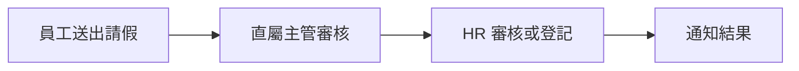

# 澄清第 1 輪

## 問題 1

**背景**  
你目前已經明確的是「要做公司內部請假系統」，但還沒有明確第一版要做到多大範圍。這會直接影響畫面數量、資料表設計、權限模型與開發時程。這裡的 MVP 指的是第一版最小可用範圍，也就是先把最核心、最不能錯的流程做對，而不是一開始把所有 HR 功能都塞進來。

**總結之提問**  
第一版你希望先交付哪一種範圍？

**選項（單選）**

| 編號 | 選項 | 說明 |
| --- | --- | --- |
| 1 | 只做請假申請與主管審核（推薦：先鎖定核心流程，最快驗證需求） | 先支援員工送出請假、主管核准或退回、查詢申請紀錄；不先做排班、補卡、報表。 |
| 2 | 請假申請 + 主管審核 + HR 管理後台 | 除了員工與主管流程，也先讓 HR 可查看全公司請假狀況、調整假別與管理規則。 |
| 3 | 直接做完整出勤管理系統 | 除了請假，也納入補卡、加班、排班、報表與假別額度管理；範圍最大但也最慢。 |
| 4 | 其他 | 我的需求不是以上三種，想補充第一版真正要做的範圍。 |

## 問題 2

**背景**  
審核流程會直接改變系統流程、通知節點與資料結構。如果你只需要單層審核，系統可以很簡單；如果要雙層或條件式審核，後面就要預留更多規則設定能力。

上圖只是示意流程，重點是在確認你要幾層審核，而不是先決定畫面長相。

**總結之提問**  
你的請假流程，第一版希望採用哪一種審核模式？

**選項（單選）**

| 編號 | 選項 | 說明 |
| --- | --- | --- |
| 1 | 單層審核（推薦：流程最穩定，最適合先做第一版） | 員工送出後，只需要直屬主管核准或退回即可。 |
| 2 | 雙層審核 | 員工送出後，要先經主管，再由 HR 或第二層主管確認。 |
| 3 | 依條件切換審核規則 | 例如請假天數超過某門檻才要第二層；彈性最高，但規則設計最複雜。 |
| 4 | 其他 | 我的審核流程不是上述模式，我想補充實際流程。 |

## 問題 3

**背景**  
通知方式會影響系統邊界。若第一版就要整合 Slack、Email 或 Google Calendar，開發範圍會擴大；若先只做站內通知，系統會比較封閉但交付速度較快。這一題不是在問你「最理想的最終版本」，而是在問你「第一版一定要有什麼」。

**總結之提問**  
第一版的通知與整合，你最希望先做到哪一種程度？

**選項（單選）**

| 編號 | 選項 | 說明 |
| --- | --- | --- |
| 1 | 先只做站內通知（推薦：先把產品核心跑順，再決定要接哪些外部服務） | 申請送出、審核結果等資訊只在系統內顯示，不先串外部工具。 |
| 2 | 站內通知 + Email | 除了系統內顯示，也會發送 Email，適合公司成員不常登入系統的情境。 |
| 3 | 站內通知 + 協作工具整合 | 例如 Slack、Teams 或 Google Calendar；體驗完整，但整合成本更高。 |
| 4 | 其他 | 我已經有明確指定的通知或整合方式，想直接補充。 |

請直接依題號回覆選項編號；若你的情況不在既有選項內，請選 `其他` 並補充說明。
