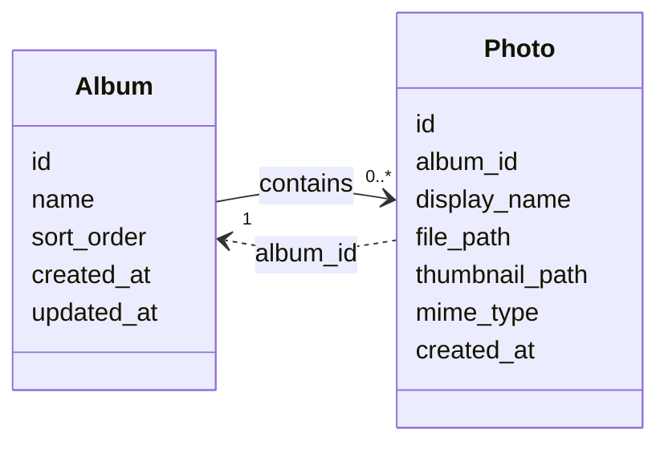

# 資料計畫：照片相簿整理應用程式

**功能分支**: `001-photo-albums`
**建立日期**: 2026-07-22
**狀態**: 草稿

## 實體：Album（相簿）

相簿是整理照片的單層容器。主頁依建立日期分組顯示，同分組內可拖放重排。

| 欄位 | 型別 | 必填 | 說明 | 驗證規則 | 對應 User Story |
| --- | --- | --- | --- | --- | --- |
| `id` | TEXT | 系統產生 | 相簿主鍵 | 主鍵，全域唯一 | — |
| `name` | TEXT | 是 | 相簿可辨識名稱 | 非空白 (US1-FR1) | US1 |
| `sort_order` | INTEGER | 是 | 同建立日期分組內的自訂排序 | 預設 `0` (US3-FR1, US3-FR2) | US3 |
| `created_at` | TEXT | 系統產生 | 建立時間（ISO-8601） | 預設 now()；主頁分組依此日期 (US2-FR2) | US2 |
| `updated_at` | TEXT | 系統產生 | 最後更新時間 | 寫入／重排時更新 | — |

### 衍生屬性

- **`group_date`（建立日期分組鍵）**：由 `DATE(created_at)` 衍生，格式 `YYYY-MM-DD`。用於主頁日期分組 (US2-FR2)。
- **`photo_count`（相簿內照片數）**：純查詢計算，`COUNT(photos)` WHERE `album_id = albums.id`。用於列表與空狀態判斷 (US4-FR3)。

### 範例資料輸出

```json
{
  "id": "alb_01HZX2K9M3Q8R7N6P5T4V3W2X1",
  "name": "旅行",
  "sort_order": 0,
  "created_at": "2026-07-11T09:00:00+08:00",
  "updated_at": "2026-07-20T15:30:00+08:00"
}
```

---

## 實體：Photo（照片）

使用者上傳至指定相簿的影像檔案紀錄。每張照片同一時間只屬於一個相簿。

| 欄位 | 型別 | 必填 | 說明 | 驗證規則 | 對應 User Story |
| --- | --- | --- | --- | --- | --- |
| `id` | TEXT | 系統產生 | 照片主鍵 | 主鍵，全域唯一 | — |
| `album_id` | TEXT | 是 | 所屬相簿 | 對應 `Album.id`（關聯形狀見「實體關聯設計」；US1-FR2, US1-FR4） | US1 |
| `display_name` | TEXT | 是 | 列表／平鋪可辨識名稱 | 非空白 (US1-FR3) | US1, US4 |
| `file_path` | TEXT | 是 | app-managed 目錄中的原檔相對路徑 | 非空白；路徑全域唯一 | US1 |
| `thumbnail_path` | TEXT | 否 | app-managed 目錄中的縮圖相對路徑 | 縮圖失敗可為 null，降級顯示原檔 (US4-FR2) | US4 |
| `mime_type` | TEXT | 是 | 影像 MIME 類型 | 限 `image/jpeg`、`image/png`、`image/webp` (US1-FR3) | US1 |
| `created_at` | TEXT | 系統產生 | 加入相簿時間 | 預設 now()；平鋪預覽依此排序 | US4 |

### 範例資料輸出

```json
{
  "id": "pho_01HZX3A1B2C3D4E5F6G7H8J9K0",
  "album_id": "alb_01HZX2K9M3Q8R7N6P5T4V3W2X1",
  "display_name": "IMG_20260711_090015.jpg",
  "file_path": "uploads/pho_01HZX3A1B2C3D4E5F6G7H8J9K0.jpg",
  "thumbnail_path": "thumbs/pho_01HZX3A1B2C3D4E5F6G7H8J9K0.webp",
  "mime_type": "image/jpeg",
  "created_at": "2026-07-20T14:00:00+08:00"
}
```

---

## 約束清單

> 僅列實體內部欄位／屬性約束。實體之間的關聯形狀與理由見下方「實體關聯設計」。

- 因為相簿必須可辨識（US1-FR1），所以 `albums.name` 必填且非空白。
- 因為主頁要依相簿建立日期分組（US2-FR2），所以分組鍵由 `albums.created_at` 的日期部分衍生，不另存可手動覆寫的分組欄位。
- 因為拖放順序重開主頁後仍要保留（US3-FR2），所以 `albums.sort_order` 必填並持久化；重排僅在同一 `group_date` 分組內生效。
- 因為只支援 JPEG／PNG／WebP（US1-FR3），所以 `photos.mime_type` 限上述三種值。
- 因為照片列表／平鋪需要可辨識名稱（US1-FR3），所以 `photos.display_name` 必填且非空白。
- 因為空相簿仍應顯示（US1 邊界情境），所以刪除相簿內所有照片後，相簿列仍保留。
- 因為計數不可與歸屬列不一致，所以 `photo_count` 不落庫，改由 `photos` 計數。
- 因為改歸屬時同一張照片不得同時屬於多個相簿（US1-FR4），所以每張照片只保留單一 `album_id` 欄位，移動時覆寫該欄。

---

## 實體關聯設計



### 設計脈絡

- 因為每張照片同一時間只會屬於一個相簿（GR-002、US1-FR4），所以 `Album` 與 `Photo` 採 `1` — `0..*`，不另建 M:N 中介實體。
- 因為相簿不可巢狀（GR-001），所以不建立 `Album` 對 `Album` 的父子邊，亦不提供 `parent_album_id`。
- 因為照片必須依附指定相簿存在（US1-FR2），所以刪除相簿時一併刪除所屬照片；反向刪光照片時不刪相簿（空相簿仍保留，見約束清單）。
- 因為移動歸屬只需改所屬相簿（US1-FR4），所以以 `Photo.album_id` 單屬性覆寫表達，不另建歸屬歷史實體。

## 假設

- 相簿為單層結構，絕不巢狀；不提供 `parent_album_id`
- 主頁先依 `DATE(created_at)` 分組，組內依 `sort_order` 排列；拖放只持久化同分組內的 `sort_order`
- 上傳時原檔與縮圖皆寫入 app-managed 目錄；DB 只存相對路徑
- `photo_count` 不落庫，由 `photos` 計數
- 平鋪預覽排序固定依 `photos.created_at` 升冪；不另存可調欄數／排序偏好
- 刪除相簿時一併刪除所屬照片與實體檔（落庫級聯見 `DDL.md`）
