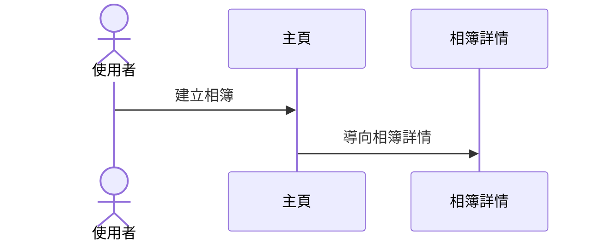
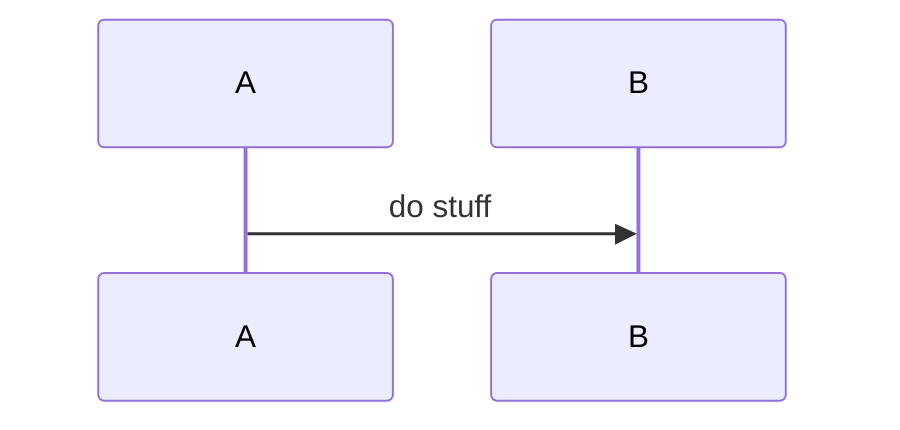

# Rule 1 - 操作流程以 spec 的 User Story 切分並連續編號

- Level: `MUST`
- 檔案必須有 `## 操作流程`；其下每個區塊標題必須使用 `### User Story N：標題`，`N` 從 1 起連續遞增、不跳號。
- `N` 與標題必須對齊同 package `spec.md` 的 User Story 編號與名稱，不可另造「業務邏輯」層。
- 切分單位是一條 User Story 的跨頁路徑；同一故事只畫跨頁 Sequence，頁內操作細節留給各頁「操作 Flow」。

## Good Example

- 這個例子是好的，因為上層是操作流程，底下故事編號與 spec 對齊。

```md
## 操作流程

### User Story 1：建立相簿並整理照片
### User Story 2：在主頁面依日期瀏覽相簿
```

## Bad Example

- 這個例子是壞的，因為另造業務邏輯層，且未對齊 spec 標題。

```md
## 業務邏輯 1：建立相簿並加入照片
```

# Rule 2 - 每條 User Story 必須含簡介、跨頁 Sequence、對應追溯

- Level: `MUST`
- 每條 User Story 固定順序：標題 → 一段簡介 → Mermaid `sequenceDiagram`（跨頁）→「對應：」條列。
- 對應條列必須能追溯到該故事的 US、FR、AC（可用 `US-x`／`FR-xxx`／`AC-x-y`）；屬於該 US 的 FR 不可寫進別條故事。
- Sequence 參與者應使用頁面與 API（或系統）角色，反映跨頁路徑。

## Good Example

- 這個例子是好的，因為結構完整，且 US1-FR4 留在故事 1。

````md
### User Story 1：建立相簿並整理照片

使用者從主頁建立相簿，進入相簿後加入照片；改歸屬時原相簿不再包含該照片。



對應：

- **US-1** 建立相簿並整理照片
- **FR-001**（US1-FR1）…
- **FR-011**（US1-FR4）…
- **AC-1-1** …
- **AC-1-2** …
````

## Bad Example

- 這個例子是壞的，因為缺追溯，或把 US1-FR4 塞進故事 4。

````md
### User Story 4：在相簿內以平鋪方式預覽照片


````

# Rule 3 - 操作流程應覆蓋本期全部主要 US

- Level: `SHOULD`
- 本期 `spec.md` 的每個主要 US 都應有對應的 `### User Story N`，避免整條價值路徑漏畫。
- 允許同一 US 的入口與驗證端分散在不同頁面職責中，但跨頁 Sequence 仍掛在該 US 底下。
- 不應為了湊數而複製幾乎相同的 Sequence。

## Good Example

- 這個例子是好的，因為四條 US 都有故事區塊，移動照片留在故事 1。

```md
### User Story 1：…（含移至其他相簿）
### User Story 4：…（只含平鋪與空狀態）
主頁職責同時標 US-1（入口）、US-2、US-3
```

## Bad Example

- 這個例子是壞的，因為漏掉整條 US，或把別的故事的 FR 畫進本圖。

```md
只畫了主頁瀏覽，US-4 平鋪路徑完全沒有操作流程。
```
