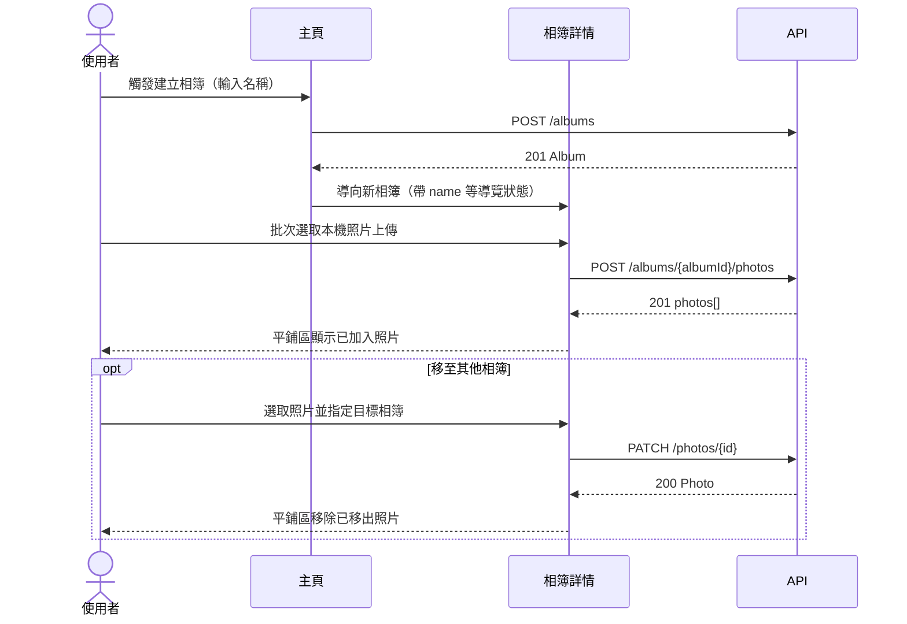
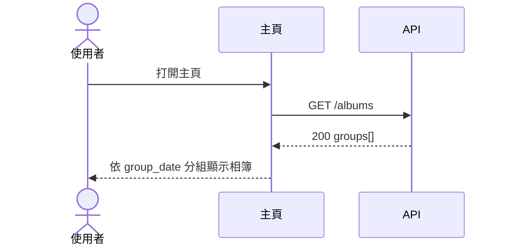
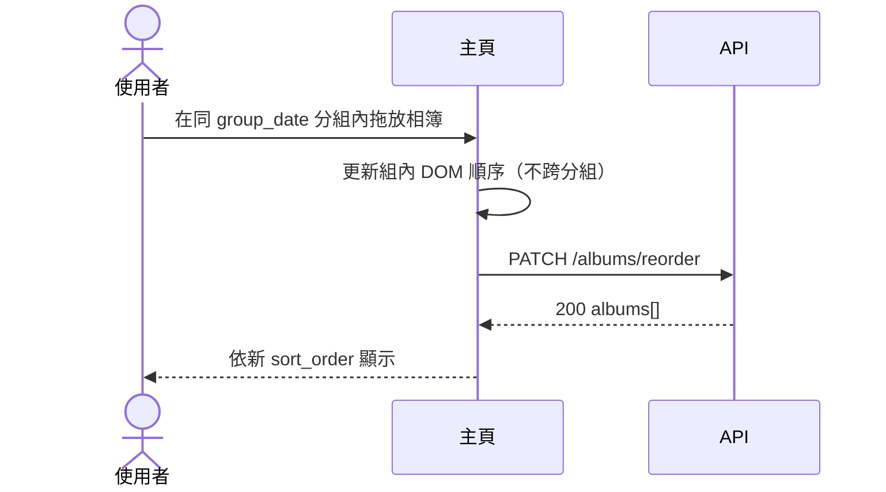
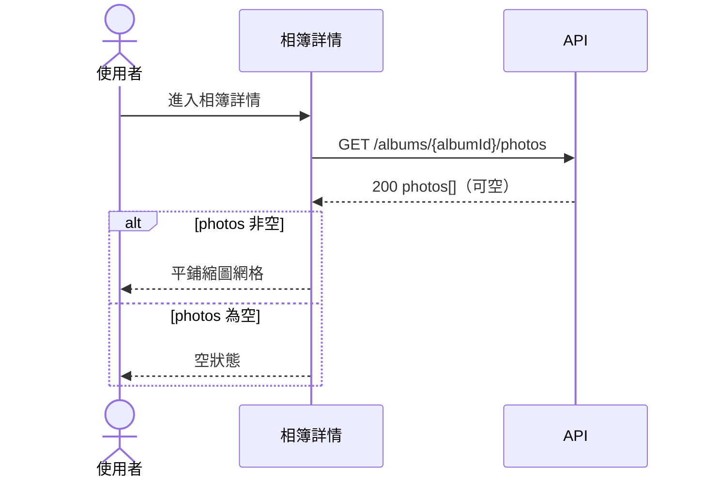
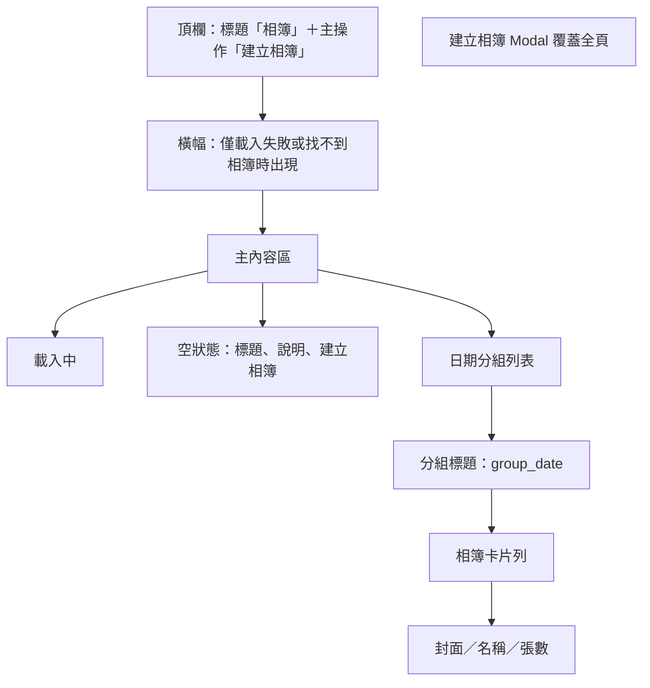
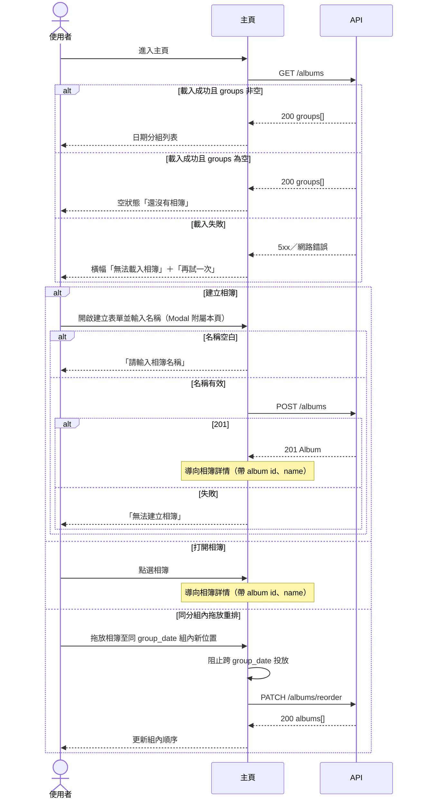
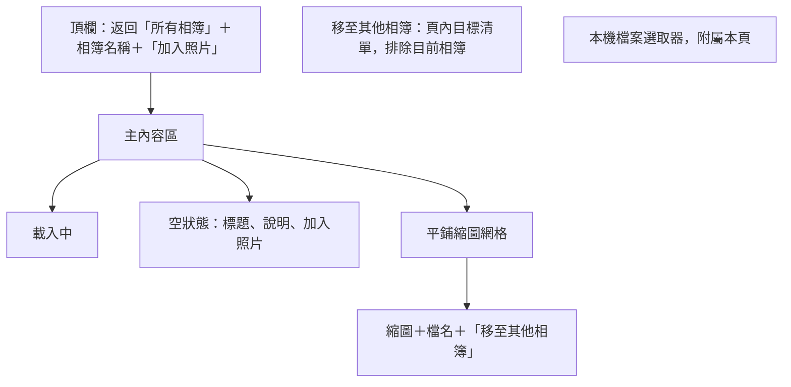
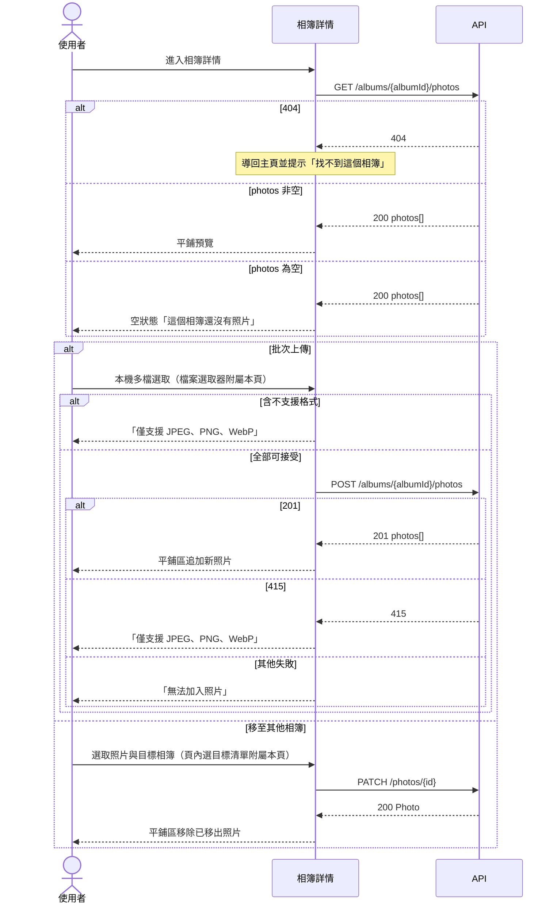
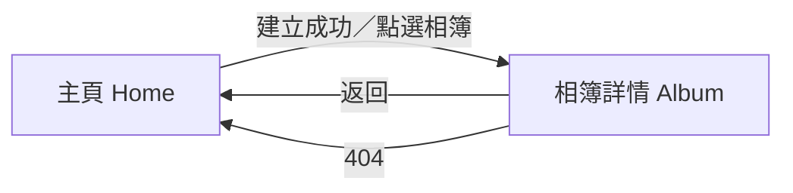

# UI 計畫：照片相簿整理應用程式

**功能分支**: `001-photo-albums`
**建立日期**: 2026-07-22
**狀態**: 草稿

## 視覺方向

- 風格來源：`spec` 假設以桌面／平板為主的單機個人相簿；憲法與 technical-research 為 Vite + Vanilla，不引入 UI framework 或元件庫。
- 本次風格結論：個人相簿整理工具。暖色紙感背景、大面積照片區塊、日期分組當掃讀主軸；不是後台表格，也不是電商卡片牆。
- 視覺重點：主頁用日期標題切分相簿；相簿卡等寬、封面＋名稱＋張數；相簿內縮圖等格平鋪。空相簿卡仍佔一格（封面為空框、`0 張`）。空狀態是說明＋主操作，不是空白頁。
- 審美原則：畫面只放使用者會看到的產品文案與假資料。雛形可點擊換頁、開 Modal、拖放與狀態切換，但不連真實 API。不在畫面上寫分析備註、US 編號或 TODO。

---

## 操作流程

### User Story 1：建立相簿並整理照片

使用者從主頁建立單層相簿，進入相簿詳情後批次選取本機 JPEG／PNG／WebP 上傳，確認照片出現在指定相簿中。若將已屬於其他相簿的照片改加入本相簿，原相簿不再包含該照片。

對應：

- **US-1** 建立相簿並整理照片
- **FR-001**（US1-FR1）建立相簿並命名
- **FR-002**（US1-FR2）將照片加入指定相簿
- **FR-003**（US1-FR3）一次選取多張 JPEG、PNG 或 WebP 匯入
- **FR-011**（US1-FR4）已歸屬照片改加入另一相簿時從原相簿移出
- **GR-001** 相簿不可嵌套
- **GR-002** 一張照片同一時間只屬於一個相簿
- **AC-1-1** 建立「旅行」並匯入多張 JPEG／PNG／WebP 後，相簿存在且內含這些照片
- **AC-1-2** 已屬於相簿 A 的照片移入相簿 B 後，只出現在相簿 B

---

### User Story 2：在主頁面依日期瀏覽相簿

使用者進入主頁，依相簿建立日期分組查看所有相簿；無相簿的日期分組不顯示。

對應：

- **US-2** 在主頁面依日期瀏覽相簿
- **FR-004**（US2-FR1）主頁顯示所有相簿
- **FR-005**（US2-FR2）依相簿建立日期分組
- **AC-2-1** 不同日期建立的相簿出現在對應日期分組之下

---

### User Story 3：透過拖放重新排列相簿

使用者在主頁以原生 HTML Drag and Drop 調整同一 `group_date` 分組內的相簿順序，順序持久化後重新整理仍保留。

對應：

- **US-3** 透過拖放重新排列相簿
- **FR-006**（US3-FR1）主頁拖放重新排列相簿順序
- **FR-007**（US3-FR2）保存重新排列後的相簿順序
- **AC-3-1** 拖放後依新順序顯示相簿
- **AC-3-2** 重新整理或再次進入主頁後仍保留先前順序

---

### User Story 4：在相簿內以平鋪方式預覽照片

使用者進入相簿詳情查看平鋪縮圖；空相簿顯示可理解空狀態。

對應：

- **US-4** 在相簿內以平鋪方式預覽照片
- **FR-008**（US4-FR1）進入單一相簿查看內容
- **FR-009**（US4-FR2）相簿內平鋪式預覽照片
- **FR-010**（US4-FR3）相簿沒有照片時顯示可理解空狀態
- **AC-4-1** 含多張照片的相簿以平鋪式預覽顯示

---

## 頁面設計

### 頁面：主頁（Home）

- 對應雛形檔案：`ui/index.html`
- 進入條件：開啟應用預設入口；從相簿詳情按「所有相簿」返回；相簿 404 時被導回並帶「找不到這個相簿」。

#### 職責

- **US-1**（入口）：建立新相簿
- **US-2**：依建立日期分組瀏覽相簿
- **US-3**：同 `group_date` 分組內拖放重排

#### 頁面編排

頂欄固定；主內容垂直堆疊日期分組，組間順序對齊 `api-plan` 的 `GET /albums` 範例。同一分組內相簿卡以等寬網格排列，可在組內橫向／換行拖放。Modal 附屬本頁，不另開全頁。

#### 呈現內容

- 應用標題：**相簿**
- 主操作：**建立相簿**（頂欄；空狀態再放同一操作）
- 有資料：依 `group_date` 分組；分組標題即日期字串（例如 `2026-07-11`）；組內依 `sort_order` 升冪
- 相簿卡：名稱（`name`）、張數（`{n} 張`）、封面（有照片用首張縮圖語意；`photo_count = 0` 顯示空框封面，卡片仍在）
- 無相簿：不顯示任何日期分組（含空白日期標題）
- 建立表單（Modal）：標題「建立相簿」、欄位「相簿名稱」、placeholder「例如：旅行」、按鈕「取消」「建立」

#### 操作 Flow

結構性禁止巢狀：主頁不提供「把相簿拖進另一相簿」的有效投放目標（GR-001）。僅一個相簿的分組內，拖放不造成錯誤或混淆互動（US3 邊界情境）：可開始拖，但沒有可改變順序的投放點，畫面維持原狀。

#### 狀態

| 狀態 ID | 觸發時間 | 畫面文案 |
| --- | --- | --- |
| `home-loading` | `GET /albums` 進行中 | 載入相簿中… |
| `home-empty` | `groups` 為空 | 標題「還沒有相簿」；說明「建立第一個相簿，開始整理照片。」 |
| `home-grouped` | 至少一個相簿 | 日期分組＋相簿卡；張數為 `{n} 張` |
| `home-load-error` | 列表載入失敗 | 「無法載入相簿」與操作「再試一次」 |
| `home-not-found-notice` | 從相簿 404 導回 | 找不到這個相簿 |
| `home-create-open` | Modal 開啟 | 建立相簿／相簿名稱／例如：旅行 |
| `home-create-invalid` | 名稱空白或僅空白 | 請輸入相簿名稱 |
| `home-create-error` | `POST /albums` 失敗 | 無法建立相簿 |

#### 導覽

| 操作 | 前往頁面 |
| --- | --- |
| 建立相簿成功 | 相簿詳情（新建立的 album） |
| 點選某個相簿 | 相簿詳情 |
| 拖放重排 | 留在主頁 |
| 相簿 404 被導回 | 留在主頁（`home-not-found-notice`） |

#### API 對應

| 使用者操作 | API | 說明 |
| --- | --- | --- |
| 載入主頁相簿列表 | `GET /albums` | 依 `group_date` 分組與組內 `sort_order` 呈現 |
| 建立相簿 | `POST /albums` | `name` 必填且不可空白 |
| 拖放重排 | `PATCH /albums/reorder` | 請求含 `group_date` 與該組全部 `album_ids` 新順序 |

---

### 頁面：相簿詳情（Album）

- 對應雛形檔案：`ui/album.html`
- 進入條件：主頁建立成功或點選相簿，導覽狀態帶入 `id`、`name`。直接開啟不存在的 `id` 不停留本頁。

#### 職責

- **US-1**：批次上傳照片至相簿
- **US-4**：平鋪預覽與空狀態
- **US-1**（驗證端）：將已歸屬照片移至其他相簿（US1-FR4）

#### 頁面編排

頂欄左為返回、中為 `name`、右為加入照片。平鋪區等格正方形縮圖，依 `created_at` 升冪由左而右、由上而下。空狀態置中，不是空白畫布。目標清單與檔案選取器附屬本頁。

#### 呈現內容

- 返回：**所有相簿**
- 標題：`name`（導覽狀態帶入；不呼叫 `GET /albums/{albumId}`）
- 上傳：**加入照片**；檔案選取器 `accept` 為 JPEG／PNG／WebP，可多選
- 有照片：平鋪縮圖；優先 `thumbnail_url`，為 `null` 時降級 `original_url`；可顯示 `display_name`
- 無照片：空狀態，不是空白頁
- 每張照片：**移至其他相簿**；目標清單為其他相簿名稱（來自 `GET /albums` 展開 `groups[].albums`，排除目前）

#### 操作 Flow

前端在送出前即可依副檔名／MIME 擋 HEIC 等；後端 415 時用同一句文案。相簿不存在（404）不停留本頁。

#### 狀態

| 狀態 ID | 觸發時間 | 畫面文案 |
| --- | --- | --- |
| `album-loading` | `GET .../photos` 進行中 | 載入照片中… |
| `album-empty` | `photos` 為空 | 標題「這個相簿還沒有照片」；說明「選取本機的 JPEG、PNG 或 WebP，一次可加入多張。」 |
| `album-grid` | 至少一張照片 | 平鋪縮圖網格 |
| `album-unsupported` | 選到 HEIC 等或 API 415 | 僅支援 JPEG、PNG、WebP |
| `album-upload-error` | 上傳失敗（非 415） | 無法加入照片 |
| `album-move-open` | 開啟目標清單 | 移至其他相簿 |
| `album-move-none` | 沒有其他相簿 | 沒有其他相簿可移入 |
| `album-move-error` | `PATCH /photos/{id}` 失敗 | 無法移動照片 |

#### 導覽

| 操作 | 前往頁面 |
| --- | --- |
| 返回 | 主頁 |
| 上傳完成 | 留在相簿詳情 |
| 移至其他相簿成功 | 留在相簿詳情（該張從本頁平鋪區消失） |
| 相簿不存在（404） | 主頁（`home-not-found-notice`） |

#### API 對應

| 使用者操作 | API | 說明 |
| --- | --- | --- |
| 載入平鋪照片 | `GET /albums/{albumId}/photos` | 有資料／空狀態判斷；依 `created_at` 升冪 |
| 批次上傳照片 | `POST /albums/{albumId}/photos` | multipart `files` 欄位，可多檔 |
| 將照片移至其他相簿 | `PATCH /photos/{id}` | 請求 body 含目標 `album_id`；落實 GR-002 |
| 載入移動目標相簿清單 | `GET /albums` | 展開 `groups[].albums` 供選目標（排除目前相簿） |

---

### 頁面總覽（導覽關係）

| 頁面 | 主要 US | 雛形 |
| --- | --- | --- |
| 主頁 | US-2、US-3；入口承載 US-1 | `ui/index.html` |
| 相簿詳情 | US-1、US-4 | `ui/album.html` |

---

## 雛形輸出規劃

- 多頁入口：`ui/index.html` 就是產品主頁，不是 sitemap 或說明頁。
- 預計輸出檔案：`ui/index.html`、`ui/album.html`、`ui/app.css`
- 換頁原則：真實產品會換頁的才換頁（主頁 ↔ 相簿詳情）。空狀態、載入失敗、建立 Modal、移至清單、415 提示都留在同頁切換。
- 假資料策略：對齊 `api-plan` 的 `GET /albums` 範例。`2026-07-11`：旅行（5 張）、家庭（0 張）；`2026-07-20`：工作（12 張）。旅行平鋪含 JPEG／PNG／WebP；其中 PNG 模擬 `thumbnail_url = null`（仍顯示原圖語意的色塊，畫面不出現 null）。
- 互動原則：可點進相簿、開建立 Modal、組內拖放、加入照片（檔案選取）、移至其他相簿（該張從本頁消失）。跨日期分組拖放無投放效果。檔案選取器 `accept` 為 JPEG／PNG／WebP；若仍選到 HEIC／HEIF（改選所有檔案或 MIME 為 `image/heic`），顯示「僅支援 JPEG、PNG、WebP」。多數系統因 `accept` 選不到 HEIC，雛形用 `error=unsupported` 展示同一句文案。未實作登入、刪除相簿、相簿內排序。
- 內容原則：HTML 只放產品文案與假資料。狀態的 query 切換寫在本節，不寫進畫面。
- Review 目標：不看本檔也能從主頁看出兩個日期分組、把「旅行」拖到「家庭」旁、點進旅行看到平鋪、點進家庭看到空狀態、建立新相簿進入空的詳情頁。
- 雛形狀態切換（給 Review／對齊用，非正式產品 URL）：
  - `ui/index.html`：預設 `home-grouped`
  - `ui/index.html?loading=1`：`home-loading`
  - `ui/index.html?empty=1`：`home-empty`
  - `ui/index.html?error=load`：`home-load-error`
  - `ui/index.html?notice=not_found`：`home-not-found-notice`
  - `ui/index.html?error=create`：開啟 Modal 並顯示 `home-create-error`
  - `ui/album.html?id=alb_01HZX2K9M3Q8R7N6P5T4V3W2X1&name=旅行`：`album-grid`
  - `ui/album.html?id=alb_01HZX2K9M3Q8R7N6P5T4V3W2Y2&name=家庭`：`album-empty`
  - `ui/album.html?id=alb_01HZX2K9M3Q8R7N6P5T4V3W2Z3&name=工作`：較密的平鋪
  - `ui/album.html?id=alb_01HZX2K9M3Q8R7N6P5T4V3W2X1&name=旅行&loading=1`：`album-loading`
  - `ui/album.html?id=alb_01HZX2K9M3Q8R7N6P5T4V3W2X1&name=旅行&error=unsupported`：`album-unsupported`
  - `ui/album.html?id=alb_01HZX2K9M3Q8R7N6P5T4V3W2X1&name=旅行&error=upload`：`album-upload-error`
  - `ui/album.html?id=alb_01HZX2K9M3Q8R7N6P5T4V3W2X1&name=旅行&error=move`：`album-move-error`
  - `ui/album.html?id=alb_01HZX2K9M3Q8R7N6P5T4V3W2X1&name=旅行&alone=1`：開啟「移至其他相簿」時為 `album-move-none`
  - `ui/album.html?id=missing`：導回 `index.html?notice=not_found`

---

## 假設

- 第一版為單機個人 Web 應用（Vanilla Vite 前端），不處理登入、雲端同步或多人共享
- 相簿為單層結構，絕不巢狀（GR-001）；主頁不提供相簿對相簿投放目標
- 主頁拖放重排僅限同一 `group_date`（建立日）分組內，使用原生 HTML Drag and Drop；跨分組拖放由前端阻止
- 僅兩個可獨立到達的全頁（主頁、相簿詳情）；Modal、檔案選取器、移動目標選單附屬於所屬頁操作 Flow
- 相簿詳情標題 `name` 由導覽狀態帶入（來自 `GET /albums` 或 `POST /albums` 回應），本期不另呼叫 `GET /albums/{albumId}`
- 平鋪預覽固定依 `photos.created_at` 升冪；相簿內不提供照片拖放排序
- 僅支援 JPEG、PNG、WebP；縮圖失敗時 `thumbnail_url` 為 `null`，前端降級顯示 `original_url`
- 「移至其他相簿」為相簿詳情頁內附屬操作，以 `PATCH /photos/{id}` 落實 US1-FR4；不提供相簿巢狀或照片多重歸屬
- REST 實際路徑掛載於 `/api` 前綴；媒體經 `/media/` 同 origin 提供；開發期 Vite proxy 轉發 `/api` 與 `/media`
- 刪除相簿本期不開 DELETE UI 或 Endpoint；低風險預設為後端 cascade（見 api-plan 假設）
- 主頁日期分組順序對齊 `api-plan` 的 `GET /albums` 範例：先 `2026-07-11` 再 `2026-07-20`。組間排序未在規格另定，不以雛形發明降冪。
- 靜態雛形用色塊代替真實 `/media/` 圖檔；正式前端才接 `thumbnail_url`／`original_url`
- 上列狀態的畫面文案為前端 TDD Then 要比對的字；實作與雛形不得擅自改寫語氣
