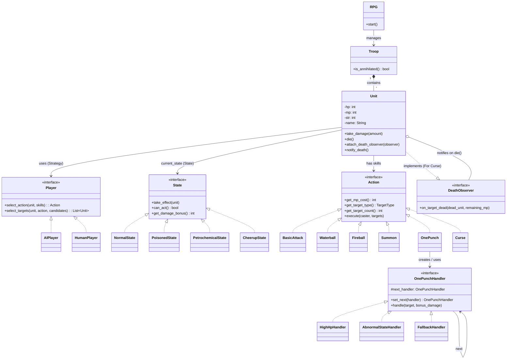

# RPG 重構類別圖 (v2 設計模式 - 責任鏈版)

為了徹底消滅 `v1` 中違反 OCP 的 `if-else` 與 `switch-case`，並配合你目前學過的設計模式，將原本規劃的「雙重派發」改為「責任鏈模式」。本次重構將會套用以下 5 個設計模式：

1. **策略模式 (Strategy Pattern)**: 抽離玩家的決策邏輯 (`HumanPlayer` 與 `AIPlayer`)。
2. **狀態模式 (State Pattern)**: 將 `State` 改為介面，針對不同狀態實作對應的各種行為（例如能否行動、每回合影響），消滅 `boolean` 標記。
3. **命令模式 (Command Pattern)**: 將原本 `SkillHandler` 的醜陋判斷消滅。讓每個技能 (Action) 都成為一個獨立類別，封裝自己的 MP 消耗、對象選擇邏輯、以及執行邏輯 (`execute`)。
4. **觀察者模式 (Observer Pattern)**: 解決「詛咒 (Curse)」在目標死亡時必須跨越生命週期回饋 MP 給施咒者的問題。目標 `Unit` 作為被觀察者，在死亡時通知施咒者。
5. **責任鏈模式 (Chain of Responsibility Pattern)**: 解決「一拳攻擊 (OnePunch)」繁雜的判斷邏輯。將 `HP >= 500`、`異常狀態`、`普通狀態` 三種不同的攻擊判定，各自寫成一個處理者 (Handler) 串成一條鏈。

## Class Diagram

