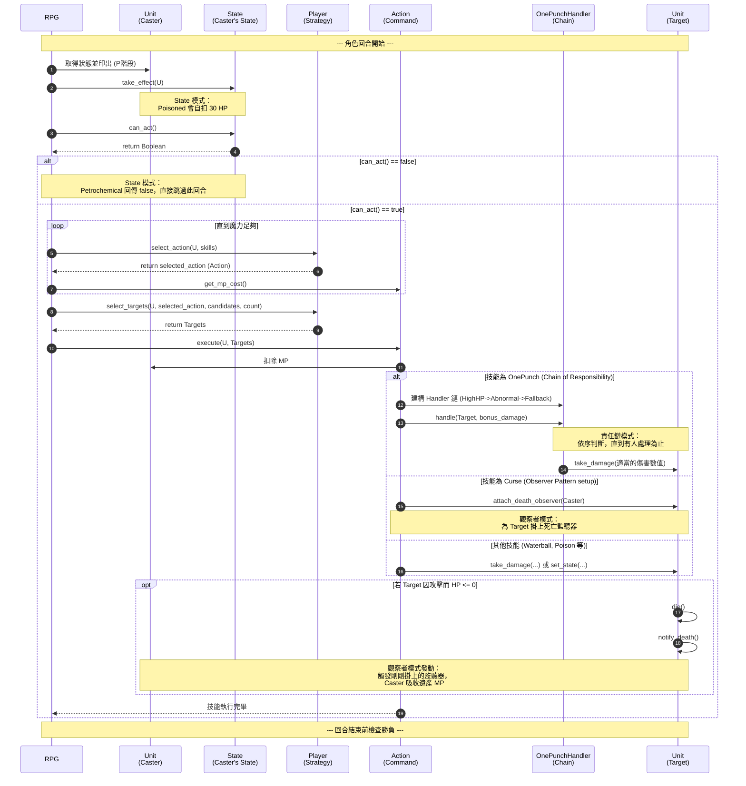

# RPG 回合制戰鬥循序圖 (v2 設計模式 - 責任鏈版)

這張循序圖展示了套用 **5 大設計模式** 後的系統互動流程。你可以明顯看到原本 `RPG` 與 `SkillHandler` 身上龐雜的邏輯，現在被完美地分配到了 `State` (狀態)、`Player` (策略)、`Action` (命令)、`OnePunchHandler` (責任鏈) 以及 `DeathObserver` (觀察者) 身上。

