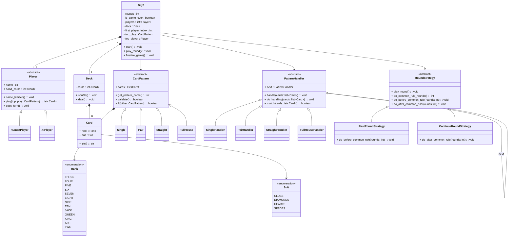

```mermaid
classDiagram
    class Big2 {
        - rounds : int
        - is_game_over : boolean
        - players : list~Player~
        - deck : Deck
        - first_player_index : int
        - top_play : CardPattern
        - top_player : Player
        + start() : void
        + play_round() : void
        + finalize_game() : void
    }

    class Player {
        <<abstract>>
        + name : str
        + hand_cards : list~Card~
        + name_himself() : void
        + play(top_play: CardPattern) : list~Card~
        + pass_turn() : void
    }
    class HumanPlayer {
    }
    class AIPlayer {
    }
    Player <|-- HumanPlayer
    Player <|-- AIPlayer

    class Deck {
        - cards : list~Card~
        + shuffle() : void
        + deal() : void
    }

    class Card {
        + rank : Rank
        + suit : Suit
        + __str__() : str
    }

    class Suit {
        <<enumeration>>
        CLUBS
        DIAMONDS
        HEARTS
        SPADES
    }

    class Rank {
        <<enumeration>>
        THREE
        FOUR
        FIVE
        SIX
        SEVEN
        EIGHT
        NINE
        TEN
        JACK
        QUEEN
        KING
        ACE
        TWO
    }

    class CardPattern {
        <<abstract>>
        + cards : list~Card~
        + get_pattern_name() : str
        + validate() : boolean
        + __lt__(other: CardPattern) : boolean
    }
    class Single
    class Pair
    class Straight
    class FullHouse
    CardPattern <|-- Single
    CardPattern <|-- Pair
    CardPattern <|-- Straight
    CardPattern <|-- FullHouse

    class PatternHandler {
        <<abstract>>
        + next : PatternHandler
        + handle(cards: list~Card~) : void
        + do_handling(cards: list~Card~) : void
        + match(cards: list~Card~) : boolean
    }
    class SingleHandler
    class PairHandler
    class StraightHandler
    class FullHouseHandler
    PatternHandler <|-- SingleHandler
    PatternHandler <|-- PairHandler
    PatternHandler <|-- StraightHandler
    PatternHandler <|-- FullHouseHandler

    class RoundStrategy {
        <<abstract>>
        + play_round() : void
        + do_common_rule_rounds() : int
        + do_before_common_rule(rounds: int) : void
        + do_after_common_rule(rounds: int) : void
    }
    class FirstRoundStrategy {
        + do_before_common_rule(rounds: int) : void
    }
    class ContinueRoundStrategy {
        + do_after_common_rule(rounds: int) : void
    }
    RoundStrategy <|-- FirstRoundStrategy
    RoundStrategy <|-- ContinueRoundStrategy

    %% Relationships
    Big2 "1" *-- "4" Player
    Big2 "1" *-- "1" Deck
    Big2 --> RoundStrategy
    Big2 --> CardPattern
    Big2 --> PatternHandler  
    Deck "1" *-- "52" Card
    Card --> Rank
    Card --> Suit
    CardPattern *-- Card
    PatternHandler --> PatternHandler : next
```