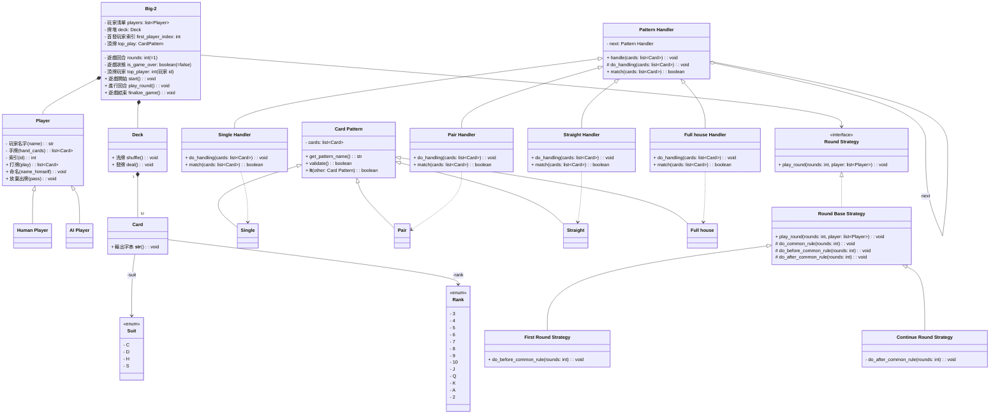

```mermaid
classDiagram
    class Big2["Big-2"] {
        - 遊戲回合 rounds: int(=1)
        - 遊戲狀態 is_game_over: boolean(=false)
        - 玩家清單 players: list~Player~
        - 牌堆 deck: Deck
        - 首發玩家索引 first_player_index: int
        - 頂牌 top_play: CardPattern
        - 頂牌玩家 top_player: int(玩家 id)
        + 遊戲開始 start(): void
        + 進行回合 play_round(): void
        + 遊戲結束 finalize_game(): void
    }

    class Player {
        - 玩家名字(name): str
        - 手牌(hand_cards): list~Card~
        - 索引(id): int
        + 打牌(play): list~Card~
        + 命名(name_himself): void
        + 放棄出牌(pass): void
    }
    class HumanPlayer["Human Player"]
    class AIPlayer["AI Player"]
    Player <|-- HumanPlayer
    Player <|-- AIPlayer

    class Deck {
        + 洗牌 shuffle(): void
        + 發牌 deal(): void
    }

    class Card {
        + 輸出字串 __str__(): void
    }

    class Suit {
        <<enum>>
        - C
        - D
        - H
        - S
    }

    class Rank {
        <<enum>>
        - 3
        - 4
        - 5
        - 6
        - 7
        - 8
        - 9
        - 10
        - J
        - Q
        - K
        - A
        - 2
    }

    class CardPattern["Card Pattern"] {
        - cards: list~Card~
        + get_pattern_name(): str
        + validate(): boolean
        + __lt__(other: Card Pattern): boolean
    }
    class Single
    class Pair
    class Straight
    class FullHouse["Full house"]
    CardPattern <|-- Single
    CardPattern <|-- FullHouse
    CardPattern <|-- Straight
    CardPattern <|-- Pair

    class PatternHandler["Pattern Handler"] {
        - next: Pattern Handler
        + handle(cards: list~Card~): void
        # do_handling(cards: list~Card~): void
        + match(cards: list~Card~): boolean
    }
    class SingleHandler["Single Handler"] {
        + do_handling(cards: list~Card~): void
        + match(cards: list~Card~): boolean
    }
    class FullHouseHandler["Full house Handler"] {
        + do_handling(cards: list~Card~): void
        + match(cards: list~Card~): boolean
    }
    class StraightHandler["Straight Handler"] {
        + do_handling(cards: list~Card~): void
        + match(cards: list~Card~): boolean
    }
    class PairHandler["Pair Handler"] {
        + do_handling(cards: list~Card~): void
        + match(cards: list~Card~): boolean
    }
    PatternHandler <|-- SingleHandler
    PatternHandler <|-- FullHouseHandler
    PatternHandler <|-- StraightHandler
    PatternHandler <|-- PairHandler

    class RoundStrategy["Round Strategy"] {
        <<interface>>
        + play_round(rounds: int, player: list~Player~): void
    }
    class RoundBaseStrategy["Round Base Strategy"] {
        + play_round(rounds: int, player: list~Player~): void
        # do_common_rule(rounds: int): void
        # do_before_common_rule(rounds: int): void
        # do_after_common_rule(rounds: int): void
    }
    class FirstRoundStrategy["First Round Strategy"] {
        + do_before_common_rule(rounds: int): void
    }
    class ContinueRoundStrategy["Continue Round Strategy"] {
        - do_after_common_rule(rounds: int): void
    }
    RoundStrategy <|.. RoundBaseStrategy
    RoundBaseStrategy <|-- FirstRoundStrategy
    RoundBaseStrategy <|-- ContinueRoundStrategy

    %% Relationships
    Big2 *-- Player
    Big2 *-- Deck
    Big2 --> RoundStrategy
    Deck "1" *-- "52" Card
    Card --> Suit : -suit
    Card --> Rank : -rank
    PatternHandler o-- PatternHandler : next
    SingleHandler ..> Single
    FullHouseHandler ..> FullHouse
    StraightHandler ..> Straight
    PairHandler ..> Pair
```