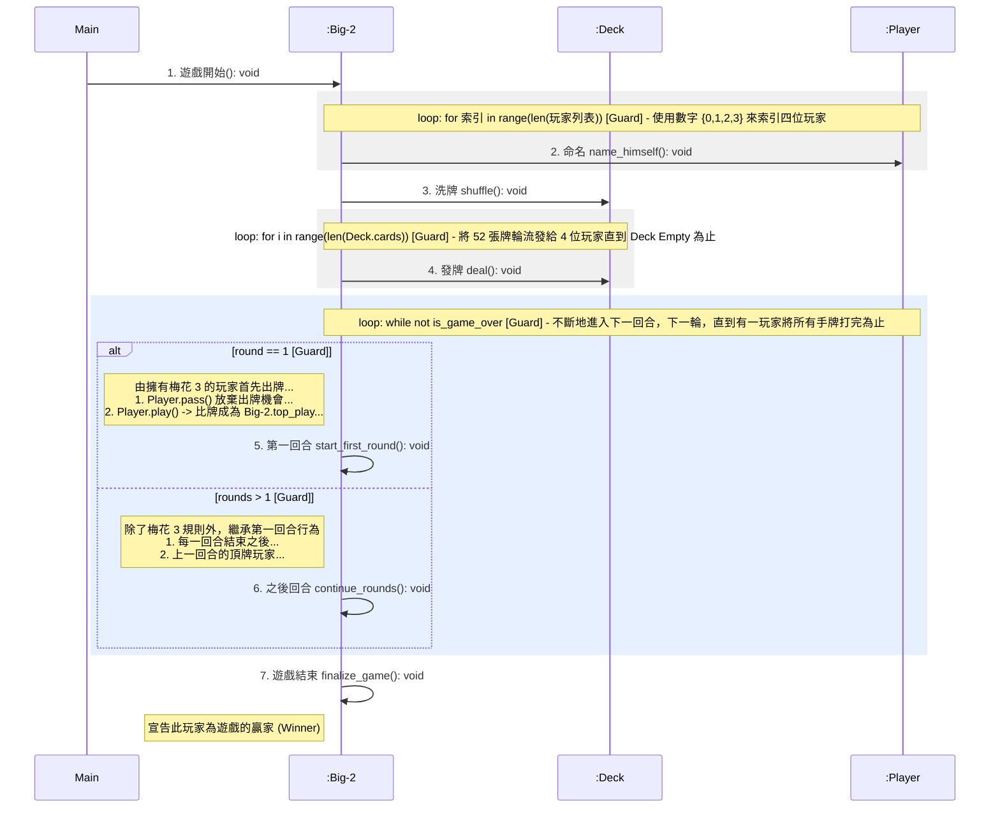

```mermaid
sequenceDiagram
    participant Main
    participant Big2 as :Big-2
    participant Deck as :Deck
    participant Player as :Player

    Main->>Big2: 1. 遊戲開始(): void
    
    rect rgb(240, 240, 240)
    Note over Big2, Player: loop: for 索引 in range(len(玩家列表)) [Guard] - 使用數字 {0,1,2,3} 來索引四位玩家
    Big2->>Player: 2. 命名 name_himself(): void
    end
    
    Big2->>Deck: 3. 洗牌 shuffle(): void
    
    rect rgb(240, 240, 240)
    Note over Big2, Deck: loop: for i in range(len(Deck.cards)) [Guard] - 將 52 張牌輪流發給 4 位玩家直到 Deck Empty 為止
    Big2->>Deck: 4. 發牌 deal(): void
    end

    rect rgb(230, 240, 255)
    Note over Big2, Player: loop: while not is_game_over [Guard] - 不斷地進入下一回合，下一輪，直到有一玩家將所有手牌打完為止
        
        alt round == 1 [Guard] 
            Note left of Big2: 由擁有梅花 3 的玩家首先出牌...<br/>1. Player.pass() 放棄出牌機會...<br/>2. Player.play() -> 比牌成為 Big-2.top_play...
            Big2->>Big2: 5. 第一回合 start_first_round(): void
        else rounds > 1 [Guard]
            Note left of Big2: 除了梅花 3 規則外，繼承第一回合行為<br/>1. 每一回合結束之後...<br/>2. 上一回合的頂牌玩家...
            Big2->>Big2: 6. 之後回合 continue_rounds(): void
        end
    end

    Big2->>Big2: 7. 遊戲結束 finalize_game(): void
    Note left of Big2: 宣告此玩家為遊戲的贏家 (Winner)
```