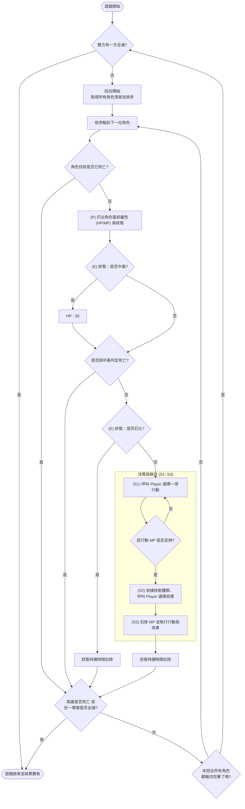

# RPG 回合制戰鬥流程圖 (Procedural 版本)

這張流程圖展示了我們目前修正過後的遊戲核心迴圈 (對應 `RPG` 類別中的 `start()` 方法)，精準地呈現了 `(P)`、`(E)`、`(S1)`、`(S2)`、`(S3)` 各階段的執行順序，以及 MP 檢查回傳重選的迴圈。

```mermaid
flowchart TD
    Start([遊戲開始]) --> CheckGameOverLoop{雙方有一方全滅?}
    CheckGameOverLoop -- 是 --> End([遊戲結束並結算勝負])
    CheckGameOverLoop -- 否 --> NextRound[回合開始 <br> 取得所有角色清單並排序]
    NextRound --> IterateUnit[依序輪到下一位角色]

    IterateUnit --> CheckAlreadyDead{角色目前是否已死亡?}
    CheckAlreadyDead -- 是 --> CheckMidGameOver

    CheckAlreadyDead -- 否 --> P_Phase["(P) 印出角色當前屬性 (HP/MP) 與狀態"]
    P_Phase --> E_Phase_Poison{"(E) 狀態：是否中毒?"}

    E_Phase_Poison -- 是 --> PoisonDmg[HP - 30]
    E_Phase_Poison -- 否 --> CheckDead

    PoisonDmg --> CheckDead{"是否因中毒判定死亡?"}
    CheckDead -- 是 --> CheckMidGameOver
    CheckDead -- 否 --> E_Phase_Petro{"(E) 狀態：是否石化?"}

    E_Phase_Petro -- 是 --> TickStateSkip[狀態持續時間扣除] --> CheckMidGameOver
    E_Phase_Petro -- 否 --> S1_Select

    subgraph "決策與執行 (S1~S3)"
        S1_Select["(S1) 呼叫 Player 選擇一項行動"]
        S1_Select --> MP_Check{"該行動 MP 是否足夠?"}

        %% 魔力不足時退回重選
        MP_Check -- 否 --> S1_Select

        %% 魔力充足進入 S2
        MP_Check -- 是 --> S2_Select["(S2) 依據技能種類，<br>呼叫 Player 選擇目標"]

        S2_Select --> S3_Exec["(S3) 扣除 MP 並執行行動與效果"]
    end

    S3_Exec --> TickState[狀態持續時間扣除]
    TickState --> CheckMidGameOver

    CheckMidGameOver{"英雄是否死亡 或<br>任一軍隊是否全滅?"}
    CheckMidGameOver -- 是 --> End
    CheckMidGameOver -- 否 --> HasNextUnit{"本回合所有角色<br>都輪流完畢了嗎?"}

    HasNextUnit -- 是 --> CheckGameOverLoop
    HasNextUnit -- 否 --> IterateUnit
```
