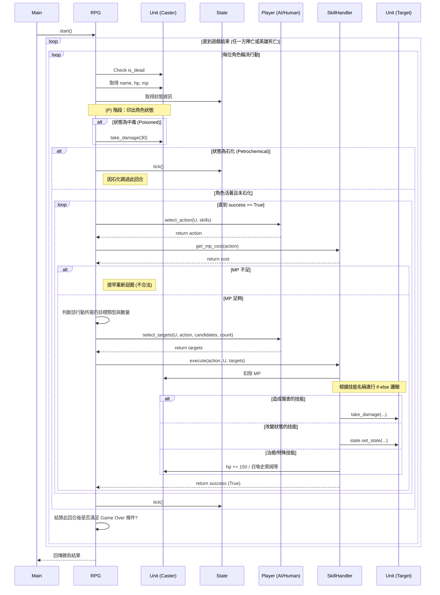

# RPG 回合制戰鬥循序圖 (Procedural 版本)

這張循序圖 (Sequence Diagram) 展示了在目前的程式架構中，一次完整的「角色回合」是如何透過各個物件之間的訊息傳遞 (Message Passing) 來完成的。這有助於我們看清目前的耦合狀況，例如 `RPG` 類別身兼太多雜事，以及 `SkillHandler` 越俎代庖的壞味道。

```mermaid
sequenceDiagram
    participant Main
    participant R as RPG
    participant U as Unit (Caster)
    participant S as State
    participant P as Player (AI/Human)
    participant SH as SkillHandler
    participant T as Unit (Target)

    Main->>R: start()

    loop 直到遊戲結束 (任一方陣亡或英雄死亡)
        loop 每位角色輪流行動
            R->>U: Check is_dead

            %% (P) 階段
            R->>U: 取得 name, hp, mp
            R->>S: 取得狀態資訊
            Note over R, U: (P) 階段：印出角色狀態

            %% (E) 階段
            alt 狀態為中毒 (Poisoned)
                R->>U: take_damage(30)
            end

            alt 狀態為石化 (Petrochemical)
                R->>S: tick()
                Note right of R: 因石化跳過此回合
            else 角色活著且未石化
                %% (S1) ~ (S3) 決策與執行階段
                loop 直到 success == True
                    %% (S1) 選擇行動
                    R->>P: select_action(U, skills)
                    P-->>R: return action

                    R->>SH: get_mp_cost(action)
                    SH-->>R: return cost

                    alt MP 不足
                        Note right of R: 提早重新迴圈 (不合法)
                    else MP 足夠
                        %% (S2) 選擇目標
                        R->>R: 判斷該行動所需的目標類型與數量
                        R->>P: select_targets(U, action, candidates, count)
                        P-->>R: return targets

                        %% (S3) 執行行為
                        R->>SH: execute(action, U, targets)

                        SH->>U: 扣除 MP
                        Note over SH, T: 根據技能名稱進行 if-else 邏輯

                        alt 造成傷害的技能
                            SH->>T: take_damage(...)
                        else 改變狀態的技能
                            SH->>T: state.set_state(...)
                        else 治癒/特殊技能
                            SH->>U: hp += 150 / 召喚史萊姆等
                        end

                        SH-->>R: return success (True)
                    end
                end

                %% 回合結束狀態更迭
                R->>S: tick()
            end

            %% 遊戲中斷檢查
            R->>R: 結算此回合後是否滿足 Game Over 條件?
        end
    end

    R-->>Main: 回傳勝負結果
```
