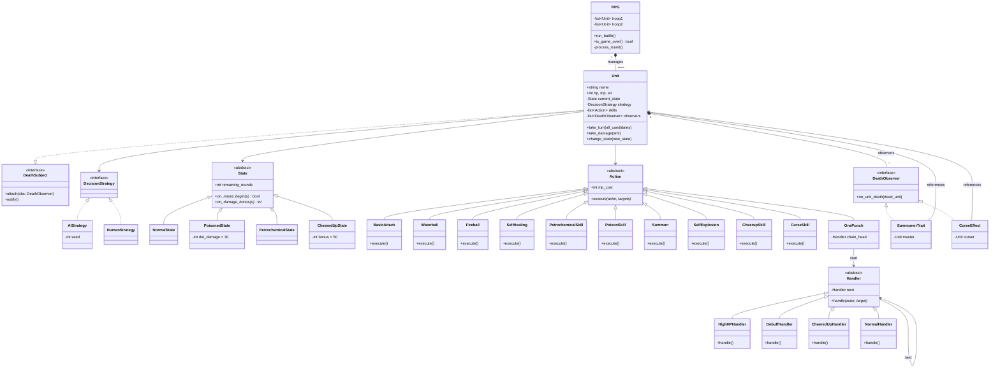

```mermaid
classDiagram
direction TB

    %% --- 指揮官與核心實體 ---
    class RPG {
        -list~Unit~ troop1
        -list~Unit~ troop2
        +run_battle()
        +is_game_over() bool
        -process_round()
    }

    class DeathSubject {
        <<interface>>
        +attach(obs: DeathObserver)
        +notify()
    }

    class Unit {
        +string name
        +int hp, mp, str
        -State current_state
        -DecisionStrategy strategy
        -list~Action~ skills
        -list~DeathObserver~ observers
        +take_turn(all_candidates)
        +take_damage(amt)
        +change_state(new_state)
    }

    RPG "1" *-- "many" Unit : manages
    Unit ..|> DeathSubject

    %% --- 1. 策略模式 (Strategy) ---
    class DecisionStrategy { <<interface>> }
    class AIStrategy { -int seed }
    class HumanStrategy { }
    DecisionStrategy <|.. AIStrategy
    DecisionStrategy <|.. HumanStrategy
    Unit --> DecisionStrategy

    %% --- 2. 狀態模式 (State) ---
    class State {
        <<abstract>>
        +int remaining_rounds
        +on_round_begin(u)* bool
        +on_damage_bonus(u)* int
    }
    class NormalState
    class PoisonedState { -int dot_damage = 30 }
    class PetrochemicalState
    class CheeredUpState { -int bonus = 50 }

    State <|-- NormalState
    State <|-- PoisonedState
    State <|-- PetrochemicalState
    State <|-- CheeredUpState
    Unit --> State

    %% --- 3. 命令模式 (Command) ---
    class Action {
        <<abstract>>
        +int mp_cost
        +execute(actor, targets)*
    }
    class BasicAttack { +execute() }
    class Waterball { +execute() }
    class Fireball { +execute() }
    class SelfHealing { +execute() }
    class PetrochemicalSkill { +execute() }
    class PoisonSkill { +execute() }
    class Summon { +execute() }
    class SelfExplosion { +execute() }
    class CheerupSkill { +execute() }
    class CurseSkill { +execute() }
    class OnePunch { -Handler chain_head }

    Action <|-- BasicAttack
    Action <|-- Waterball
    Action <|-- Fireball
    Action <|-- SelfHealing
    Action <|-- PetrochemicalSkill
    Action <|-- PoisonSkill
    Action <|-- Summon
    Action <|-- SelfExplosion
    Action <|-- CheerupSkill
    Action <|-- CurseSkill
    Action <|-- OnePunch
    Unit --> Action

    %% --- 4. 責任鍊模式 (CoR) ---
    class Handler {
        <<abstract>>
        -Handler next
        +handle(actor, target)*
    }
    class HighHPHandler { +handle() }
    class DebuffHandler { +handle() }
    class CheeredUpHandler { +handle() }
    class NormalHandler { +handle() }

    Handler <|-- HighHPHandler
    Handler <|-- DebuffHandler
    Handler <|-- CheeredUpHandler
    Handler <|-- NormalHandler
    Handler --> Handler : next
    OnePunch --> Handler : start

    %% --- 5. 觀察者模式 (Observer) ---
    class DeathObserver {
        <<interface>>
        +on_unit_death(dead_unit)
    }
    class SummonerTrait { -Unit master }
    class CurseEffect { -Unit curser }

    DeathObserver <|.. SummonerTrait
    DeathObserver <|.. CurseEffect
    Unit "1" *-- "*" DeathObserver : observers
    CurseEffect --> Unit : references
    SummonerTrait --> Unit : references
```
