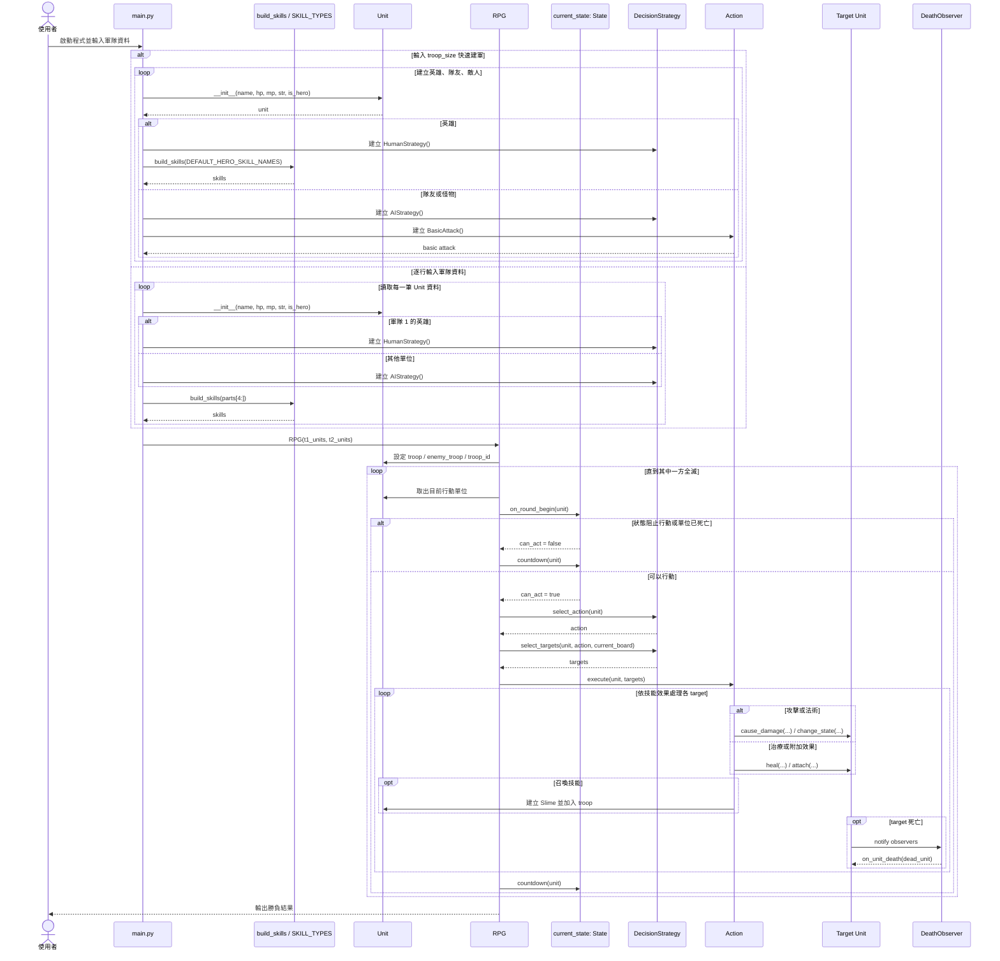
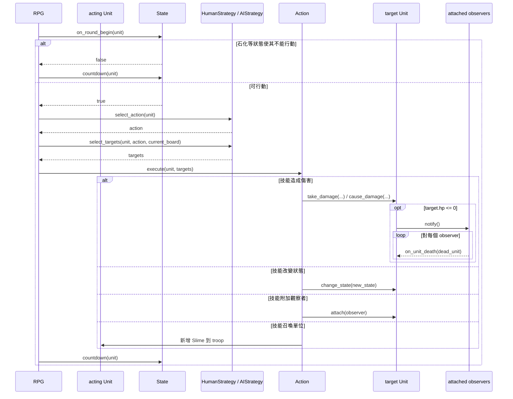

# 專案循序圖

這份文件用 Mermaid 畫出整個 RPG 專案從建立軍隊到戰鬥結束的主要互動流程。

## 1. 主流程總覽

## 2. 回合內部細節

這張圖聚焦在單一回合內，讓 `State`、`Strategy`、`Command`、`Observer` 怎麼串起來更清楚。

## 3. 圖中各參與者對應到的程式

- `Main`：負責讀取輸入、建立單位、指派策略與技能
- `RPG`：負責整體戰鬥流程控制
- `Unit`：核心實體，持有 state、strategy、skills、observers
- `State`：處理回合開始效果與狀態倒數
- `Strategy`：決定這回合用哪個技能、打誰
- `Action`：真正執行技能效果
- `Observer`：在死亡事件發生時觸發額外反應

## 4. 閱讀建議

如果你想搭配設計模式一起看，推薦順序是：

1. 先看主流程總覽，理解 `main -> RPG -> Unit`
2. 再看回合內部細節，理解 `State -> Strategy -> Action -> Observer`
3. 最後搭配 `docs/設計模式解析` 裡的各模式文件一起對照
