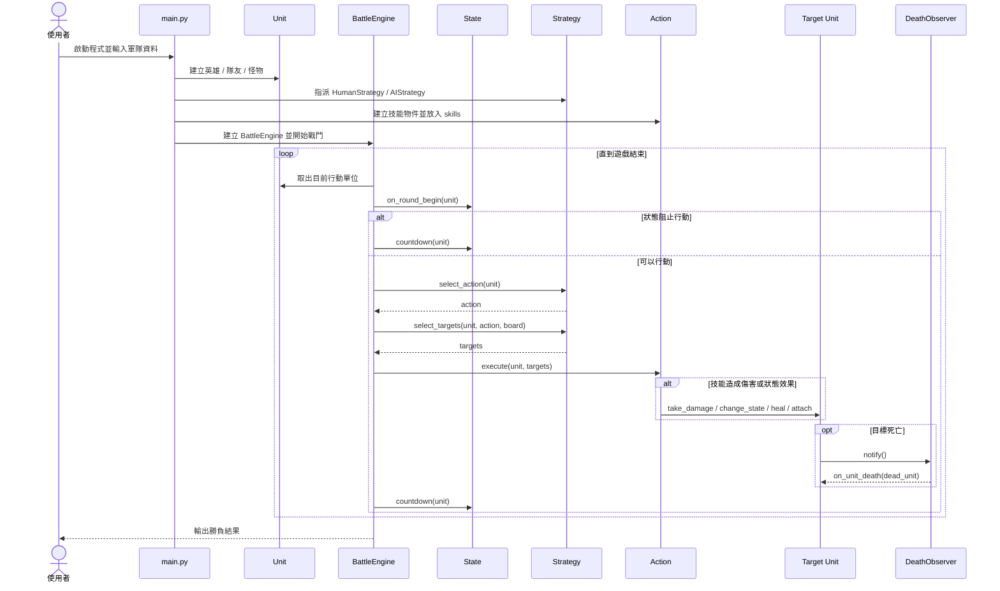
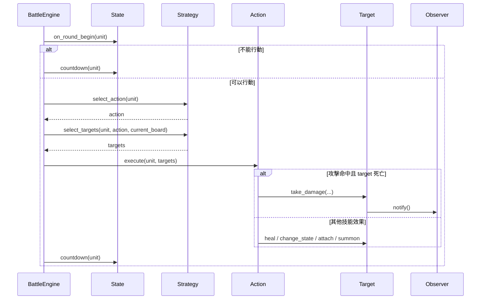

# 專案循序圖 v2

這份是精簡版，只保留整個 RPG 專案最重要的互動節點，參考 `v1/sequence_diagram.md` 的呈現方式。

如果你想看比較完整的版本，請搭配 [專案循序圖.md](/home/allentan/workspaces/Software-Design-Pattern-HW/homework5_rpg/v3/docs/專案循序圖.md) 一起看。

## 1. 主流程精簡版

## 2. 單一回合重點版

這張圖只聚焦一個角色輪到自己時，主流程會經過哪些設計模式。

## 3. 這版刻意省略了什麼？

這份 `v2` 為了讓圖更容易一眼看懂，刻意不展開以下細節：

- `build_skills()` 與 `SKILL_TYPES` 的 factory 細節
- `HumanStrategy` 和 `AIStrategy` 內部如何選技能 / 選目標
- 各種 `Action` 子類別自己的內部邏輯
- `Observer` 有哪些具體類別
- `OnePunch` 裡責任鏈的 handler 傳遞細節

如果要看這些細節，請回去看詳細版或各設計模式解析文件。

## 4. 建議用途

- `v2`：拿來報告、簡報、口頭說明主流程
- 詳細版：拿來對照程式碼與各設計模式實作
