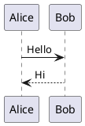

# PlantUML 快速預覽（最小安裝）

這份設定走 **PlantUML Server**，不需要本機安裝 Java / Graphviz。

## 使用方式

1. 安裝 VS Code 套件：`PlantUML`（jebbs.plantuml）
2. 開啟本檔後，用命令面板執行：`PlantUML: Preview Current Diagram`

## 範例

```plantuml
@startuml
Alice -> Bob: Hello
Bob --> Alice: Hi
@enduml
```
