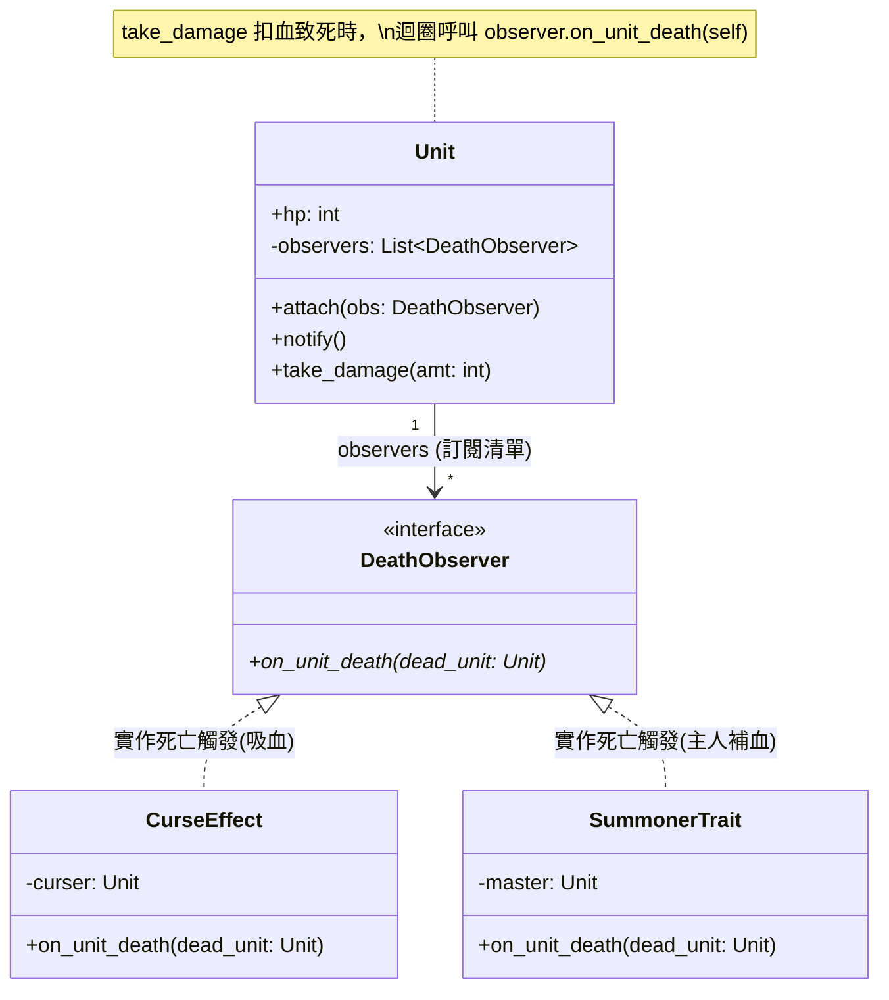

# 觀察者模式分析 (Observer Pattern Analysis)

## 1. 觀察者模式的本質與定義

**觀察者模式 (Observer Pattern)** 的定義是一對多的依賴關係：當一個物件（Subject，被觀察者/發布者）的狀態發生改變時，所有依賴於它的物件（Observers，觀察者/訂閱者）都會得到通知並自動更新。

本質上，它是用來**解耦「事件發生者」與「事件處理者」**，讓發布者不需要知道訂閱者的具體細節，滿足**開閉原則 (OCP)** 與**單一職責原則 (SRP)**。

## 2. 在本專案中解決了什麼問題？（痛點與 Forces）

在目前的 RPG 遊戲（`v3`）中，有許多「伴隨角色死亡而觸發的被動效果」，例如：

1. **詛咒技能 (CurseSkill)**：給敵人上詛咒後，當該敵人死亡，施咒者會回復等同於死者魔力量的 HP。
2. **召喚技能 (Summon)**：召喚出史萊姆，當史萊姆死亡時，召喚的主人會回復 30 點 HP。

**如果不使用觀察者模式（不用 `attach`, `notify`），程式碼會長這樣（錯誤示範）：**

我們必須在 `Unit.take_damage()` 處理死亡的環節裡面，硬寫上一大堆技能與狀態的判斷：

```python
class Unit:
    def take_damage(self, amt: int):
        self.hp -= amt
        if self.hp <= 0:
            self.hp = 0
            print(f"[{self.troop_id}]{self.name} 死亡。")

            # --- 災難的開始：Unit 類別被迫理解各種技能邏輯 ---
            if self.has_curse_effect:
                self.curser.hp += self.mp

            if self.name == "Slime" and self.master is not None:
                self.master.hp += 30
```

**上述爛 Code 的痛點：**

1. **違反單一職責 (SRP)：** `Unit` 只是個戰鬥單位，它為什麼需要懂「詛咒規則」和「史萊姆規則」？
2. **違反開閉原則 (OCP) 導致改動擴散：** 以後如果有個新技能是「自殺炸彈（死亡時對全體造成傷害）」或「復活十字架（死亡時復活）」，我們就得一直回來修改 `Unit.take_damage()`，非常容易改壞核心程式碼。

---

## 3. 套用觀察者模式後的優雅設計 (專案現狀)

為了解決這個痛點，專案引入了 `DeathObserver` 機制：

- **Subject（被觀察者）**：`Unit` 本身。它維護了一個清單 `self.observers`，不管裡面裝什麼，只要自己死亡 (`hp <= 0`)，統一呼叫 `self.notify()`。
- **Observer（觀察者）**：`CurseEffect`、`SummonerTrait` 等，實作了 `on_unit_death(dead_unit)` 方法。

```python
# 實際的優雅代碼 (Unit 內部)
class Unit:
    def take_damage(self, amt: int):
        # ...
        if self.hp <= 0:
            self.notify() # 發生了死亡事件，廣播給所有訂閱者！

    def notify(self):
        for obs in self.observers:
            obs.on_unit_death(self) # 把自己(死者)傳給訂閱者處理
```

這時候，**「詛咒」或「召喚」只要把自己的 Observer `attach` 給目標**，等目標一死，效果自然觸發。`Unit` 的程式碼從此不再需要修改 (Closed for Modification)，未來有幾百種死亡效果也能輕易擴充 (Open for Extension)！

---

## 4. 套用模式後的 UML (本專案的實際架構)

透過 `DeathSubject` (這裡由 `Unit` 直接擔任) 與 `DeathObserver` 的解耦，讓技能效果與角色生命週期完美分離。


