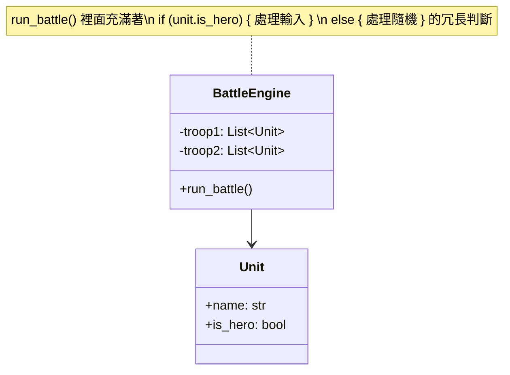
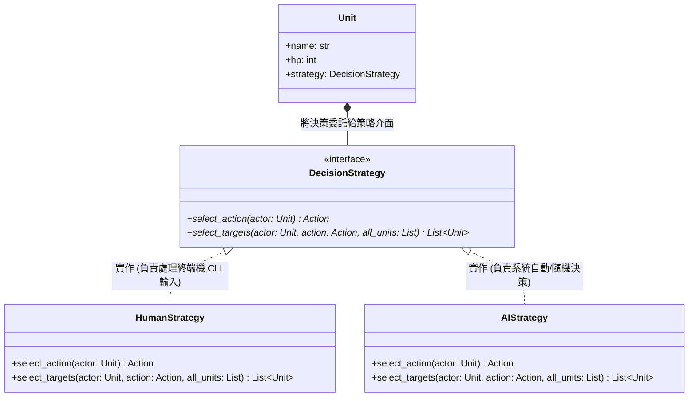

# 策略模式分析 (Strategy Pattern Analysis)

## 1. 策略模式的本質與定義

**策略模式 (Strategy Pattern)** 的定義是：「定義一族演算法，將每個演算法封裝起來，並且使它們可以相互替換。策略模式讓演算法能夠獨立於使用它的客戶端而變化。」

本質上，它是用來消除程式碼中大量的條件判斷 (if-else 或 switch-case)，並將容易變動的「行為」或「演算法」抽離成獨立的介面及實作類別，來滿足**開閉原則 (OCP)** 與**單一職責原則 (SRP)**。

## 2. 在本專案中解決了什麼問題？

在 `v3` 的實際實作中（於 `battle_engine.py` 內），角色輪到他的回合時，會需要「選擇技能」與「選擇目標」：

- **英雄/玩家**：需要透過終端機 (CLI) 讓真實玩家自行輸入指令。
- **其他敵軍或 AI 隊友**：由系統隨機或依照演算法選擇。

**如果不使用策略模式，程式碼會長這樣（錯誤示範）：**

在 `BattleEngine` 的 `run_battle()` 迴圈中，可能會塞滿巨大且難以維護的 `if-else` 判斷：

```python
# 沒有策略模式的爛代碼
if unit.is_hero:
    # --- 超長一串的 input() 處理玩家邏輯 ---
    action = get_human_input_for_action()
    targets = get_human_input_for_targets()
else:
    # --- 另一串 AI 隨機處理邏輯 ---
    action = calculate_ai_action()
    targets = calculate_ai_targets()
```

如果你之後要再加一種「會優先補血的聰明 AI」，你就必須再去改這段 `run_battle()`，增加 `elif unit.is_smart_ai:`，這會嚴重違反**開閉原則 (OCP)**。

**套用策略模式後（專案現狀）：**

- 將這兩套完全不同的決策演算法，抽成獨立的 `DecisionStrategy` 介面。
- 並提供 `HumanStrategy` (玩家互動) 和 `AIStrategy` (電腦隨機決策) 的實作類別。
- `BattleEngine` 和 `Unit` 都只需依賴介面，在 `run_battle()` 這樣執行即可：
  ```python
  # 實際的優雅代碼
  action = unit.strategy.select_action(unit)
  targets = unit.strategy.select_targets(unit, action, current_board)
  ```

---

## 3. 套用模式前的 UML (未使用策略模式的緊耦合設計)

在最糟糕的情況下，決策邏輯會通通堆在 `BattleEngine` 或 `Unit` 裡面，並且用 `if-else` 控制：



---

## 4. 套用模式後的 UML (本專案的實際架構)

透過 `models/strategies/decision_strategy.py` 的抽離，`BattleEngine` 只管跑迴圈，`Unit` 本身也不用管自己是誰，通通交給身上帶的 `strategy`：


