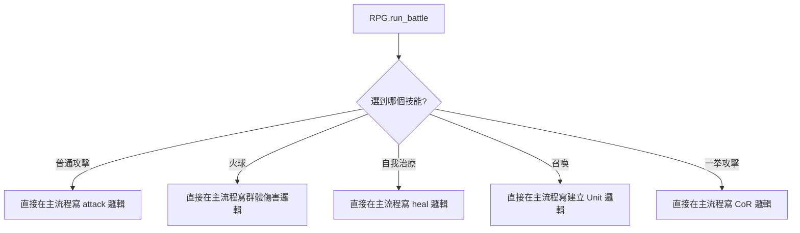
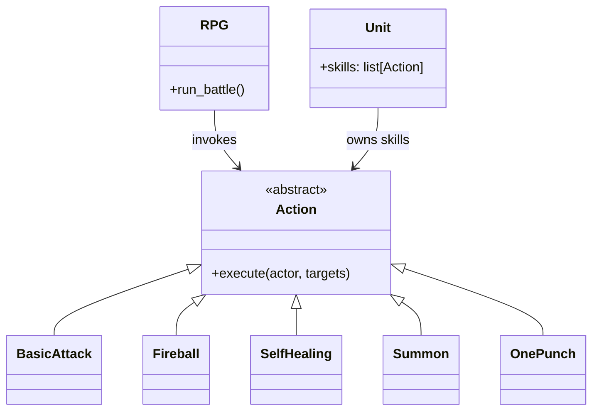
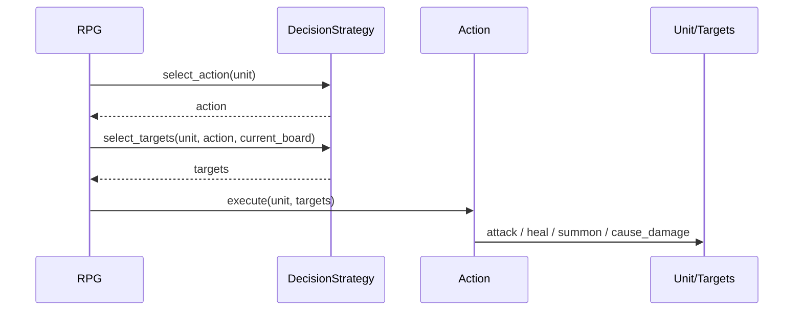

# 指令模式

## 模式意圖

把「要執行的動作」封裝成獨立物件，讓主流程只需要統一呼叫命令，而不用知道每個技能的內部細節。

## Problems

這個專案在沒有指令模式之前，至少同時受到這幾個 forces 拉扯：

- `RPG` 想維持統一的戰鬥流程，不想知道每一招技能各自怎麼實作。
- 技能種類很多，而且效果差異很大，有的是攻擊、有的是補血、有的是召喚、有的是複合規則。
- 新增技能應該盡量只新增一個技能模組，不希望每次都回頭改主流程。
- 技能執行需要攜帶自己的語意與資料，例如 MP 消耗、目標類型、目標數量，不適合只用字串或函式名稱處理。

## 套用設計模式前的簡圖

如果不套用指令模式，戰鬥主流程很容易長成這樣：



這種寫法的問題是：

- `RPG` 會知道太多技能細節。
- 新增技能時，主流程要一直長大。
- 不同技能的邏輯會互相糾纏。

## 套用設計模式後的 form

套用指令模式後，每個技能都變成一個 `Action` 物件：



這時候：

- 主流程只管「拿到哪個 `Action` 並執行」
- 各技能類別自己封裝自己的執行方式

## 專案中的角色對應

- `Command`：`Action`
- `ConcreteCommand`：各種技能類別，例如 `BasicAttack`、`Fireball`、`Summon`
- `Invoker`：`RPG`
- `Receiver`：`Unit` 與技能作用到的目標

## 核心程式位置

### Command 介面

在 [models/actions/action.py](/home/allentan/workspaces/Software-Design-Pattern-HW/homework5_rpg/v3/models/actions/action.py:7)：

```python
class Action(ABC):
    @abstractmethod
    def execute(self, actor: Unit, targets: list[Unit]) -> None:
        ...
```

這表示每一個技能都必須提供統一介面：

- `execute(actor, targets)`

### ConcreteCommand

目前專案裡的技能類別都屬於具體命令，例如：

- [BasicAttack](/home/allentan/workspaces/Software-Design-Pattern-HW/homework5_rpg/v3/models/actions/basic_attack.py:6)
- [Waterball](/home/allentan/workspaces/Software-Design-Pattern-HW/homework5_rpg/v3/models/actions/waterball.py:6)
- [Fireball](/home/allentan/workspaces/Software-Design-Pattern-HW/homework5_rpg/v3/models/actions/fireball.py:6)
- [SelfHealing](/home/allentan/workspaces/Software-Design-Pattern-HW/homework5_rpg/v3/models/actions/self_healing.py:6)
- [Summon](/home/allentan/workspaces/Software-Design-Pattern-HW/homework5_rpg/v3/models/actions/summon.py:9)
- [OnePunch](/home/allentan/workspaces/Software-Design-Pattern-HW/homework5_rpg/v3/models/actions/one_punch.py:10)

它們都繼承 `Action`，但各自實作自己的 `execute(...)`。

### 例子 1：普通攻擊

在 [models/actions/basic_attack.py](/home/allentan/workspaces/Software-Design-Pattern-HW/homework5_rpg/v3/models/actions/basic_attack.py:10)：

```python
def execute(self, actor: Unit, targets: list[Unit]) -> None:
    for target in targets:
        print(...)
        actor.attack(target)
```

它封裝的是「對指定目標造成傷害」。

### 例子 2：自我治療

在 [models/actions/self_healing.py](/home/allentan/workspaces/Software-Design-Pattern-HW/homework5_rpg/v3/models/actions/self_healing.py:10)：

```python
def execute(self, actor: Unit, targets: list[Unit]) -> None:
    self.announce_use(actor)
    for target in targets:
        target.heal(150)
```

它封裝的是「回血」。

### 例子 3：召喚

在 [models/actions/summon.py](/home/allentan/workspaces/Software-Design-Pattern-HW/homework5_rpg/v3/models/actions/summon.py:13)：

```python
def execute(self, actor: Unit, targets: list[Unit]) -> None:
    self.announce_use(actor)
    slime = Unit(...)
    ...
    actor.troop.append(slime)
```

它封裝的是「建立新單位並加入隊伍」。

這顯示指令模式不是只能包簡單函式，而是能封裝完整業務邏輯。

## 指令模式在本專案怎麼被呼叫？

在 [battle_engine.py](/home/allentan/workspaces/Software-Design-Pattern-HW/homework5_rpg/v3/battle_engine.py:47)：

```python
action = strategy.select_action(unit)
targets = strategy.select_targets(unit, action, current_board)
unit.mp -= action.mp_cost
action.execute(unit, targets)
```

`RPG` 真正知道的只有：

1. 先取得一個 `action`
2. 再取得它的 `targets`
3. 最後呼叫 `action.execute(...)`

它並不需要知道：

- 火球怎麼打
- 召喚怎麼生出史萊姆
- 一拳攻擊怎麼走 CoR

## 指令模式在本專案的流程圖



## `Unit.skills` 為什麼重要？

在 [models/unit.py](/home/allentan/workspaces/Software-Design-Pattern-HW/homework5_rpg/v3/models/unit.py:20)：

```python
self.skills: list["Action"] = []
```

這行表示角色身上存放的是：

- 一組可執行的技能物件

而不是：

- 一組字串名稱
- 一堆寫死在主流程裡的條件判斷

這讓技能本身成為第一級物件，可以被：

- 加入角色
- 移除
- 替換
- 交給策略選取

## 為什麼這樣設計是好的？

- 主流程不需要知道每個技能的內部細節。
- 新增技能時，通常只需要新增一個新的 `Action` 子類別。
- 每個技能的邏輯都封裝在自己的模組裡，維護性更好。
- 它可以很自然地和策略模式搭配：
  - `Strategy` 負責選哪個技能
  - `Command` 負責執行那個技能

## 一句話總結

這個專案的指令模式，就是把每個技能封裝成獨立的 `Action` 物件，讓戰鬥流程只要統一呼叫 `execute(...)`，就能執行各種不同技能，而不用把所有技能邏輯寫死在主流程裡。
