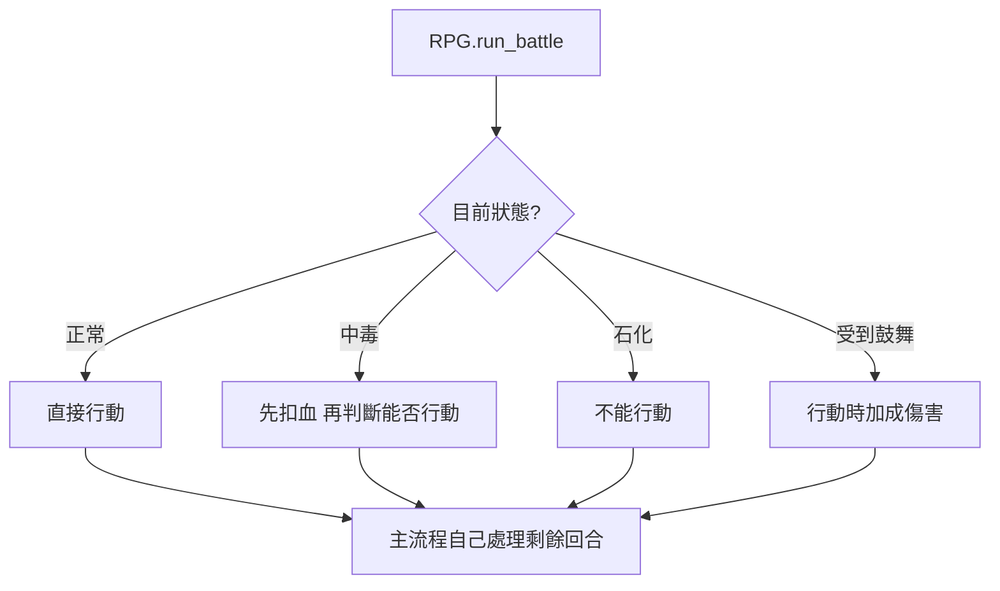
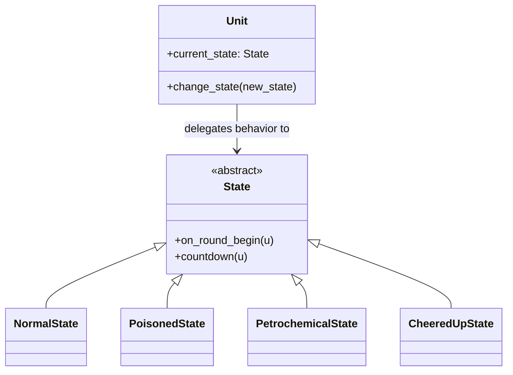
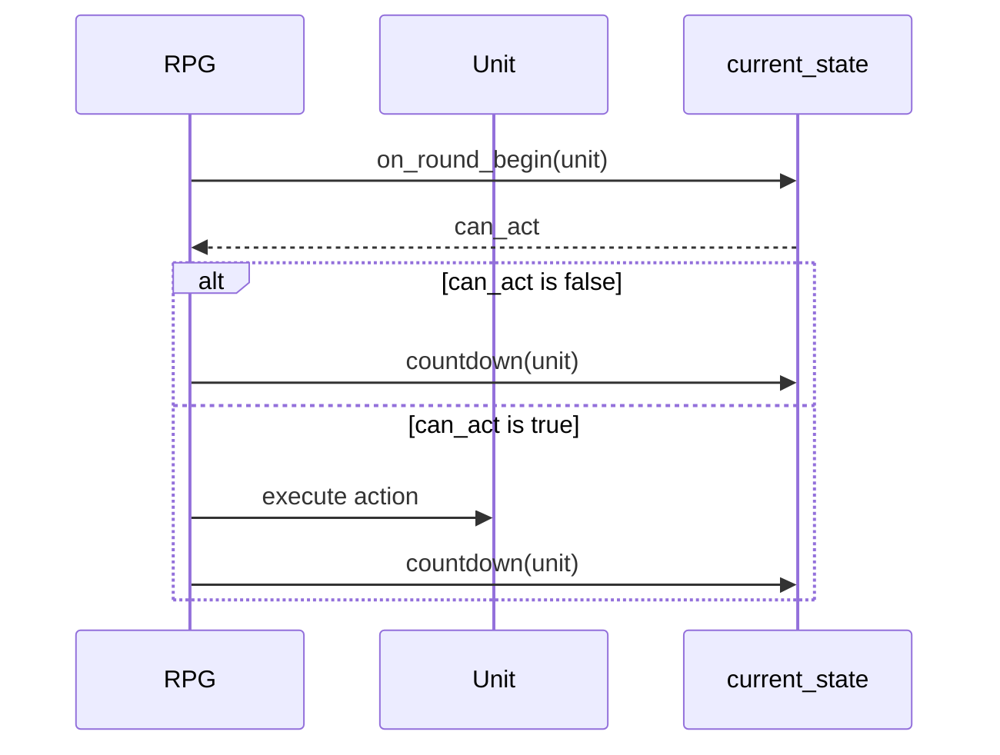

# 狀態模式

## 模式意圖

把「物件在不同狀態下的行為差異」封裝到不同狀態物件中，讓主流程不需要到處寫狀態分支判斷。

## Problems

這個專案在沒有狀態模式之前，至少同時受到這幾個 forces 拉扯：

- `Unit` 在不同狀態下，回合開始時的行為不同，有的可以行動，有的不能，有的還會先扣血。
- 狀態有持續回合數，還會自動倒數、到期解除，不只是單次效果。
- 同一個角色可能被不同技能改變狀態，主流程不想知道每種狀態的細節。
- 如果把所有狀態規則都寫成 `if/elif`，`RPG` 或 `Unit` 很快會變得很難維護。

## 套用設計模式前的簡圖

如果不套用狀態模式，回合邏輯很容易集中在主流程：



這種寫法的問題是：

- 主流程知道太多狀態細節。
- 新增一種狀態時，要回頭改既有流程。
- 倒數解除、狀態切換、回合開始效果會糾纏在一起。

## 套用設計模式後的 form

套用狀態模式後，`Unit` 只持有一個抽象 `State`，再把行為委託給它：



這時候：

- `Unit` 不需要知道每個狀態怎麼運作
- 每個狀態類別自己決定這回合的效果

## 專案中的角色對應

- `Context`：`Unit`
- `State`：`State`
- `ConcreteState`：`NormalState`、`PoisonedState`、`PetrochemicalState`、`CheeredUpState`
- 使用狀態的主流程：`RPG.run_battle()`

## 核心程式位置

### State 介面

在 [models/states/state.py](/home/allentan/workspaces/Software-Design-Pattern-HW/homework5_rpg/v3/models/states/state.py:7)：

```python
class State(ABC):
    def on_round_begin(self, u: Unit) -> bool:
        ...

    def countdown(self, u: Unit) -> None:
        ...
```

這代表狀態至少要會處理兩件事：

- 回合開始時要發生什麼
- 回合結束後怎麼倒數與解除

### Context

在 [models/unit.py](/home/allentan/workspaces/Software-Design-Pattern-HW/homework5_rpg/v3/models/unit.py:18)：

```python
self.current_state: "State" = NormalState()
```

`Unit` 只持有目前狀態，真正的狀態行為則委託出去。

## 各狀態在做什麼？

### 正常

在 [models/states/normal_state.py](/home/allentan/workspaces/Software-Design-Pattern-HW/homework5_rpg/v3/models/states/normal_state.py:6)：

- `on_round_begin(...)` 回傳 `True`
- 表示可以正常行動

### 中毒

在 [models/states/poisoned_state.py](/home/allentan/workspaces/Software-Design-Pattern-HW/homework5_rpg/v3/models/states/poisoned_state.py:6)：

```python
def on_round_begin(self, u: Unit) -> bool:
    u.take_damage(self.dot_damage)
    if u.hp <= 0:
        return False
    return True
```

中毒狀態會：

- 回合開始先扣血
- 如果沒死，仍可行動

### 石化

在 [models/states/petrochemical_state.py](/home/allentan/workspaces/Software-Design-Pattern-HW/homework5_rpg/v3/models/states/petrochemical_state.py:10)：

```python
def on_round_begin(self, u: Unit) -> bool:
    return False
```

表示石化單位在這回合不能行動。

### 受到鼓舞

在 [models/states/cheered_up_state.py](/home/allentan/workspaces/Software-Design-Pattern-HW/homework5_rpg/v3/models/states/cheered_up_state.py:6)：

- `on_round_begin(...)` 回傳 `True`
- 並把傷害加成資料存在狀態自己身上

對應加成是在 [models/unit.py](/home/allentan/workspaces/Software-Design-Pattern-HW/homework5_rpg/v3/models/unit.py:29) 使用：

```python
if isinstance(self.current_state, CheeredUpState):
    bonus = self.current_state.bonus
```

## 狀態切換是怎麼發生的？

`Unit` 提供 [change_state](/home/allentan/workspaces/Software-Design-Pattern-HW/homework5_rpg/v3/models/unit.py:51)：

```python
def change_state(self, new_state: "State") -> None:
    self.current_state = new_state
```

技能會透過這個方法幫角色換狀態，例如：

- 石化技能把目標改成 `PetrochemicalState`
- 下毒技能把目標改成 `PoisonedState`
- 鼓舞技能把目標改成 `CheeredUpState`

## 倒數與解除是怎麼做的？

在 [models/states/state.py](/home/allentan/workspaces/Software-Design-Pattern-HW/homework5_rpg/v3/models/states/state.py:16)：

```python
def countdown(self, u: Unit) -> None:
    if self.remaining_rounds > 0:
        self.remaining_rounds -= 1

    if self.remaining_rounds == 0:
        u.change_state(NormalState())
```

這表示：

- 狀態物件自己負責倒數
- 到期後自己把角色切回 `NormalState`

## 狀態模式在本專案怎麼被呼叫？

在 [battle_engine.py](/home/allentan/workspaces/Software-Design-Pattern-HW/homework5_rpg/v3/battle_engine.py:35)：

```python
can_act = unit.current_state.on_round_begin(unit)
if not can_act:
    unit.current_state.countdown(unit)
    continue
...
action.execute(unit, targets)
unit.current_state.countdown(unit)
```

主流程只做這幾件事：

1. 把回合開始事件交給目前狀態
2. 根據狀態決定能不能行動
3. 回合後讓狀態自己倒數

## 狀態模式在本專案的流程圖



## 為什麼這樣設計是好的？

- 狀態行為不再塞在主流程的大型分支裡。
- 新增狀態時，通常只要新增一個新的 `State` 子類別。
- 狀態自己掌管自己的回合效果與解除機制，責任更集中。
- `Unit` 保持簡潔，只持有目前狀態，不需要認識所有細節。

## 一句話總結

這個專案的狀態模式，就是把角色在不同狀態下的回合行為封裝到不同 `State` 類別裡，讓主流程只需要呼叫統一介面，而不用自己判斷每一種狀態。
