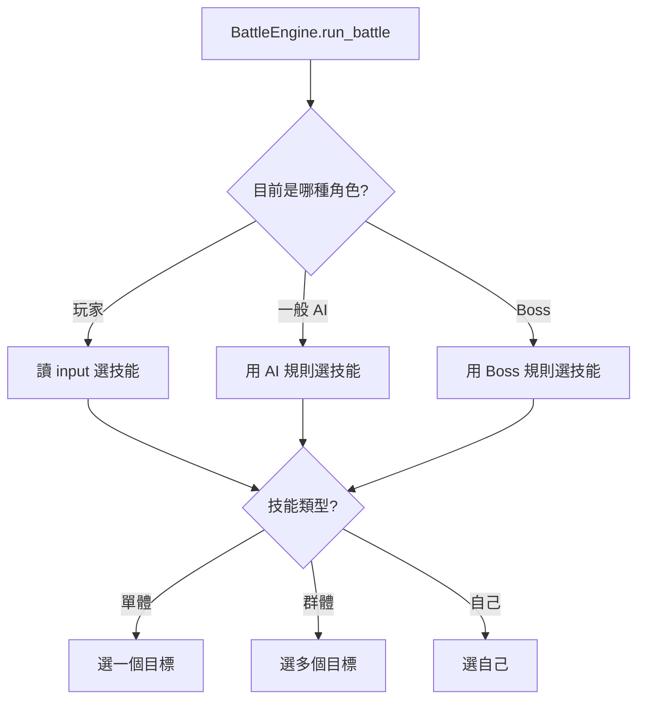
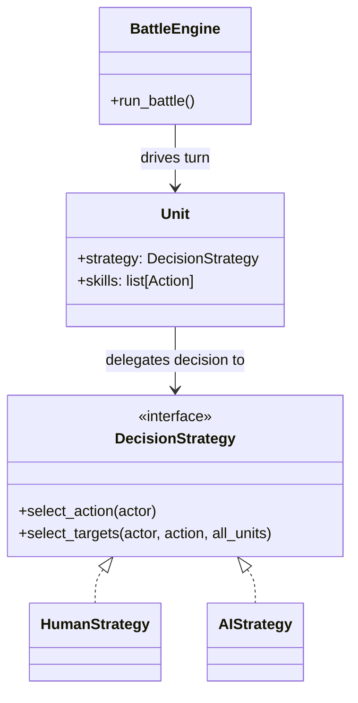
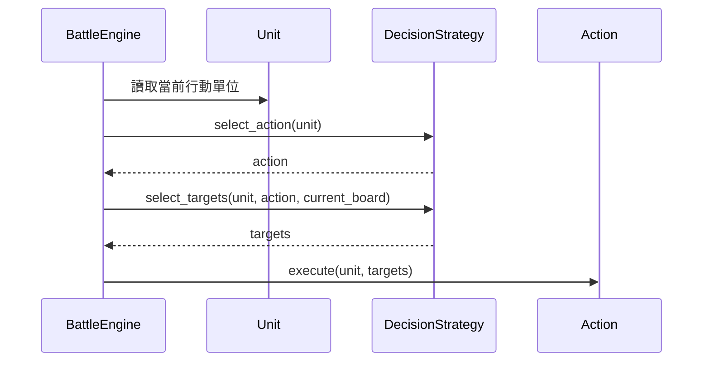

# 策略模式

## 模式意圖

把「如何做決策」從主流程抽離，封裝成可替換的策略物件，讓同一套戰鬥流程可以搭配不同決策方式運作。

## Problems

這個專案在沒有策略模式之前，至少同時受到這幾個 forces 拉扯：

- `BattleEngine` 需要維持固定且乾淨的回合流程，不想知道太多人控或 AI 控的細節。
- 英雄、隊友、怪物的決策方式不同，有的要吃玩家輸入，有的要自動選技能與目標。
- 未來可能還要新增新的決策方式，例如 `BossStrategy`、`RandomStrategy`、`GreedyStrategy`，希望不要每新增一種就回頭改主流程。
- 角色本身 `Unit` 應該專注在自己的狀態與能力，不想把「決策演算法」直接塞進 `Unit`。

## 套用設計模式前的簡圖

如果不套用策略模式，戰鬥流程通常會變成下面這種集中分支：



這種寫法的問題是：

- `BattleEngine` 會知道太多決策細節。
- 每新增一種角色決策方式，就要回來改這個大分支。
- 主流程和決策邏輯緊緊耦合。

## 套用設計模式後的 form

套用策略模式後，主流程只依賴抽象介面：



這時候：

- `BattleEngine` 只負責流程
- `Unit` 只負責持有策略
- 各種具體策略自己負責決策演算法

## 專案中的角色對應

- `Context`：`Unit`
- `Strategy`：`DecisionStrategy`
- `ConcreteStrategy`：`HumanStrategy`、`AIStrategy`
- 使用策略的主流程：`BattleEngine.run_battle()`

## 核心程式位置

### Strategy 介面

在 [models/strategies/decision_strategy.py](/home/allentan/workspaces/Software-Design-Pattern-HW/homework5_rpg/v3/models/strategies/decision_strategy.py:28)：

```python
class DecisionStrategy(ABC):
    @abstractmethod
    def select_action(self, actor: Unit) -> Action:
        ...

    @abstractmethod
    def select_targets(self, actor: Unit, action: Action, all_units: list[Unit]) -> list[Unit]:
        ...
```

這代表所有策略都要會做兩件事：

- 決定要用哪個技能
- 決定這個技能要打誰

### Concrete Strategy

目前專案裡有兩個具體策略：

- [models/strategies/human_strategy.py](/home/allentan/workspaces/Software-Design-Pattern-HW/homework5_rpg/v3/models/strategies/human_strategy.py:10) 的 `HumanStrategy`
- [models/strategies/ai_strategy.py](/home/allentan/workspaces/Software-Design-Pattern-HW/homework5_rpg/v3/models/strategies/ai_strategy.py:10) 的 `AIStrategy`

`HumanStrategy` 的特色：

- 顯示技能選單
- 用 `input()` 讓玩家選技能
- 用 `input()` 讓玩家選目標

`AIStrategy` 的特色：

- 依照 `seed` 輪流選技能
- 自動從候選目標中選出合法目標

### Context

在 [models/unit.py](/home/allentan/workspaces/Software-Design-Pattern-HW/homework5_rpg/v3/models/unit.py:19)：

```python
self.strategy: "DecisionStrategy | None" = None
```

這表示 `Unit` 不自己實作決策，而是把決策委託給 `strategy`。

### 策略是在哪裡被指定的？

在 [main.py](/home/allentan/workspaces/Software-Design-Pattern-HW/homework5_rpg/v3/main.py:93) 附近：

```python
hero.strategy = HumanStrategy()
ally.strategy = AIStrategy()
monster.strategy = AIStrategy()
```

這代表同樣都是 `Unit`，只要換掉 `strategy`，行為就會改變。

## 戰鬥流程怎麼用到策略？

真正使用策略的地方在 [battle_engine.py](/home/allentan/workspaces/Software-Design-Pattern-HW/homework5_rpg/v3/battle_engine.py:42)。

```python
strategy = unit.strategy
assert strategy is not None

action = strategy.select_action(unit)
targets = strategy.select_targets(unit, action, current_board)
action.execute(unit, targets)
```

它的關鍵觀念是：

- `BattleEngine` 不知道這是玩家還是 AI
- 它只知道目前有一個符合 `DecisionStrategy` 介面的物件可呼叫

## 策略模式在本專案的執行流程圖



## `select_targets(unit, action, current_board)` 是什麼意思？

這行：

```python
targets = strategy.select_targets(unit, action, current_board)
```

意思是：

「現在輪到 `unit` 行動，已經決定要用 `action` 了，請根據目前場上的活人 `current_board`，幫我挑出這招真正要作用到的目標。」

三個參數分別是：

- `unit`
  目前正在行動的人，也就是施法者或攻擊者。

- `action`
  這回合決定要用的技能，例如普通攻擊、火球、自我治療。

- `current_board`
  目前場上所有還活著的單位。

回傳值 `targets` 是一個 `list[Unit]`，代表這次技能真正會作用到的目標。

## 為什麼這樣設計是好的？

- 戰鬥流程和決策邏輯清楚分離。
- 新增一種決策方式時，通常只要新增一個新的策略類別。
- 避免把大量 `if/elif` 決策分支塞進 `BattleEngine`。
- `Unit` 可以在執行期切換策略，彈性更高。

## 一句話總結

這個專案的策略模式，就是把「角色如何選行動、如何選目標」抽成可替換的策略物件，讓主流程穩定，而決策演算法可以自由替換。
