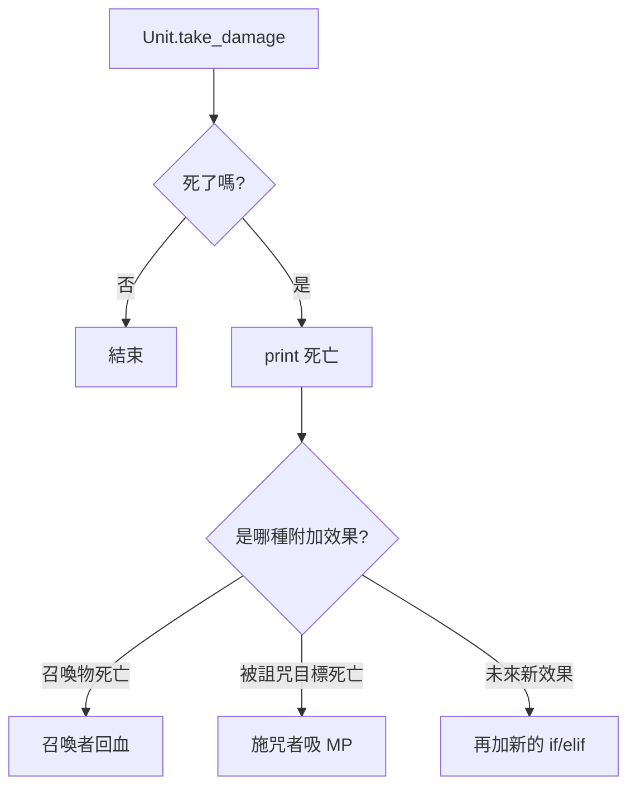
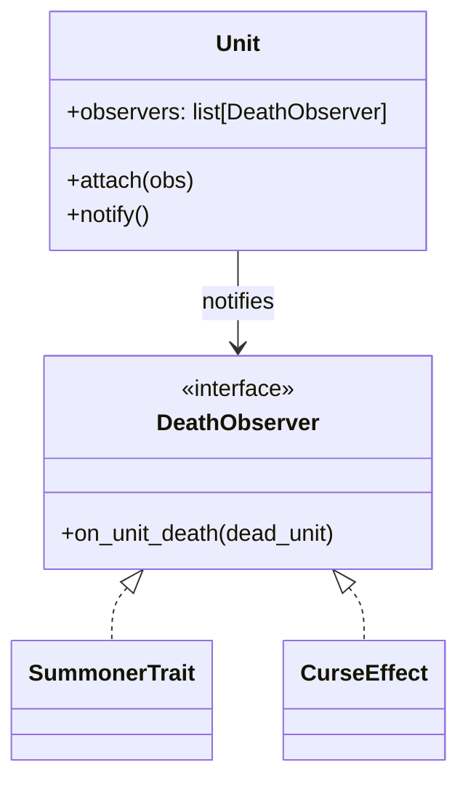
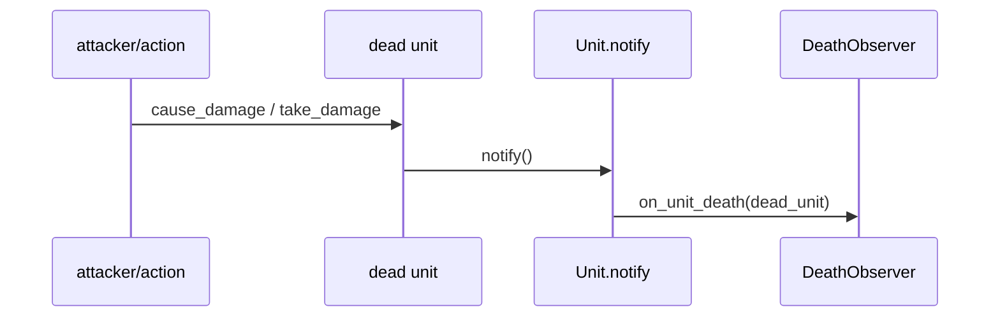

# 觀察者模式

## 模式意圖

讓一個事件發生時，可以自動通知多個關心這個事件的對象，而不用把反應邏輯硬寫死在事件來源本體裡。

## Problems

這個專案在沒有觀察者模式之前，至少同時受到這幾個 forces 拉扯：

- 單位死亡時，可能會觸發額外效果，例如召喚者回血、施咒者吸收 MP。
- 同一個死亡事件可能會有多個反應者，不想把所有效果都寫進 `Unit.take_damage()`。
- 死亡事件本身是共通事件，但觸發後的反應可能持續擴充，不希望每新增效果都回頭改 `Unit`。
- `Unit` 應該只負責自己死亡與通知，不應直接知道所有衍生業務規則。

## 套用設計模式前的簡圖

如果不套用觀察者模式，死亡邏輯很容易長成這樣：



這種寫法的問題是：

- `Unit` 會知道太多死亡後果。
- 每新增一種死亡後效果，就要回來改 `Unit`。
- 死亡事件和後續反應耦合太深。

## 套用設計模式後的 form

套用觀察者模式後，`Unit` 只做通知，真正反應交給 observers：



這時候：

- `Unit` 只需要發出通知
- 各個 observer 自己決定怎麼回應

## 專案中的角色對應

- `Subject`：`Unit`
- `Observer`：`DeathObserver`
- `ConcreteObserver`：`SummonerTrait`、`CurseEffect`
- 事件觸發點：`Unit.notify()`

## 核心程式位置

### Observer 介面

在 [models/observers/death_observer.py](/home/allentan/workspaces/Software-Design-Pattern-HW/homework5_rpg/v3/models/observers/death_observer.py:6)：

```python
class DeathObserver(ABC):
    def on_unit_death(self, dead_unit: Unit) -> None:
        ...
```

所有觀察者都必須實作：

- `on_unit_death(dead_unit)`

### Subject

在 [models/unit.py](/home/allentan/workspaces/Software-Design-Pattern-HW/homework5_rpg/v3/models/unit.py:21)：

```python
self.observers: list["DeathObserver"] = []
```

而且 `Unit` 還提供：

- [attach](/home/allentan/workspaces/Software-Design-Pattern-HW/homework5_rpg/v3/models/unit.py:54)
- [notify](/home/allentan/workspaces/Software-Design-Pattern-HW/homework5_rpg/v3/models/unit.py:58)

```python
def attach(self, obs: "DeathObserver") -> None:
    if obs not in self.observers:
        self.observers.append(obs)

def notify(self) -> None:
    for obs in self.observers:
        obs.on_unit_death(self)
```

這就是典型的 subject 行為。

## 兩個具體觀察者在做什麼？

### SummonerTrait

在 [models/observers/summoner_trait.py](/home/allentan/workspaces/Software-Design-Pattern-HW/homework5_rpg/v3/models/observers/summoner_trait.py:5)：

```python
def on_unit_death(self, dead_unit: Unit) -> None:
    if self.master.hp > 0:
        self.master.hp += 30
```

這代表：

- 被觀察的單位死亡時
- 召喚者可以回血

它主要用在召喚物身上。

### CurseEffect

在 [models/observers/curse_effect.py](/home/allentan/workspaces/Software-Design-Pattern-HW/homework5_rpg/v3/models/observers/curse_effect.py:5)：

```python
def on_unit_death(self, dead_unit: Unit) -> None:
    if self.curser.hp > 0:
        self.curser.hp += dead_unit.mp
```

這代表：

- 被詛咒的目標死亡時
- 下咒的人會吸收死者的 MP

## Observer 是在哪裡被掛上的？

### 召喚物死亡觀察

在 [models/actions/summon.py](/home/allentan/workspaces/Software-Design-Pattern-HW/homework5_rpg/v3/models/actions/summon.py:20)：

```python
slime.attach(SummonerTrait(actor))
```

意思是：

- 史萊姆死亡時
- 會通知 `SummonerTrait`

### 詛咒效果觀察

在 [models/actions/curse_skill.py](/home/allentan/workspaces/Software-Design-Pattern-HW/homework5_rpg/v3/models/actions/curse_skill.py:12)：

```python
target.attach(CurseEffect(actor))
```

意思是：

- 目標死亡時
- 會通知 `CurseEffect`

## 死亡事件怎麼真正被觸發？

在 [models/unit.py](/home/allentan/workspaces/Software-Design-Pattern-HW/homework5_rpg/v3/models/unit.py:38)：

```python
def take_damage(self, amt: int) -> None:
    ...
    if self.hp <= 0:
        self.hp = 0
        print(...)
        self.notify()
```

也就是：

- 先判斷死亡
- 一旦死亡，就發出通知

## 觀察者模式在本專案的流程圖



## 為什麼這樣設計是好的？

- `Unit` 不需要知道所有死亡後效果。
- 新增新的死亡觸發效果時，通常只要新增一個 observer。
- 同一個死亡事件可以同時通知多個觀察者。
- 死亡事件與後續反應解耦，系統更容易擴充。

## 一句話總結

這個專案的觀察者模式，就是把「單位死亡後的附加反應」抽成可訂閱的 observer，讓 `Unit` 只負責通知死亡事件，而不用自己知道所有後續效果。
