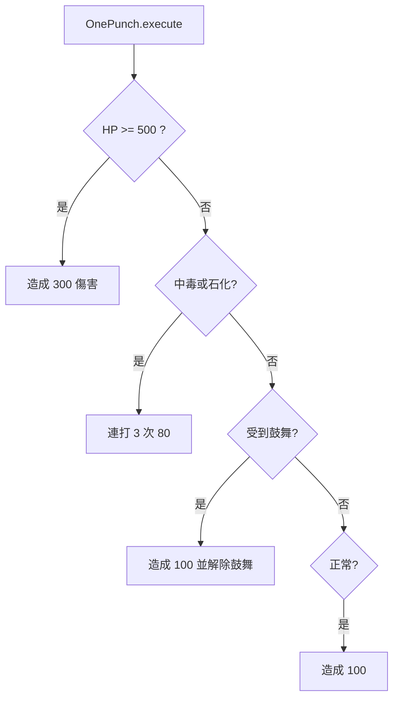
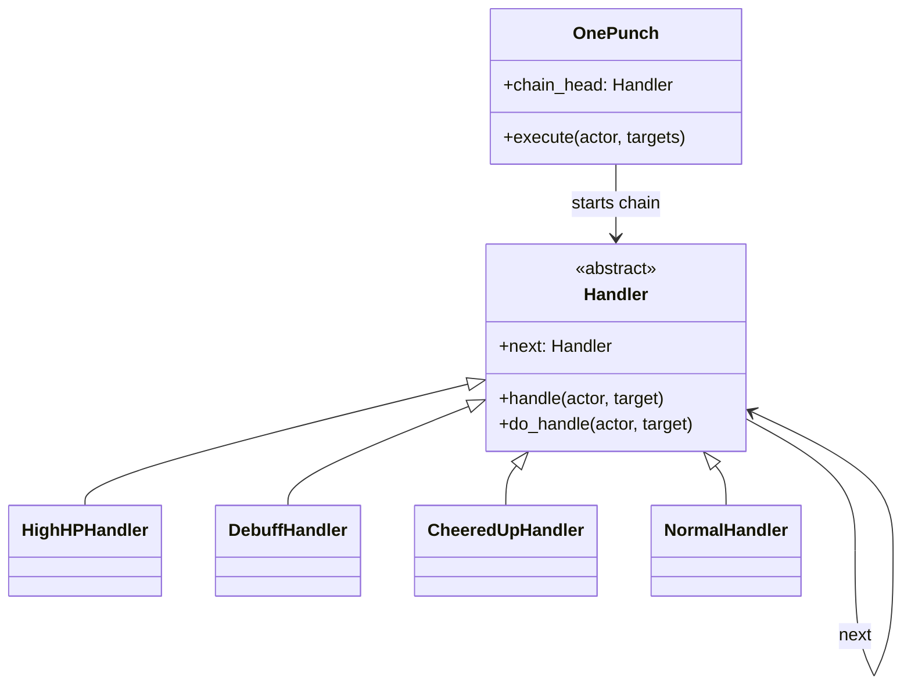
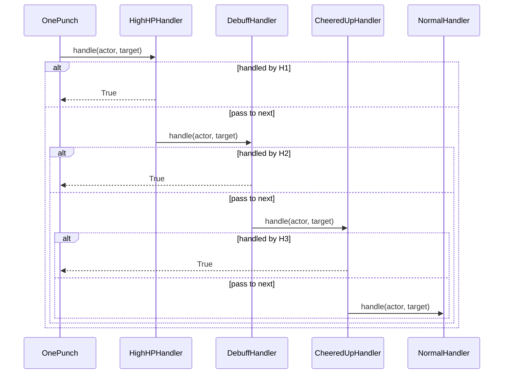

# 責任鏈模式

## 模式意圖

把一連串可能的處理規則串成鏈，讓請求沿著鏈依序傳遞，直到某個節點負責處理為止。

## Problems

這個專案在沒有責任鏈模式之前，至少同時受到這幾個 forces 拉扯：

- `OnePunch` 的傷害規則不是單一規則，而是依照目標條件不同套用不同處理方式。
- 這些規則有明確優先順序，例如高血量優先、異常狀態優先、受到鼓舞優先、最後才是正常狀態。
- 規則未來可能繼續增加，不希望把所有判斷都塞進 `OnePunch.execute()`。
- 主技能只想表達「把這個請求丟進規則鏈」，不想自己知道所有分支細節。

## 套用設計模式前的簡圖

如果不套用責任鏈模式，`OnePunch` 很容易變成一長串條件判斷：



這種寫法的問題是：

- 技能本身知道太多規則細節。
- 規則優先順序和規則內容全部混在一起。
- 新增一條規則時，要回頭修改巨大分支。

## 套用設計模式後的 form

套用責任鏈模式後，每條規則變成一個 handler：



這時候：

- `OnePunch` 只負責把請求送進鏈
- 每個 handler 只負責自己的一條規則

## 專案中的角色對應

- `Client`：`OnePunch`
- `Handler`：`Handler`
- `ConcreteHandler`：`HighHPHandler`、`DebuffHandler`、`CheeredUpHandler`、`NormalHandler`
- 被處理的請求：`(actor, target)` 這組攻擊上下文

## 核心程式位置

### Handler 介面

在 [models/cor/handler.py](/home/allentan/workspaces/Software-Design-Pattern-HW/homework5_rpg/v3/models/cor/handler.py:6)：

```python
class Handler(ABC):
    def handle(self, actor: Unit, target: Unit) -> bool:
        if self.do_handle(actor, target):
            return True
        if self.next:
            return self.next.handle(actor, target)
        return False
```

這段是責任鏈的核心：

- 先試自己處理
- 自己處理不了，就交給下一個

### 規則 1：高血量目標

在 [models/cor/high_hp_handler.py](/home/allentan/workspaces/Software-Design-Pattern-HW/homework5_rpg/v3/models/cor/high_hp_handler.py:5)：

```python
if target.hp >= 500:
    actor.cause_damage(target, 300)
    return True
```

### 規則 2：中毒或石化

在 [models/cor/debuff_handler.py](/home/allentan/workspaces/Software-Design-Pattern-HW/homework5_rpg/v3/models/cor/debuff_handler.py:7)：

```python
if isinstance(target.current_state, (PoisonedState, PetrochemicalState)):
    for _ in range(3):
        ...
    return True
```

### 規則 3：受到鼓舞

在 [models/cor/cheered_up_handler.py](/home/allentan/workspaces/Software-Design-Pattern-HW/homework5_rpg/v3/models/cor/cheered_up_handler.py:7)：

```python
if isinstance(target.current_state, CheeredUpState):
    actor.cause_damage(target, 100)
    target.change_state(NormalState())
    return True
```

### 規則 4：正常狀態

在 [models/cor/normal_handler.py](/home/allentan/workspaces/Software-Design-Pattern-HW/homework5_rpg/v3/models/cor/normal_handler.py:6)：

```python
if isinstance(target.current_state, NormalState):
    actor.cause_damage(target, 100)
    return True
```

## 鏈是在哪裡被串起來的？

在 [models/actions/one_punch.py](/home/allentan/workspaces/Software-Design-Pattern-HW/homework5_rpg/v3/models/actions/one_punch.py:11)：

```python
self.chain_head = HighHPHandler(
    DebuffHandler(
        CheeredUpHandler(
            NormalHandler(),
        ),
    ),
)
```

這個順序非常重要，因為它決定了優先權：

1. `HighHPHandler`
2. `DebuffHandler`
3. `CheeredUpHandler`
4. `NormalHandler`

## 責任鏈怎麼被啟動？

在 [models/actions/one_punch.py](/home/allentan/workspaces/Software-Design-Pattern-HW/homework5_rpg/v3/models/actions/one_punch.py:21)：

```python
def execute(self, actor: Unit, targets: list[Unit]) -> None:
    self.announce_targeted_use(actor, targets)
    for target in targets:
        self.chain_head.handle(actor, target)
```

這代表 `OnePunch` 本身並不處理規則，只是：

- 對每個目標啟動整條鏈

## 責任鏈模式在本專案的流程圖



## 為什麼這樣設計是好的？

- 每條規則只關心自己該不該處理。
- 規則優先順序清楚地表現在鏈的串接順序裡。
- 新增規則時，通常只要新增 handler 並決定插入鏈中的位置。
- `OnePunch` 技能本身更乾淨，不會充滿巢狀條件判斷。

## 一句話總結

這個專案的責任鏈模式，就是把 `OnePunch` 的多段條件規則拆成一串 handlers，讓攻擊請求沿鏈傳遞，直到某個 handler 依照目標條件接手處理為止。
