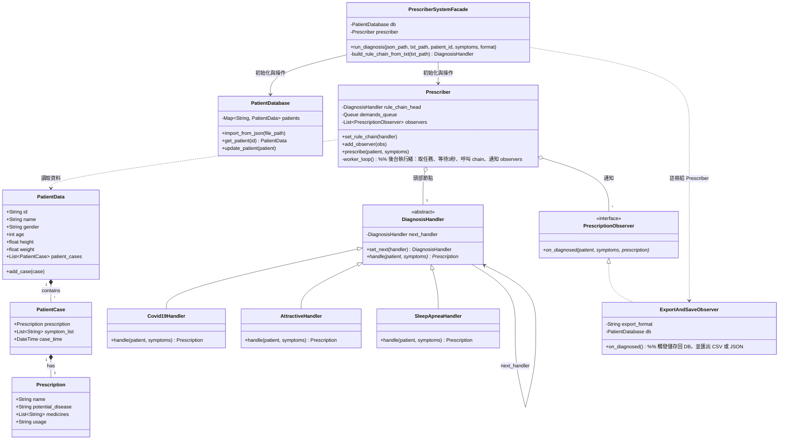

```mermaid
classDiagram
direction TB

    %% --- 實體模型 (Entities) ---
    class PatientData {
        +String id
        +String name
        +String gender
        +int age
        +float height
        +float weight
        +List~PatientCase~ patient_cases
        +add_case(case)
    }

    class PatientCase {
        +Prescription prescription
        +List~String~ symptom_list
        +DateTime case_time
    }

    class Prescription {
        +String name
        +String potential_disease
        +List~String~ medicines
        +String usage
    }

    PatientData "1" *-- "*" PatientCase : contains
    PatientCase "1" *-- "1" Prescription : has

    %% --- 核心系統 (Database & Prescriber) ---
    class PatientDatabase {
        -Map~String, PatientData~ patients
        +import_from_json(file_path)
        +get_patient(id) PatientData
        +update_patient(patient)
    }

    class Prescriber {
        -DiagnosisHandler rule_chain_head
        -Queue demands_queue
        -List~PrescriptionObserver~ observers
        +set_rule_chain(handler)
        +add_observer(obs)
        +prescribe(patient, symptoms) 
        -worker_loop() %% 後台執行緒：取任務、等待3秒、呼叫 chain、通知 observers
    }
    
    Prescriber ..> PatientData : 讀取資料

    %% --- 1. 責任鏈模式 (Chain of Responsibility) - 解決 B-3, C-2 ---
    class DiagnosisHandler {
        <<abstract>>
        -DiagnosisHandler next_handler
        +set_next(handler) DiagnosisHandler
        +handle(patient, symptoms)* Prescription
    }
    class Covid19Handler {
        +handle(patient, symptoms) Prescription
    }
    class AttractiveHandler {
        +handle(patient, symptoms) Prescription
    }
    class SleepApneaHandler {
        +handle(patient, symptoms) Prescription
    }

    DiagnosisHandler <|-- Covid19Handler
    DiagnosisHandler <|-- AttractiveHandler
    DiagnosisHandler <|-- SleepApneaHandler
    DiagnosisHandler --> DiagnosisHandler : next_handler
    Prescriber o-- "1" DiagnosisHandler : 頭部節點

    %% --- 2. 觀察者模式 (Observer) - 解決 B-2 ---
    class PrescriptionObserver {
        <<interface>>
        +on_diagnosed(patient, symptoms, prescription)*
    }
    class ExportAndSaveObserver {
        -String export_format
        -PatientDatabase db
        +on_diagnosed() %% 觸發儲存回 DB，並匯出 CSV 或 JSON
    }

    PrescriptionObserver <|.. ExportAndSaveObserver
    Prescriber o-- "*" PrescriptionObserver : 通知

    %% --- 3. 門面模式 (Facade) - 解決 C-3 ---
    class PrescriberSystemFacade {
        -PatientDatabase db
        -Prescriber prescriber
        +run_diagnosis(json_path, txt_path, patient_id, symptoms, format)
        -build_rule_chain_from_txt(txt_path) DiagnosisHandler
    }

    PrescriberSystemFacade --> PatientDatabase : 初始化與操作
    PrescriberSystemFacade --> Prescriber : 初始化與操作
    PrescriberSystemFacade ..> ExportAndSaveObserver : 註冊給 Prescriber
```
