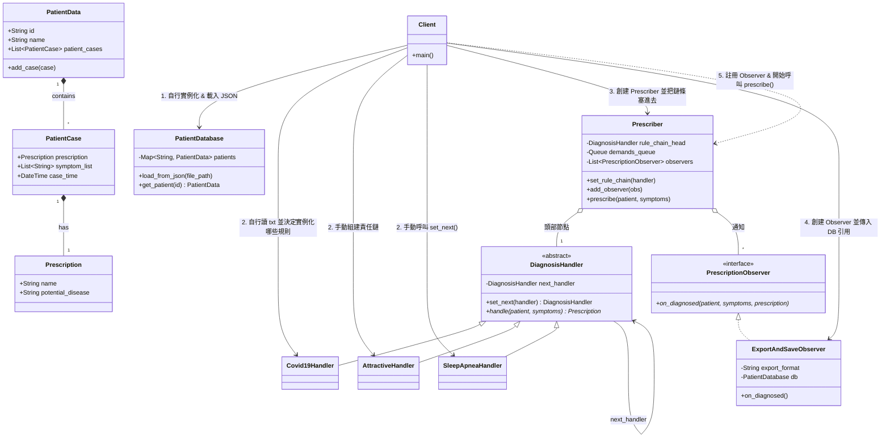

```mermaid
classDiagram
direction TB

    %% --- 沒用門面模式，Client 必須親自處理所有細節 ---
    class Client {
        +main()
    }

    %% --- 實體模型 (Entities) ---
    class PatientData {
        +String id
        +String name
        +List~PatientCase~ patient_cases
        +add_case(case)
    }

    class PatientCase {
        +Prescription prescription
        +List~String~ symptom_list
        +DateTime case_time
    }

    class Prescription {
        +String name
        +String potential_disease
    }

    PatientData "1" *-- "*" PatientCase : contains
    PatientCase "1" *-- "1" Prescription : has

    %% --- 核心系統 (Database & Prescriber) ---
    class PatientDatabase {
        -Map~String, PatientData~ patients
        +load_from_json(file_path)
        +get_patient(id) PatientData
    }

    class Prescriber {
        -DiagnosisHandler rule_chain_head
        -Queue demands_queue
        -List~PrescriptionObserver~ observers
        +set_rule_chain(handler)
        +add_observer(obs)
        +prescribe(patient, symptoms) 
    }

    %% --- 1. 責任鏈模式 (Chain of Responsibility) ---
    class DiagnosisHandler {
        <<abstract>>
        -DiagnosisHandler next_handler
        +set_next(handler) DiagnosisHandler
        +handle(patient, symptoms)* Prescription
    }
    class Covid19Handler { }
    class AttractiveHandler { }
    class SleepApneaHandler { }

    DiagnosisHandler <|-- Covid19Handler
    DiagnosisHandler <|-- AttractiveHandler
    DiagnosisHandler <|-- SleepApneaHandler
    DiagnosisHandler --> DiagnosisHandler : next_handler
    Prescriber o-- "1" DiagnosisHandler : 頭部節點

    %% --- 2. 觀察者模式 (Observer) ---
    class PrescriptionObserver {
        <<interface>>
        +on_diagnosed(patient, symptoms, prescription)*
    }
    class ExportAndSaveObserver {
        -String export_format
        -PatientDatabase db
        +on_diagnosed()
    }

    PrescriptionObserver <|.. ExportAndSaveObserver
    Prescriber o-- "*" PrescriptionObserver : 通知

    %% ==========================================
    %% 以下展示沒有門面模式時，Client 的災難性依賴
    %% ==========================================
    
    Client --> PatientDatabase : 1. 自行實例化 & 載入 JSON
    Client --> Covid19Handler : 2. 自行讀 txt 並決定實例化哪些規則
    Client --> AttractiveHandler : 2. 手動組建責任鏈
    Client --> SleepApneaHandler : 2. 手動呼叫 set_next()
    Client --> Prescriber : 3. 創建 Prescriber 並把鏈條塞進去
    Client --> ExportAndSaveObserver : 4. 創建 Observer 並傳入 DB 引用
    Client ..> Prescriber : 5. 註冊 Observer & 開始呼叫 prescribe() 
```