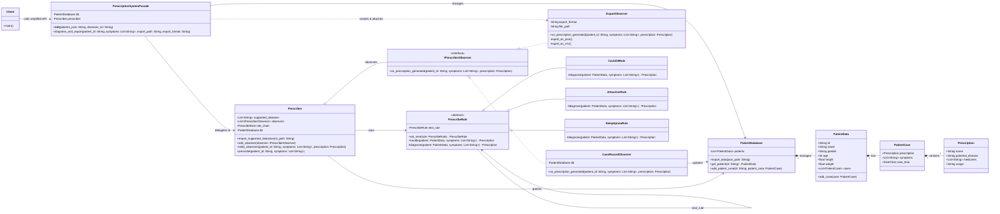

# OOD - Version 2 (完整套用責任鏈模式、觀察者模式、以及門面模式)

```mermaid
classDiagram
    direction LR
    %% Core Data Models
    class PatientData {
        +String id
        +String name
        +String gender
        +int age
        +float height
        +float weight
        +List~PatientCase~ cases
        +add_case(case: PatientCase)
    }
    
    class PatientCase {
        +Prescription prescription
        +List~String~ symptoms
        +DateTime case_time
    }

    class Prescription {
        +String name
        +String potential_disease
        +List~String~ medicines
        +String usage
    }

    %% Database
    class PatientDatabase {
        -List~PatientData~ patients
        +import_data(json_path: String)
        +get_patient(id: String) PatientData
        +add_patient_case(id: String, patient_case: PatientCase)
    }

    %% Observer Pattern Interfaces & Classes
    class IPrescriberObserver {
        <<interface>>
        +on_prescription_generated(patient_id: String, symptoms: List~String~, prescription: Prescription)
    }
    
    class CaseRecordObserver {
        -PatientDatabase db
        +on_prescription_generated(patient_id: String, symptoms: List~String~, prescription: Prescription)
    }

    class ExportObserver {
        -String export_format
        -String file_path
        +on_prescription_generated(patient_id: String, symptoms: List~String~, prescription: Prescription)
        -export_as_json()
        -export_as_csv()
    }

    %% Chain of Responsibility Pattern
    class PrescribeRule {
        <<abstract>>
        -PrescribeRule next_rule
        +set_next(rule: PrescribeRule) PrescribeRule
        +handle(patient: PatientData, symptoms: List~String~) Prescription
        #diagnose(patient: PatientData, symptoms: List~String~) Prescription
    }
    
    class Covid19Rule {
        #diagnose(patient: PatientData, symptoms: List~String~) Prescription
    }
    
    class AttractiveRule {
        #diagnose(patient: PatientData, symptoms: List~String~) Prescription
    }
    
    class SleepApneaRule {
        #diagnose(patient: PatientData, symptoms: List~String~) Prescription
    }

    %% Prescriber
    class Prescriber {
        -List~String~ supported_diseases
        -List~IPrescriberObserver~ observers
        -PrescribeRule rule_chain
        -PatientDatabase db
        +import_supported_diseases(txt_path: String)
        +add_observer(observer: IPrescriberObserver)
        -notify_observers(patient_id: String, symptoms: List~String~, prescription: Prescription)
        +prescribe(patient_id: String, symptoms: List~String~)
    }

    %% Facade Pattern
    class PrescriptionSystemFacade {
        -PatientDatabase db
        -Prescriber prescriber
        +__init__(patients_json: String, diseases_txt: String)
        +diagnose_and_export(patient_id: String, symptoms: List~String~, export_path: String, export_format: String)
    }

    %% Client (With Facade)
    class Client {
        +main()
    }

    %% Relationships
    PatientData "1" *-- "*" PatientCase : has
    PatientCase "1" *-- "1" Prescription : contains
    PatientDatabase "1" *-- "*" PatientData : manages
    
    Prescriber o-- IPrescriberObserver : observers
    Prescriber --> PrescribeRule : uses
    Prescriber --> PatientDatabase : queries
    
    IPrescriberObserver <|.. CaseRecordObserver
    IPrescriberObserver <|.. ExportObserver
    CaseRecordObserver --> PatientDatabase : updates
    
    PrescribeRule <|-- Covid19Rule
    PrescribeRule <|-- AttractiveRule
    PrescribeRule <|-- SleepApneaRule
    PrescribeRule --> PrescribeRule : next_rule
    
    PrescriptionSystemFacade --> Prescriber : delegates to
    PrescriptionSystemFacade --> PatientDatabase : manages
    PrescriptionSystemFacade ..> ExportObserver : creates & attaches
    
    Client --> PrescriptionSystemFacade : calls simplifed API
```
