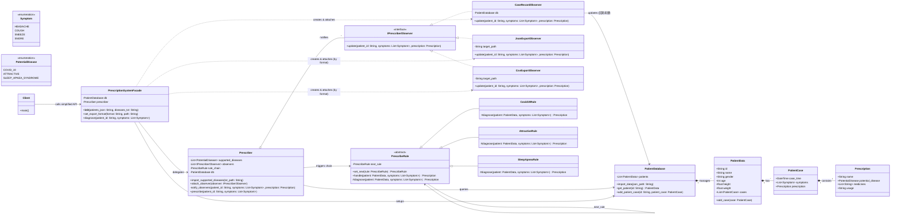

# OOD - Version 3 (修正版：完美整合門面、責任鏈與觀察者模式並加入 Enums)

```mermaid
classDiagram
    direction LR

    %% ================= Enums =================
    class Symptom {
        <<enumeration>>
        HEADACHE
        COUGH
        SNEEZE
        SNORE
    }

    class PotentialDisease {
        <<enumeration>>
        COVID_19
        ATTRACTIVE
        SLEEP_APNEA_SYNDROME
    }

    %% ================= Core Data Models =================
    class PatientData {
        +String id
        +String name
        +String gender
        +int age
        +float height
        +float weight
        +List~PatientCase~ cases
        +add_case(case: PatientCase)
    }
    
    class PatientCase {
        +DateTime case_time
        +List~Symptom~ symptoms
        +Prescription prescription
    }

    class Prescription {
        +String name
        +PotentialDisease potential_disease
        +List~String~ medicines
        +String usage
    }

    PatientData "1" *-- "*" PatientCase : has
    PatientCase "1" *-- "1" Prescription : contains

    %% ================= Database =================
    class PatientDatabase {
        -List~PatientData~ patients
        +import_data(json_path: String)
        +get_patient(id: String) PatientData
        +add_patient_case(id: String, patient_case: PatientCase)
    }
    PatientDatabase "1" *-- "*" PatientData : manages

    %% ================= Observer Pattern (包含回寫DB與通知外匯) =================
    class IPrescriberObserver {
        <<interface>>
        +update(patient_id: String, symptoms: List~Symptom~, prescription: Prescription)
    }
    
    class CaseRecordObserver {
        -PatientDatabase db
        +update(patient_id: String, symptoms: List~Symptom~, prescription: Prescription)
    }
    
    class JsonExportObserver {
        -String target_path
        +update(patient_id: String, symptoms: List~Symptom~, prescription: Prescription)
    }
    
    class CsvExportObserver {
        -String target_path
        +update(patient_id: String, symptoms: List~Symptom~, prescription: Prescription)
    }

    IPrescriberObserver <|.. CaseRecordObserver
    IPrescriberObserver <|.. JsonExportObserver
    IPrescriberObserver <|.. CsvExportObserver
    CaseRecordObserver --> PatientDatabase : updates (回寫病歷)

    %% ================= Chain of Responsibility Pattern =================
    class PrescribeRule {
        <<abstract>>
        -PrescribeRule next_rule
        +set_next(rule: PrescribeRule) PrescribeRule
        +handle(patient: PatientData, symptoms: List~Symptom~) Prescription
        #diagnose(patient: PatientData, symptoms: List~Symptom~) Prescription
    }
    
    class Covid19Rule {
        #diagnose(patient: PatientData, symptoms: List~Symptom~) Prescription
    }
    
    class AttractiveRule {
        #diagnose(patient: PatientData, symptoms: List~Symptom~) Prescription
    }
    
    class SleepApneaRule {
        #diagnose(patient: PatientData, symptoms: List~Symptom~) Prescription
    }

    PrescribeRule <|-- Covid19Rule
    PrescribeRule <|-- AttractiveRule
    PrescribeRule <|-- SleepApneaRule
    PrescribeRule --> PrescribeRule : next_rule

    %% ================= Prescriber (Subject) =================
    class Prescriber {
        -List~PotentialDisease~ supported_diseases
        -List~IPrescriberObserver~ observers
        -PrescribeRule rule_chain
        -PatientDatabase db
        +import_supported_diseases(txt_path: String)
        +attach_observer(observer: IPrescriberObserver)
        -notify_observers(patient_id: String, symptoms: List~Symptom~, prescription: Prescription)
        +prescribe(patient_id: String, symptoms: List~Symptom~)
    }

    Prescriber o-- "*" IPrescriberObserver : notifies
    Prescriber --> PrescribeRule : triggers chain
    Prescriber --> PatientDatabase : queries

    %% ================= Facade Pattern =================
    class PrescriptionSystemFacade {
        -PatientDatabase db
        -Prescriber prescriber
        +__init__(patients_json: String, diseases_txt: String)
        +set_export_format(format: String, path: String)
        +diagnose(patient_id: String, symptoms: List~Symptom~)
    }

    PrescriptionSystemFacade --> Prescriber : delegates
    PrescriptionSystemFacade --> PatientDatabase : setups
    PrescriptionSystemFacade ..> CaseRecordObserver : creates & attaches
    PrescriptionSystemFacade ..> JsonExportObserver : creates & attaches (by format)
    PrescriptionSystemFacade ..> CsvExportObserver : creates & attaches (by format)

    %% ================= Client =================
    class Client {
        +main()
    }

    Client --> PrescriptionSystemFacade : calls simplified API
```