# OOD - Version 4-1 (未套用 Facade 模式，並以標註展現 OOA Forces 衝突與設計意圖)

這份圖表移除了 `PrescriptionSystemFacade`，還原成 **Client 必須親自指揮各個子系統** 的狀態。同時，圖上利用了黃色背景的 `note` (便條紙) 將你提供的 OOA 圖上的「Forces (力量/衝突)」具體標示在對應的 OOD 模式上，幫助閱讀者理解為什麼這裡要套用這些設計模式，以及沒有 Facade 時 Client 面臨的易用性問題。

```mermaid
classDiagram
    direction LR

    %% ================= Enums =================
    class Symptom {
        <<enumeration>>
        HEADACHE
        COUGH
        SNEEZE
        SNORE
    }

    class PotentialDisease {
        <<enumeration>>
        COVID_19
        ATTRACTIVE
        SLEEP_APNEA_SYNDROME
    }

    %% ================= Core Data Models =================
    class PatientData {
        +String id
        +String name
        +String gender
        +int age
        +float height
        +float weight
        +List~PatientCase~ cases
        +add_case(case: PatientCase)
    }
    
    class PatientCase {
        +DateTime case_time
        +List~Symptom~ symptoms
        +Prescription prescription
    }

    class Prescription {
        +String name
        +PotentialDisease potential_disease
        +List~String~ medicines
        +String usage
    }

    PatientData "1" *-- "*" PatientCase : has
    PatientCase "1" *-- "1" Prescription : contains

    %% ================= Database =================
    class PatientDatabase {
        -List~PatientData~ patients
        +import_data(json_path: String)
        +get_patient(id: String) PatientData
        +add_patient_case(id: String, patient_case: PatientCase)
    }
    PatientDatabase "1" *-- "*" PatientData : manages

    %% ================= Observer Pattern (解決響應與外部擴充) =================
    class IPrescriberObserver {
        <<interface>>
        +update(patient_id: String, symptoms: List~Symptom~, prescription: Prescription)
    }
    note for IPrescriberObserver "<br/><b>【Force-OCP 開放封閉原則】</b><br/>👉 <b>開放</b>：Client 能任意擴充收到結果時要觸發的外部行為 (如新增 CSV, DB)。<br/>👉 <b>封閉</b>：不必修改 Prescriber 內部核心程式。<br/><br/><b>【Force-BV 響應型】</b><br/>👉 當發生 diagnosis 完成事件後，自動觸發響應操作 (紀錄病歷/檔案匯出)。"
    
    class CaseRecordObserver {
        -PatientDatabase db
        +update(patient_id: String, symptoms: List~Symptom~, prescription: Prescription)
    }
    
    class JsonExportObserver {
        -String target_path
        +update(patient_id: String, symptoms: List~Symptom~, prescription: Prescription)
    }

    IPrescriberObserver <|.. CaseRecordObserver
    IPrescriberObserver <|.. JsonExportObserver
    CaseRecordObserver --> PatientDatabase : updates 

    %% ================= Chain of Responsibility Pattern (解決規則擴充) =================
    class PrescribeRule {
        <<abstract>>
        -PrescribeRule next_rule
        +set_next(rule: PrescribeRule) PrescribeRule
        +handle(patient: PatientData, symptoms: List~Symptom~) Prescription
        #diagnose(patient: PatientData, symptoms: List~Symptom~) Prescription
    }
    note for PrescribeRule "<br/><b>【Force-OCP 開放封閉原則】</b><br/>👉 <b>開放</b>：未來會持續擴充全新疾病的診斷規則。<br/>👉 <b>封閉</b>：不必修改 Prescriber 診斷模組與既有 Rule。<br/><br/><b>【Force-BV 輸入比對型】</b><br/>👉 每一類對應的處理行為不同，依據打噴嚏、身高體重等特徵比對進行裁決。"
    
    class Covid19Rule {
        #diagnose(patient: PatientData, symptoms: List~Symptom~) Prescription
    }
    class AttractiveRule {
        #diagnose(patient: PatientData, symptoms: List~Symptom~) Prescription
    }
    class SleepApneaRule {
        #diagnose(patient: PatientData, symptoms: List~Symptom~) Prescription
    }

    PrescribeRule <|-- Covid19Rule
    PrescribeRule <|-- AttractiveRule
    PrescribeRule <|-- SleepApneaRule
    PrescribeRule --> PrescribeRule : next_rule

    %% ================= Prescriber (Subject) =================
    class Prescriber {
        -List~PotentialDisease~ supported_diseases
        -List~IPrescriberObserver~ observers
        -PrescribeRule rule_chain
        -PatientDatabase db
        +import_supported_diseases(txt_path: String)
        +attach_observer(observer: IPrescriberObserver)
        -notify_observers(patient_id: String, symptoms: List~Symptom~, prescription: Prescription)
        +prescribe(patient_id: String, symptoms: List~Symptom~)
    }

    Prescriber o-- "*" IPrescriberObserver : notifies
    Prescriber --> PrescribeRule : triggers chain
    Prescriber --> PatientDatabase : queries

    %% ================= Client =================
    class Client {
        +main()
    }
    note for Client "<br/><b>【Force-易用性 (衝突發生點)】</b><br/>👉 <b>期望</b>：希望 Client 用 1~3 行即可執行一趟完整流程。<br/>👉 <b>現實</b>：沒有 Facade 模式時，Client 被迫要自己手動建立 DB、<br/>手動建立 Prescriber、手動建立並掛載所有 Observer。<br/>導致高度耦合且嚴重違反高內聚與易用性！"

    Client --> PatientDatabase : 直接控制初始化
    Client --> Prescriber : 直接設定與呼叫診斷
    Client ..> CaseRecordObserver : 必須親自建立物件
    Client ..> JsonExportObserver : 必須親自建立物件

```

