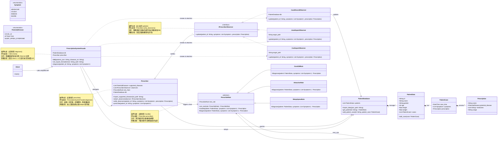

# OOD - Version 4 (加入架構註解與流程說明的版本)

```mermaid
classDiagram
    direction LR

    %% ================= Enums =================
    class Symptom {
        <<enumeration>>
        HEADACHE
        COUGH
        SNEEZE
        SNORE
    }

    class PotentialDisease {
        <<enumeration>>
        COVID_19
        ATTRACTIVE
        SLEEP_APNEA_SYNDROME
    }

    %% ================= Core Data Models =================
    class PatientData {
        +String id
        +String name
        +String gender
        +int age
        +float height
        +float weight
        +List~PatientCase~ cases
        +add_case(case: PatientCase)
    }
    
    class PatientCase {
        +DateTime case_time
        +List~Symptom~ symptoms
        +Prescription prescription
    }

    class Prescription {
        +String name
        +PotentialDisease potential_disease
        +List~String~ medicines
        +String usage
    }

    PatientData "1" *-- "*" PatientCase : has
    PatientCase "1" *-- "1" Prescription : contains

    %% ================= Database =================
    class PatientDatabase {
        -List~PatientData~ patients
        +import_data(json_path: String)
        +get_patient(id: String) PatientData
        +add_patient_case(id: String, patient_case: PatientCase)
    }
    PatientDatabase "1" *-- "*" PatientData : manages

    %% ================= Observer Pattern =================
    class IPrescriberObserver {
        <<interface>>
        +update(patient_id: String, symptoms: List~Symptom~, prescription: Prescription)
    }
    note for IPrescriberObserver "<br/>被呼叫者：此介面的 update()<br/>呼叫來源：Prescriber.notify_observers()<br/>目的：解耦診斷完成後的副作用(如寫檔/更新DB)<br/>對應流程：完成診斷後觸發外部行為"
    
    class CaseRecordObserver {
        -PatientDatabase db
        +update(patient_id: String, symptoms: List~Symptom~, prescription: Prescription)
    }
    
    class JsonExportObserver {
        -String target_path
        +update(patient_id: String, symptoms: List~Symptom~, prescription: Prescription)
    }
    
    class CsvExportObserver {
        -String target_path
        +update(patient_id: String, symptoms: List~Symptom~, prescription: Prescription)
    }

    IPrescriberObserver <|.. CaseRecordObserver
    IPrescriberObserver <|.. JsonExportObserver
    IPrescriberObserver <|.. CsvExportObserver
    CaseRecordObserver --> PatientDatabase : updates 

    %% ================= Chain of Responsibility Pattern =================
    class PrescribeRule {
        <<abstract>>
        -PrescribeRule next_rule
        +set_next(rule: PrescribeRule) PrescribeRule
        +handle(patient: PatientData, symptoms: List~Symptom~) Prescription
        #diagnose(patient: PatientData, symptoms: List~Symptom~) Prescription
    }
    note for PrescribeRule "<br/>被呼叫者：此類別的 handle()<br/>呼叫來源：Prescriber.prescribe()<br/>目的：將診斷請求沿著規則鏈傳遞<br/>對應流程：判斷病患符合哪種疾病的處方"
    
    class Covid19Rule {
        #diagnose(patient: PatientData, symptoms: List~Symptom~) Prescription
    }
    class AttractiveRule {
        #diagnose(patient: PatientData, symptoms: List~Symptom~) Prescription
    }
    class SleepApneaRule {
        #diagnose(patient: PatientData, symptoms: List~Symptom~) Prescription
    }

    PrescribeRule <|-- Covid19Rule
    PrescribeRule <|-- AttractiveRule
    PrescribeRule <|-- SleepApneaRule
    PrescribeRule --> PrescribeRule : next_rule

    %% ================= Prescriber (Subject) =================
    class Prescriber {
        -List~PotentialDisease~ supported_diseases
        -List~IPrescriberObserver~ observers
        -PrescribeRule rule_chain
        -PatientDatabase db
        +import_supported_diseases(txt_path: String)
        +attach_observer(observer: IPrescriberObserver)
        -notify_observers(patient_id: String, symptoms: List~Symptom~, prescription: Prescription)
        +prescribe(patient_id: String, symptoms: List~Symptom~)
    }
    note for Prescriber "<br/>被呼叫者：此類別的 prescribe()<br/>呼叫來源：PrescriptionSystemFacade.diagnose()<br/>目的：啟動 3 秒診斷，排隊機制，與廣播結果<br/>對應流程：核心診斷器與主題(Subject)發布者"

    Prescriber o-- "*" IPrescriberObserver : notifies
    Prescriber --> PrescribeRule : triggers chain
    Prescriber --> PatientDatabase : queries

    %% ================= Facade Pattern =================
    class PrescriptionSystemFacade {
        -PatientDatabase db
        -Prescriber prescriber
        +__init__(patients_json: String, diseases_txt: String)
        +set_export_format(format: String, path: String)
        +diagnose(patient_id: String, symptoms: List~Symptom~)
    }
    note for PrescriptionSystemFacade "<br/>被呼叫者：此類別的 diagnose()<br/>呼叫來源：Client.main()<br/>目的：隱藏複雜的初始化與 Observer 註冊<br/>對應流程：提供 Client 1~3 行即可執行的極簡 API"

    PrescriptionSystemFacade --> Prescriber : delegates
    PrescriptionSystemFacade --> PatientDatabase : setups
    PrescriptionSystemFacade ..> CaseRecordObserver : creates & attaches
    PrescriptionSystemFacade ..> JsonExportObserver : creates & attaches 
    PrescriptionSystemFacade ..> CsvExportObserver : creates & attaches 

    %% ================= Client =================
    class Client {
        +main()
    }

    Client --> PrescriptionSystemFacade : calls simplifed API
```