# OOD - Version 5 (完整公開操作註解版 + 互動對照表)

## 1. 架構圖 (包含所有核心公開操作之註解)

```mermaid
classDiagram
    direction LR

    %% ================= Enums =================
    class Symptom {
        <<enumeration>>
        HEADACHE
        COUGH
        SNEEZE
        SNORE
    }

    class PotentialDisease {
        <<enumeration>>
        COVID_19
        ATTRACTIVE
        SLEEP_APNEA_SYNDROME
    }

    %% ================= Core Data Models =================
    class PatientData {
        +String id
        +String name
        +String gender
        +int age
        +float height
        +float weight
        +List~PatientCase~ cases
        +add_case(case: PatientCase)
    }
    
    class PatientCase {
        +DateTime case_time
        +List~Symptom~ symptoms
        +Prescription prescription
    }

    class Prescription {
        +String name
        +PotentialDisease potential_disease
        +List~String~ medicines
        +String usage
    }

    PatientData "1" *-- "*" PatientCase : has
    PatientCase "1" *-- "1" Prescription : contains

    %% ================= Database =================
    class PatientDatabase {
        -List~PatientData~ patients
        +import_data(json_path: String)
        +get_patient(id: String) PatientData
        +add_patient_case(id: String, patient_case: PatientCase)
    }
    note for PatientDatabase "<br/>【1】import_data<br/>呼叫來源：Facade.__init__()<br/>目的：從 JSON 載入病患<br/><br/>【2】get_patient<br/>呼叫來源：Prescriber.prescribe()<br/>目的：取得患者詳細以供診斷<br/><br/>【3】add_patient_case<br/>呼叫來源：CaseRecordObserver.update()<br/>目的：存入最新病歷至患者資料內"
    
    PatientDatabase "1" *-- "*" PatientData : manages

    %% ================= Observer Pattern =================
    class IPrescriberObserver {
        <<interface>>
        +update(patient_id: String, symptoms: List~Symptom~, prescription: Prescription)
    }
    note for IPrescriberObserver "<br/>【4】update<br/>呼叫來源：Prescriber.notify_observers()<br/>目的：廣播診斷結果給訂閱者"
    
    class CaseRecordObserver {
        -PatientDatabase db
        +update(patient_id: String, symptoms: List~Symptom~, prescription: Prescription)
    }
    
    class JsonExportObserver {
        -String target_path
        +update(patient_id: String, symptoms: List~Symptom~, prescription: Prescription)
    }
    
    class CsvExportObserver {
        -String target_path
        +update(patient_id: String, symptoms: List~Symptom~, prescription: Prescription)
    }

    IPrescriberObserver <|.. CaseRecordObserver
    IPrescriberObserver <|.. JsonExportObserver
    IPrescriberObserver <|.. CsvExportObserver

    %% ================= Chain of Responsibility Pattern =================
    class PrescribeRule {
        <<abstract>>
        -PrescribeRule next_rule
        +set_next(rule: PrescribeRule) PrescribeRule
        +handle(patient: PatientData, symptoms: List~Symptom~) Prescription
        #diagnose(patient: PatientData, symptoms: List~Symptom~) Prescription
    }
    note for PrescribeRule "<br/>【5】set_next<br/>呼叫來源：Prescriber.__init__() 或設定期<br/>目的：串起責任鏈<br/><br/>【6】handle<br/>呼叫來源：Prescriber.prescribe() 或 前一個 Rule<br/>目的：判斷並轉交給下一個規則"
    
    class Covid19Rule {
        #diagnose(patient: PatientData, symptoms: List~Symptom~) Prescription
    }
    class AttractiveRule {
        #diagnose(patient: PatientData, symptoms: List~Symptom~) Prescription
    }
    class SleepApneaRule {
        #diagnose(patient: PatientData, symptoms: List~Symptom~) Prescription
    }

    PrescribeRule <|-- Covid19Rule
    PrescribeRule <|-- AttractiveRule
    PrescribeRule <|-- SleepApneaRule
    PrescribeRule --> PrescribeRule : next_rule

    %% ================= Prescriber (Subject) =================
    class Prescriber {
        -List~PotentialDisease~ supported_diseases
        -List~IPrescriberObserver~ observers
        -PrescribeRule rule_chain
        -PatientDatabase db
        +import_supported_diseases(txt_path: String)
        +attach_observer(observer: IPrescriberObserver)
        -notify_observers(patient_id: String, symptoms: List~Symptom~, prescription: Prescription)
        +prescribe(patient_id: String, symptoms: List~Symptom~)
    }
    note for Prescriber "<br/>【7】import_supported_diseases<br/>呼叫來源：Facade.__init__()<br/>目的：載入可診斷疾病<br/><br/>【8】attach_observer<br/>呼叫來源：Facade.set_export_format() 或 Client<br/>目的：訂閱診斷完成事件<br/><br/>【9】prescribe<br/>呼叫來源：Facade.diagnose()<br/>目的：啟動 3 秒診斷、觸發責任鏈、並呼叫 notify_observers"

    Prescriber o-- "*" IPrescriberObserver : notifies
    Prescriber --> PrescribeRule : triggers chain
    Prescriber --> PatientDatabase : queries

    %% ================= Facade Pattern =================
    class PrescriptionSystemFacade {
        -PatientDatabase db
        -Prescriber prescriber
        +__init__(patients_json: String, diseases_txt: String)
        +set_export_format(format: String, path: String)
        +diagnose(patient_id: String, symptoms: List~Symptom~)
    }
    note for PrescriptionSystemFacade "<br/>【10】__init__<br/>呼叫來源：Client.main()<br/>目的：統一初始化 DB 與 Prescriber, 並載入病患與疾病檔<br/><br/>【11】set_export_format<br/>呼叫來源：Client.main()<br/>目的：包裝建立 Observer 並 Attach 的過程<br/><br/>【12】diagnose<br/>呼叫來源：Client.main()<br/>目的：簡化呼叫，將參數轉交 Prescriber.prescribe()"

    PrescriptionSystemFacade --> Prescriber : delegates
    PrescriptionSystemFacade --> PatientDatabase : setups
    PrescriptionSystemFacade ..> CaseRecordObserver : creates & attaches
    PrescriptionSystemFacade ..> JsonExportObserver : creates & attaches 
    PrescriptionSystemFacade ..> CsvExportObserver : creates & attaches 

    %% ================= Client =================
    class Client {
        +main()
    }

    Client --> PrescriptionSystemFacade : calls simplifed API
```

---

## 2. 核心操作互動對照表

| 編號 | 類別 | 公開操作方法 | 呼叫來源 | 對應流程 / 目的 |
|---|---|---|---|---|
| **1** | `PatientDatabase` | `import_data(json_path)` | `Facade.__init__()` | **【系統初始化】** 載入病患初始庫，對應需求 C-1 |
| **2** | `PatientDatabase` | `get_patient(id)` | `Prescriber.prescribe()` | **【診斷前置】** 取出基本資料，準備餵給分析規則 |
| **3** | `PatientDatabase` | `add_patient_case(...)` | `CaseRecordObserver.update()` | **【診斷後遺症】** 觀測到處方產生後，更新內部的病歷 |
| **4** | `IPrescriberObserver` | `update(...)` | `Prescriber.notify_observers()` | **【事件通知】** 將處方廣播給所有訂閱者 (寫檔、回寫 DB) |
| **5** | `PrescribeRule` | `set_next(rule)` | `Prescriber.__init__()` | **【責任鏈初始化】** 將各項判斷規則串聯成鏈 |
| **6** | `PrescribeRule` | `handle(...)` | `Prescriber.prescribe()` | **【核心推論】** 啟動判定，不符則轉交下一棒 |
| **7** | `Prescriber` | `import_supported_diseases(...)`| `Facade.__init__()` | **【系統初始化】** 指定該系統支援哪些疾病，對應需求 C-2 |
| **8** | `Prescriber` | `attach_observer(observer)` | `Facade.set_export_format()` | **【觀察者訂閱】** 把設定好的 Observer 綁定到發布者身上 |
| **9** | `Prescriber` | `prescribe(...)` | `Facade.diagnose()` | **【發起流程】** 啟動 3 秒診斷、觸發責任鏈、收到處方、發送通知 |
| **10** | `Facade` | `__init__(...)` | `Client.main()` | **【簡化初始化】** Client 傳入兩檔案，內部搞定所有的子系統建置 |
| **11** | `Facade` | `set_export_format(...)` | `Client.main()` | **【簡化設定】** 包裝建立 Record/JSON/CSV Observer 的複雜細節 |
| **12** | `Facade` | `diagnose(...)` | `Client.main()` | **【1-3行診斷】** 用戶最終極簡的呼叫介面，對應需求 C-3 |