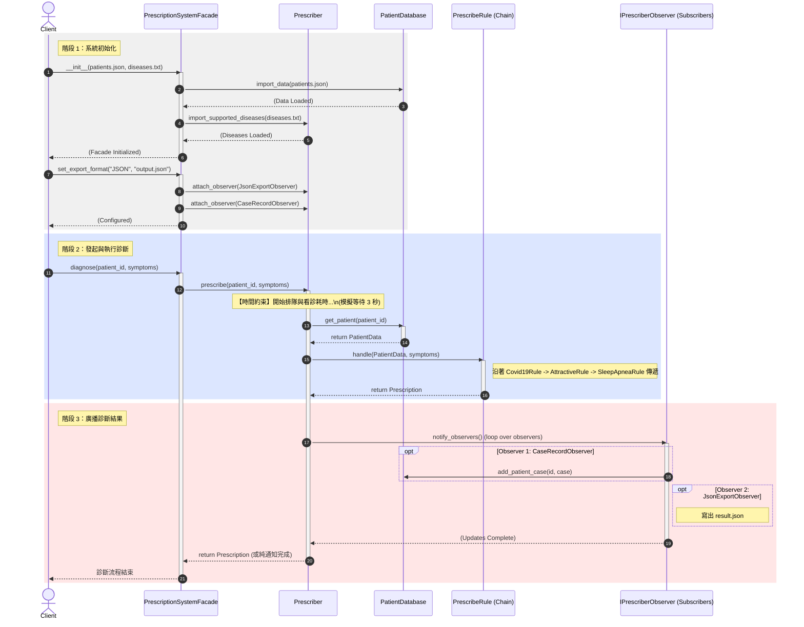

# 處方診斷系統 - 循序圖 (Sequence Diagram)

此循序圖展示了 Client 如何透過 Facade API 發起診斷，以及系統內部的 3 秒等待機制、責任鏈診斷流程、與診斷完成後的觀察者通知廣播。

```mermaid
sequenceDiagram
    autonumber
    
    actor Client
    participant Facade as PrescriptionSystemFacade
    participant Prescriber
    participant DB as PatientDatabase
    participant Rule as PrescribeRule (Chain)
    participant Obs as IPrescriberObserver (Subscribers)
    
    %% ================= 階段 1：系統初始化 =================
    rect rgb(240, 240, 240)
        Note right of Client: 階段 1：系統初始化
        Client->>Facade: __init__(patients.json, diseases.txt)
        activate Facade
        
        Facade->>DB: import_data(patients.json)
        DB-->>Facade: (Data Loaded)
        
        Facade->>Prescriber: import_supported_diseases(diseases.txt)
        Prescriber-->>Facade: (Diseases Loaded)
        
        Facade-->>Client: (Facade Initialized)
        deactivate Facade
        
        Client->>Facade: set_export_format("JSON", "output.json")
        activate Facade
        Facade->>Prescriber: attach_observer(JsonExportObserver)
        Facade->>Prescriber: attach_observer(CaseRecordObserver)
        Facade-->>Client: (Configured)
        deactivate Facade
    end

    %% ================= 階段 2：發起診斷與等待 =================
    rect rgb(220, 230, 255)
        Note right of Client: 階段 2：發起與執行診斷
        Client->>Facade: diagnose(patient_id, symptoms)
        activate Facade
        Facade->>Prescriber: prescribe(patient_id, symptoms)
        activate Prescriber
        
        Note over Prescriber: 【時間約束】開始排隊與看診耗時...\n(模擬等待 3 秒)
        
        Prescriber->>DB: get_patient(patient_id)
        activate DB
        DB-->>Prescriber: return PatientData
        deactivate DB
        
        %% --- 責任鏈分派 ---
        Prescriber->>Rule: handle(PatientData, symptoms)
        activate Rule
        Note right of Rule: 沿著 Covid19Rule -> AttractiveRule -> SleepApneaRule 傳遞
        Rule-->>Prescriber: return Prescription
        deactivate Rule
    end

    %% ================= 階段 3：事件廣播與回寫 =================
    rect rgb(255, 230, 230)
        Note right of Client: 階段 3：廣播診斷結果
        %% --- 通知 Observer ---
        Prescriber->>Obs: notify_observers() (loop over observers)
        activate Obs
        
        opt Observer 1: CaseRecordObserver
            Obs->>DB: add_patient_case(id, case)
        end
        opt Observer 2: JsonExportObserver
            Note right of Obs: 寫出 result.json
        end
        
        Obs-->>Prescriber: (Updates Complete)
        deactivate Obs
        
        Prescriber-->>Facade: return Prescription (或純通知完成)
        deactivate Prescriber
        Facade-->>Client: 診斷流程結束
        deactivate Facade
    end
```