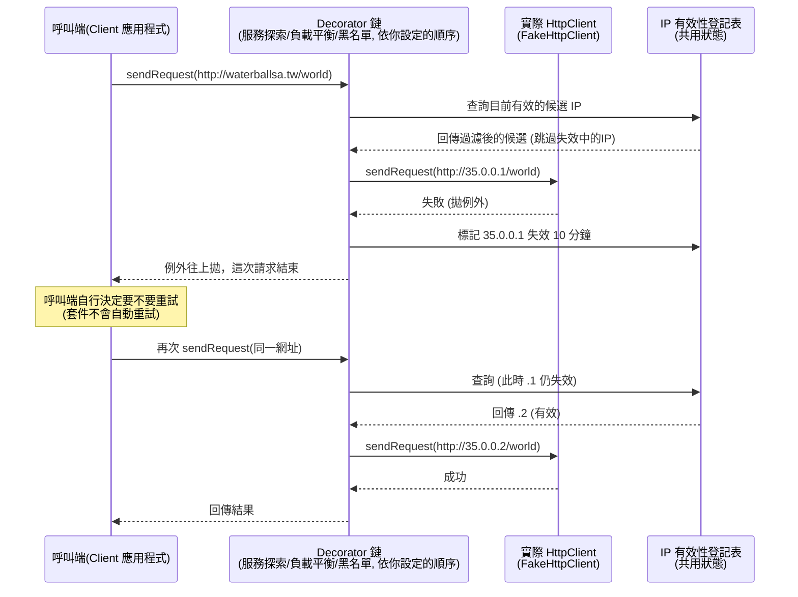

# 題目疑問解答：服務探索 / 負載平衡 / 黑名單

這份文件針對題目描述中容易讓人卡住的流程細節做澄清，並不涉及具體程式碼實作，重點在於「行為/時序」的釐清，讓你能放心去做 OOADP。

---

## 一、服務探索 (Service Discovery) 機制的流程疑問

### Q1：第一個 IP 探索失敗、換第二個成功了，還要不要繼續嘗試第三個？

**不需要，也不會。**

題目範例中的 1️⃣ 2️⃣ 3️⃣ 是**三次各自獨立的 Client 請求**，不是同一次請求內部的重試循環：

- 第 1 次請求 `http://waterballsa.tw/world`：選到 `.1` → 送出後失敗 → 這一次請求本身就**結束（失敗/拋例外）**，同時把 `.1` 標記為失效 10 分鐘。
- 第 2 次請求（Client 重新呼叫一次）：這時 `.1` 是失效狀態，所以服務探索機制選「序列中第一個仍然有效的 IP」→ 選到 `.2` → 送出後成功。
- 第 3 次請求（10 分鐘後，Client 又重新呼叫一次）：`.1` 已經恢復有效，而且它排在序列最前面，所以又被選中 → 失敗 → 再次標記失效。

也就是說，**服務探索機制的職責只有「幫這一次請求選出一個 IP」**，它不負責「這次失敗了，那我自動幫你換下一個 IP 再試一次」。失敗就是失敗，例外會被拋出，**是否要重試（呼叫下一次 `sendRequest`）是呼叫端（Client 應用程式碼）的決定**，不是套件內部自動做的事。

### Q2：為什麼 10 分鐘後又跑回去選第一個，而不是接續上次選到的 `.2`？

因為服務探索機制**沒有「記住上一次選到哪裡」的狀態**——它每次都是「從序列頭開始找，找到第一個目前有效的 IP」這樣單純的規則。

- 「記住上一次選到哪」、「輪流分配」是**負載平衡機制**的職責，跟服務探索是兩個獨立的關注點（也因此才會拆成兩個可自由排列組合的 Decorator）。
- 單獨只有服務探索、沒開負載平衡的情況下，行為就是「永遠選序列中第一個有效的 IP」，所以 `.1` 恢復有效後自然又會被排到最優先。

### Q3：這個案例中，什麼情況下才會用到第三個 IP (`.3`)？

只有當**序列中排在它前面的所有 IP 都同時處於失效狀態**時，才會輪到 `.3`。例如：

- 純服務探索（沒開負載平衡）：`.1` 失效中，這時 `.2` 也剛好送出失敗被標記失效（還在各自的 10 分鐘失效窗口內）→ 下一次請求時，`.1`、`.2` 都無效，`.3` 才會被選中。
- 有開負載平衡：假設某一輪要輪到 `.2`，但 `.2` 剛好是失效狀態，負載平衡在挑選時也要跳過失效 IP，於是可能改選下一個有效的 `.3`。

簡單說：**只要前面的候選還「有效」，就永遠輪不到後面的。**

### Q4：被標記失敗之後，什麼時候／如何重新變回「有效」？

這其實不是一個「主動重新探索」的背景機制，而是一個**惰性檢查（lazy check）**：

1. 每個 IP 維護一個「失效到期時間」的狀態（例如：`invalidUntil = 現在時間 + 10 分鐘`）。
2. 請求失敗時，把該 IP 的 `invalidUntil` 設成「現在 + 10 分鐘」。
3. **每一次要挑選 IP 時**（不論是服務探索或負載平衡挑選候選清單），才去檢查：這個 IP 的 `invalidUntil` 是否已經過了現在時間？
   - 還沒過 → 視為失效，跳過不選。
   - 已經過了 → 視為有效，可以被選中。

沒有計時器在背景主動把狀態切回「有效」，是**每次查詢/挑選當下**才判斷「現在算不算過了 10 分鐘」。這樣設計也比較簡單、不需要額外的排程機制。

---

## 二、負載平衡機制的疑問

> 題目：「如同服務探索機制，失效的 IP 位址並不會被選擇為伺服器 IP，直到該 IP 恢復生效為止。」

### Q：這裡判定「失效」是在服務探索階段被標記，還是負載平衡自己判定？

**兩者都不是「判定/標記」失效的人，真正標記失效的時機點是「實際送出 HTTP 請求之後、得知請求失敗的當下」。**

可以把「選 IP」跟「標記失效」拆成兩件不同的事：

| 動作                                       | 發生時機                                                             | 誰負責                                                                                         |
| ------------------------------------------ | -------------------------------------------------------------------- | ---------------------------------------------------------------------------------------------- |
| **讀取**某 IP 是否有效（用來過濾候選清單） | 挑選 IP 的當下（服務探索挑第一個有效的、負載平衡輪流挑下一個有效的） | 服務探索、負載平衡都會做這個「讀取」動作                                                       |
| **寫入**某 IP 為失效狀態                   | 實際發送 Http 請求之後，得知**這次請求失敗**了                       | 是由「送出請求」這一層（也就是最底層，實際呼叫 `FakeHttpClient` 之後）觸發回饋，才寫入失效狀態 |

負載平衡機制**不會自己去判定「這個 IP 有沒有失敗」**——因為它在「挑 IP」的當下，請求根本還沒送出去，它不可能知道結果。它唯一要遵守的規則是：**挑選時要跳過目前處於失效狀態的 IP**。

由於服務探索跟負載平衡兩個機制的排列順序可以任意調換（甚至可以只開負載平衡、不開服務探索），代表「IP 是否有效」這份狀態**必須是一個共用的登記表**（例如可以想成一個獨立元件，記錄「某個 IP 目前有效/失效到什麼時候」），而不是私屬於服務探索這個 Decorator 內部的資料。兩個機制都只是去「查」這份共用登記表來過濾候選名單；真正「更新」這份表格的動作，則是在請求真正發送、失敗之後才觸發。

這是一個設計上你需要自己決定「由誰擁有這份狀態」的點，題目沒有強制規定實作細節，只要行為符合上述時序即可。

---

## 三、黑名單機制的疑問

### Q1：黑名單表的格式，是不是也跟服務探索表一樣是 `host: ip1, ip2, ip3`？

**不是，你理解錯了一點點 —— 黑名單表跟服務探索的對照表是兩種不同格式的配置檔。**

題目原文：

> 套件的 Client 首先要提供一個黑名單表，表中記載著一系列的黑名單 **Host**（以逗號隔開）。

服務探索表是「Host → 一序列 IP」的**對照表**：

```
waterballsa.tw: 35.0.0.1, 35.0.0.2, 35.0.0.3
```

黑名單表則單純是一串 **Host 名稱清單**，用逗號隔開，沒有 IP 對照：

```
waterballsa.tw, evil.com, test.tw
```

兩者的用途也不同：服務探索表是拿來做「Host → IP」的替換，黑名單表則是拿來檢查「請求網址中的 Host 在不在這份黑名單清單裡」。

### Q2：黑名單機制「中止此請求並拋出例外」，是整個程式停止運作，還是繼續運作？

**只是這一次請求被中止，不是整個應用程式（process）停止運作。**

「拋出例外 (throw Exception)」在一般程式語言中的意思就是：這個呼叫鏈（call stack）從拋出點開始往上傳遞，直到被某層 `catch` 住為止。以這題來說：

- Http Client 套件內部：黑名單機制發現命中黑名單 → 拋出例外 → 這次 `sendRequest(...)` 呼叫就此中斷，不會再往下（服務探索/負載平衡/實際送出）繼續執行。
- 這個例外會往外拋給**呼叫這個套件的應用程式碼**（也就是使用你這個 Http Client 套件的人）。
- 由呼叫端自行決定要怎麼處理：可以 `catch` 起來印 log、顯示錯誤訊息後繼續跑下一筆請求；如果呼叫端沒有處理、又沒有再往上層 catch，才有可能一路往上蔓延到 `main`，導致整個程式真的中止。

所以「中止請求」是**單次請求層級**的行為，跟「整個程式的生命週期是否結束」是兩件事——後者取決於呼叫端有沒有處理這個例外。

---

## 小結：一張時序圖幫助理解



重點整理：

1. **一次請求 = 一次選 IP + 一次實際送出**，失敗就整包結束、拋例外，不會在同一次請求內自動換下一個候選重試。
2. **服務探索**永遠「選序列中第一個有效的」；**負載平衡**才負責「記住輪到誰、依序輪流」；兩者都只讀取共用的 IP 有效性狀態，不互相干涉彼此的職責。
3. **標記失效**的動作發生在「實際送出請求、得知失敗」的那一刻，而「判斷有效與否」則是用 lazy check（比對失效到期時間 vs 現在時間）。
4. **黑名單表**格式是單純的 host 清單（逗號分隔），跟服務探索的 host-IP 對照表不同。
5. **拋出例外**只中止「這一次請求」，不代表整個程式終止，由呼叫端決定如何處理這個例外。

---

## 四、既然兩個機制都要標記/尊重「IP 失效」，服務探索還剩下什麼獨有的用處？（題目描述是不是有缺陷？）

### 你的觀察很敏銳，而且點出了一個重點：「IP 失效」這件事，題目文字上寫得像是服務探索的專屬功能，但其實不是。

回頭看題目原文的兩處：

> 服務探索：「...若此請求失敗了，則將此 IP 從序列中暫時失效 (10 分鐘)...」
> 負載平衡：「**如同服務探索機制**，失效的 IP 位址並不會被選擇為伺服器 IP，直到該 IP 恢復生效為止。」

第二句話用「如同服務探索機制」帶過，語意上其實已經在講：**這是同一套規則，兩邊都要遵守**，而不是「負載平衡另外自己又做了一次一樣的事」。只是因為服務探索小節寫在前面、先把規則講完，導致讀起來容易誤會成「這是服務探索的附加功能，負載平衡只是蹭一下」。

再對照程式設計需求 B.2.a：

> 「不管是哪一種排列組合，每一個機制都能依照同一套邏輯順利運行。」

這句話幾乎是直接點名答案：**IP 失效狀態不能是服務探索私有的東西**。想像一下「只開負載平衡、不開服務探索」，或「負載平衡排在服務探索前面」這種組合——負載平衡都必須自己能判斷「這個候選現在是不是失效」，如果失效狀態被鎖死在服務探索類別內部，這些組合就會壞掉。

**所以我的看法是**：與其說是題目的邏輯缺陷，不如說是**自然語言敘述上的模糊**——它把一個「跨機制共用」的規則，用「附屬在某一個機制底下」的方式帶出來，確實容易誤導。但如果你把 B.2.a 那句話一起看，題目其實已經把「這必須是共用邏輯」的答案埋進去了，比較像是一個**故意留給你自己發現的設計陷阱**，而不是單純寫錯或漏寫。

### 那服務探索到底剩下什麼「獨有」的職責？

拆開來看，「跳過失效 IP」只是兩個機制都要遵守的**共用規則**，真正各自獨有、不能互相取代的職責是：

| 機制                      | 獨有職責                                                                                                                                                                                                                                      | 不是它的職責                                                        |
| ------------------------- | --------------------------------------------------------------------------------------------------------------------------------------------------------------------------------------------------------------------------------------------- | ------------------------------------------------------------------- |
| **服務探索**              | 1. 把網址中的 **Host 解析/替換成 IP**（沒有它，請求就是直接打去原本的 Host，根本沒有多個 IP 候選可言）<br>2. 提供**預設的退化選擇策略**：如果沒開負載平衡，自己也要能獨立選出一個 IP，用的規則是「永遠選序列中第一個有效的」                  | 「輪流」分配、「記住上次選到哪」                                    |
| **負載平衡**              | 提供 **Round Robin 的選擇策略**（記住游標、依序輪流），套用在「當下可用的候選清單」上——這清單可能是服務探索解析出來的一串 IP，也可能只是原始網址本身（例如「黑名單 → 負載平衡 → 服務探索」順序下，負載平衡拿到的候選只有 1 個，等於直接選它） | Host → IP 的解析、標記/查詢 IP 是否失效這件事本身                   |
| **（共用）IP 有效性狀態** | 記錄「哪個 IP 現在失效到什麼時候」，供任何需要過濾候選的機制查詢；並在**實際送出請求失敗後**被更新                                                                                                                                            | 不屬於任一機制專有，建議設計成獨立於這兩個 Decorator 之外的共用元件 |

也就是說：**服務探索的核心價值是「名稱解析」**（Host → IP 清單），**負載平衡的核心價值是「選擇策略」**（輪流 vs. 預設選第一個）。兩者都需要借助同一份「IP 是否失效」的共用狀態來過濾候選，但這份狀態本身既不是服務探索的專利，也不是負載平衡發明的——它是兩者都依賴的第三方共用知識。

如果你在設計時把這份「IP 有效性登記表」抽成一個獨立的協作者（而不是塞進服務探索或負載平衡任何一個 Decorator 的私有欄位），那無論排列組合怎麼變、開幾個機制，行為都能保持一致——這其實就是題目要你透過「排列組合都要能動」這條需求，逼你發現並解開的設計題。

---

## 五、「服務探索 → 負載平衡 → 黑名單」範例中，黑名單檢查的對象是什麼？

### Q1：這個順序下，黑名單表設的應該是 `35.0.0.1, 35.0.0.2, 35.0.0.3` 這種 IP，而不是 `waterballsa.tw` 這種 Host，對吧？

**你沒有誤解，理解正確。**

黑名單機制本身很單純：**只檢查「這個當下的請求網址裡的 Host 欄位」有沒有出現在黑名單清單中**，它不管這個 Host 欄位裡填的是網域名稱還是 IP 位址，反正就是字串比對。

在「服務探索 → 負載平衡 → 黑名單」這個順序下：

1. 服務探索先把 `http://waterballsa.tw/mail` 的 Host 解析成一串 IP 候選 `[35.0.0.1, 35.0.0.2, 35.0.0.3, 35.0.0.4]`。
2. 負載平衡從中輪流選出 `http://35.0.0.1/mail`——**這時候網址裡的 Host 已經被換成 IP 了，原本的 `waterballsa.tw` 字串已經不存在於這個網址裡**。
3. 黑名單機制收到的是 `http://35.0.0.1/mail`，它只能檢查「`35.0.0.1` 在不在黑名單清單裡」，它完全看不到（也不需要看到）原始的 `waterballsa.tw`。

所以在**這個特定順序**下，若你想擋掉某個服務，黑名單表裡要填的必須是「具體 IP」（例如 `35.0.0.1, 35.0.0.2, 35.0.0.3`），填 `waterballsa.tw` 在這個順序下**是不會生效的**（因為到黑名單這一關時，網址裡已經沒有這個字串了）。

反過來說，如果順序改成「黑名單 → 負載平衡 → 服務探索」（題目第二個範例），黑名單這時候拿到的網址還是原始的 `http://waterballsa.tw/mail`，此時黑名單表填 `waterballsa.tw` 才會生效，填 IP 反而沒用（因為 IP 根本還沒被解析出來）。

**這也再次呼應前面第四點提到的設計重點**：黑名單機制本身的邏輯很簡單、固定不變（就是查表比對 Host），但因為它在 Decorator 鏈中的位置不同，實際能攔截到的「內容」（是原始網域還是已解析的 IP）會不一樣——這正是題目故意設計「排列組合會產生不同結果」的地方，讓你體會 Decorator Pattern 中「順序影響行為」的特性，但黑名單機制本身完全不用因為順序不同而修改程式邏輯。

### Q2：黑名單條件成立時，這次請求就直接拋出 exception 給 Client，且沒有後續處理（例如不會去標記該 IP 失效），對吧？

**對，你的理解正確。**

黑名單機制屬於**攔截性質**（在請求真正送出之前就先擋下來），它跟「標記 IP 失效」這件事完全無關，原因是：

- 標記 IP 失效的觸發條件是「**實際送出 HTTP 請求之後，得知這次送出失敗了**」（也就是要真的呼叫到 `FakeHttpClient.sendRequest` 這一層，並且它回傳/拋出失敗結果）。
- 黑名單機制命中時，請求根本**還沒有走到「實際送出」這一步**就被攔截、拋出例外了——鏈路直接在黑名單這一層中斷，後面（不管是往下一個 Decorator，還是最終的實際 HttpClient）都不會被呼叫到。
- 既然實際送出這個動作根本沒發生，也就沒有「送出失敗」這個事件可以觸發標記失效，所以**不會有任何 IP 被標記為失效**，那個 IP（或 Host）的有效性狀態完全不受影響。

簡單講：黑名單擋下來 = 這次請求直接判定為「不合法的請求」而中止，跟「這個 IP/伺服器本身能不能連線」是兩回事，自然不會牽動到失效登記表。
