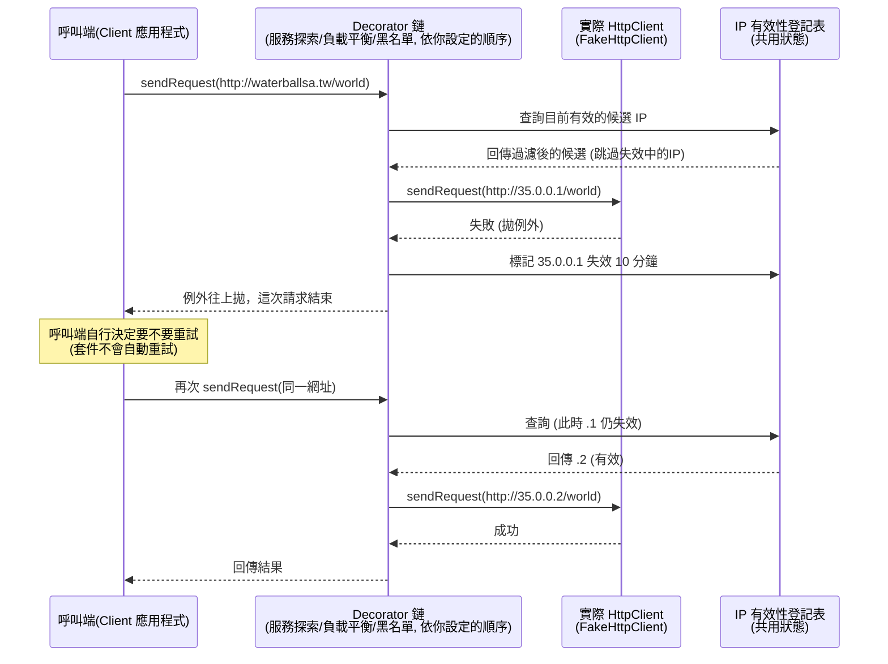

# 題目疑問解答：服務探索 / 負載平衡 / 黑名單

這份文件針對題目描述中容易讓人卡住的流程細節做澄清，並不涉及具體程式碼實作，重點在於「行為/時序」的釐清，讓你能放心去做 OOADP。

---

## 一、服務探索 (Service Discovery) 機制的流程疑問

### Q1：第一個 IP 探索失敗、換第二個成功了，還要不要繼續嘗試第三個？

**不需要，也不會。**

題目範例中的 1️⃣ 2️⃣ 3️⃣ 是**三次各自獨立的 Client 請求**，不是同一次請求內部的重試循環：

- 第 1 次請求 `http://waterballsa.tw/world`：選到 `.1` → 送出後失敗 → 這一次請求本身就**結束（失敗/拋例外）**，同時把 `.1` 標記為失效 10 分鐘。
- 第 2 次請求（Client 重新呼叫一次）：這時 `.1` 是失效狀態，所以服務探索機制選「序列中第一個仍然有效的 IP」→ 選到 `.2` → 送出後成功。
- 第 3 次請求（10 分鐘後，Client 又重新呼叫一次）：`.1` 已經恢復有效，而且它排在序列最前面，所以又被選中 → 失敗 → 再次標記失效。

也就是說，**服務探索機制的職責只有「幫這一次請求選出一個 IP」**，它不負責「這次失敗了，那我自動幫你換下一個 IP 再試一次」。失敗就是失敗，例外會被拋出，**是否要重試（呼叫下一次 `sendRequest`）是呼叫端（Client 應用程式碼）的決定**，不是套件內部自動做的事。

### Q2：為什麼 10 分鐘後又跑回去選第一個，而不是接續上次選到的 `.2`？

因為服務探索機制**沒有「記住上一次選到哪裡」的狀態**——它每次都是「從序列頭開始找，找到第一個目前有效的 IP」這樣單純的規則。

- 「記住上一次選到哪」、「輪流分配」是**負載平衡機制**的職責，跟服務探索是兩個獨立的關注點（也因此才會拆成兩個可自由排列組合的 Decorator）。
- 單獨只有服務探索、沒開負載平衡的情況下，行為就是「永遠選序列中第一個有效的 IP」，所以 `.1` 恢復有效後自然又會被排到最優先。

### Q3：這個案例中，什麼情況下才會用到第三個 IP (`.3`)？

只有當**序列中排在它前面的所有 IP 都同時處於失效狀態**時，才會輪到 `.3`。例如：

- 純服務探索（沒開負載平衡）：`.1` 失效中，這時 `.2` 也剛好送出失敗被標記失效（還在各自的 10 分鐘失效窗口內）→ 下一次請求時，`.1`、`.2` 都無效，`.3` 才會被選中。
- 有開負載平衡：假設某一輪要輪到 `.2`，但 `.2` 剛好是失效狀態，負載平衡在挑選時也要跳過失效 IP，於是可能改選下一個有效的 `.3`。

簡單說：**只要前面的候選還「有效」，就永遠輪不到後面的。**

### Q4：被標記失敗之後，什麼時候／如何重新變回「有效」？

這其實不是一個「主動重新探索」的背景機制，而是一個**惰性檢查（lazy check）**：

1. 每個 IP 維護一個「失效到期時間」的狀態（例如：`invalidUntil = 現在時間 + 10 分鐘`）。
2. 請求失敗時，把該 IP 的 `invalidUntil` 設成「現在 + 10 分鐘」。
3. **每一次要挑選 IP 時**（不論是服務探索或負載平衡挑選候選清單），才去檢查：這個 IP 的 `invalidUntil` 是否已經過了現在時間？
   - 還沒過 → 視為失效，跳過不選。
   - 已經過了 → 視為有效，可以被選中。

沒有計時器在背景主動把狀態切回「有效」，是**每次查詢/挑選當下**才判斷「現在算不算過了 10 分鐘」。這樣設計也比較簡單、不需要額外的排程機制。

---

## 二、負載平衡機制的疑問

> 題目：「如同服務探索機制，失效的 IP 位址並不會被選擇為伺服器 IP，直到該 IP 恢復生效為止。」

### Q：這裡判定「失效」是在服務探索階段被標記，還是負載平衡自己判定？

**兩者都不是「判定/標記」失效的人，真正標記失效的時機點是「實際送出 HTTP 請求之後、得知請求失敗的當下」。**

可以把「選 IP」跟「標記失效」拆成兩件不同的事：

| 動作                                       | 發生時機                                                             | 誰負責                                                                                         |
| ------------------------------------------ | -------------------------------------------------------------------- | ---------------------------------------------------------------------------------------------- |
| **讀取**某 IP 是否有效（用來過濾候選清單） | 挑選 IP 的當下（服務探索挑第一個有效的、負載平衡輪流挑下一個有效的） | 服務探索、負載平衡都會做這個「讀取」動作                                                       |
| **寫入**某 IP 為失效狀態                   | 實際發送 Http 請求之後，得知**這次請求失敗**了                       | 是由「送出請求」這一層（也就是最底層，實際呼叫 `FakeHttpClient` 之後）觸發回饋，才寫入失效狀態 |

負載平衡機制**不會自己去判定「這個 IP 有沒有失敗」**——因為它在「挑 IP」的當下，請求根本還沒送出去，它不可能知道結果。它唯一要遵守的規則是：**挑選時要跳過目前處於失效狀態的 IP**。

由於服務探索跟負載平衡兩個機制的排列順序可以任意調換（甚至可以只開負載平衡、不開服務探索），代表「IP 是否有效」這份狀態**必須是一個共用的登記表**（例如可以想成一個獨立元件，記錄「某個 IP 目前有效/失效到什麼時候」），而不是私屬於服務探索這個 Decorator 內部的資料。兩個機制都只是去「查」這份共用登記表來過濾候選名單；真正「更新」這份表格的動作，則是在請求真正發送、失敗之後才觸發。

這是一個設計上你需要自己決定「由誰擁有這份狀態」的點，題目沒有強制規定實作細節，只要行為符合上述時序即可。

---

## 三、黑名單機制的疑問

### Q1：黑名單表的格式，是不是也跟服務探索表一樣是 `host: ip1, ip2, ip3`？

**不是，你理解錯了一點點 —— 黑名單表跟服務探索的對照表是兩種不同格式的配置檔。**

題目原文：

> 套件的 Client 首先要提供一個黑名單表，表中記載著一系列的黑名單 **Host**（以逗號隔開）。

服務探索表是「Host → 一序列 IP」的**對照表**：

```
waterballsa.tw: 35.0.0.1, 35.0.0.2, 35.0.0.3
```

黑名單表則單純是一串 **Host 名稱清單**，用逗號隔開，沒有 IP 對照：

```
waterballsa.tw, evil.com, test.tw
```

兩者的用途也不同：服務探索表是拿來做「Host → IP」的替換，黑名單表則是拿來檢查「請求網址中的 Host 在不在這份黑名單清單裡」。

### Q2：黑名單機制「中止此請求並拋出例外」，是整個程式停止運作，還是繼續運作？

**只是這一次請求被中止，不是整個應用程式（process）停止運作。**

「拋出例外 (throw Exception)」在一般程式語言中的意思就是：這個呼叫鏈（call stack）從拋出點開始往上傳遞，直到被某層 `catch` 住為止。以這題來說：

- Http Client 套件內部：黑名單機制發現命中黑名單 → 拋出例外 → 這次 `sendRequest(...)` 呼叫就此中斷，不會再往下（服務探索/負載平衡/實際送出）繼續執行。
- 這個例外會往外拋給**呼叫這個套件的應用程式碼**（也就是使用你這個 Http Client 套件的人）。
- 由呼叫端自行決定要怎麼處理：可以 `catch` 起來印 log、顯示錯誤訊息後繼續跑下一筆請求；如果呼叫端沒有處理、又沒有再往上層 catch，才有可能一路往上蔓延到 `main`，導致整個程式真的中止。

所以「中止請求」是**單次請求層級**的行為，跟「整個程式的生命週期是否結束」是兩件事——後者取決於呼叫端有沒有處理這個例外。

---

## 小結：一張時序圖幫助理解



重點整理：

1. **一次請求 = 一次選 IP + 一次實際送出**，失敗就整包結束、拋例外，不會在同一次請求內自動換下一個候選重試。
2. **服務探索**永遠「選序列中第一個有效的」；**負載平衡**才負責「記住輪到誰、依序輪流」；兩者都只讀取共用的 IP 有效性狀態，不互相干涉彼此的職責。
3. **標記失效**的動作發生在「實際送出請求、得知失敗」的那一刻，而「判斷有效與否」則是用 lazy check（比對失效到期時間 vs 現在時間）。
4. **黑名單表**格式是單純的 host 清單（逗號分隔），跟服務探索的 host-IP 對照表不同。
5. **拋出例外**只中止「這一次請求」，不代表整個程式終止，由呼叫端決定如何處理這個例外。

---

## 四、既然兩個機制都要標記/尊重「IP 失效」，服務探索還剩下什麼獨有的用處？（題目描述是不是有缺陷？）

### 你的觀察很敏銳，而且點出了一個重點：「IP 失效」這件事，題目文字上寫得像是服務探索的專屬功能，但其實不是。

回頭看題目原文的兩處：

> 服務探索：「...若此請求失敗了，則將此 IP 從序列中暫時失效 (10 分鐘)...」
> 負載平衡：「**如同服務探索機制**，失效的 IP 位址並不會被選擇為伺服器 IP，直到該 IP 恢復生效為止。」

第二句話用「如同服務探索機制」帶過，語意上其實已經在講：**這是同一套規則，兩邊都要遵守**，而不是「負載平衡另外自己又做了一次一樣的事」。只是因為服務探索小節寫在前面、先把規則講完，導致讀起來容易誤會成「這是服務探索的附加功能，負載平衡只是蹭一下」。

再對照程式設計需求 B.2.a：

> 「不管是哪一種排列組合，每一個機制都能依照同一套邏輯順利運行。」

這句話幾乎是直接點名答案：**IP 失效狀態不能是服務探索私有的東西**。想像一下「只開負載平衡、不開服務探索」，或「負載平衡排在服務探索前面」這種組合——負載平衡都必須自己能判斷「這個候選現在是不是失效」，如果失效狀態被鎖死在服務探索類別內部，這些組合就會壞掉。

**所以我的看法是**：與其說是題目的邏輯缺陷，不如說是**自然語言敘述上的模糊**——它把一個「跨機制共用」的規則，用「附屬在某一個機制底下」的方式帶出來，確實容易誤導。但如果你把 B.2.a 那句話一起看，題目其實已經把「這必須是共用邏輯」的答案埋進去了，比較像是一個**故意留給你自己發現的設計陷阱**，而不是單純寫錯或漏寫。

### 那服務探索到底剩下什麼「獨有」的職責？

拆開來看，「跳過失效 IP」只是兩個機制都要遵守的**共用規則**，真正各自獨有、不能互相取代的職責是：

| 機制                      | 獨有職責                                                                                                                                                                                                                                      | 不是它的職責                                                        |
| ------------------------- | --------------------------------------------------------------------------------------------------------------------------------------------------------------------------------------------------------------------------------------------- | ------------------------------------------------------------------- |
| **服務探索**              | 1. 把網址中的 **Host 解析/替換成 IP**（沒有它，請求就是直接打去原本的 Host，根本沒有多個 IP 候選可言）<br>2. 提供**預設的退化選擇策略**：如果沒開負載平衡，自己也要能獨立選出一個 IP，用的規則是「永遠選序列中第一個有效的」                  | 「輪流」分配、「記住上次選到哪」                                    |
| **負載平衡**              | 提供 **Round Robin 的選擇策略**（記住游標、依序輪流），套用在「當下可用的候選清單」上——這清單可能是服務探索解析出來的一串 IP，也可能只是原始網址本身（例如「黑名單 → 負載平衡 → 服務探索」順序下，負載平衡拿到的候選只有 1 個，等於直接選它） | Host → IP 的解析、標記/查詢 IP 是否失效這件事本身                   |
| **（共用）IP 有效性狀態** | 記錄「哪個 IP 現在失效到什麼時候」，供任何需要過濾候選的機制查詢；並在**實際送出請求失敗後**被更新                                                                                                                                            | 不屬於任一機制專有，建議設計成獨立於這兩個 Decorator 之外的共用元件 |

也就是說：**服務探索的核心價值是「名稱解析」**（Host → IP 清單），**負載平衡的核心價值是「選擇策略」**（輪流 vs. 預設選第一個）。兩者都需要借助同一份「IP 是否失效」的共用狀態來過濾候選，但這份狀態本身既不是服務探索的專利，也不是負載平衡發明的——它是兩者都依賴的第三方共用知識。

如果你在設計時把這份「IP 有效性登記表」抽成一個獨立的協作者（而不是塞進服務探索或負載平衡任何一個 Decorator 的私有欄位），那無論排列組合怎麼變、開幾個機制，行為都能保持一致——這其實就是題目要你透過「排列組合都要能動」這條需求，逼你發現並解開的設計題。

---

## 五、「服務探索 → 負載平衡 → 黑名單」範例中，黑名單檢查的對象是什麼？

### Q1：這個順序下，黑名單表設的應該是 `35.0.0.1, 35.0.0.2, 35.0.0.3` 這種 IP，而不是 `waterballsa.tw` 這種 Host，對吧？

**你沒有誤解，理解正確。**

黑名單機制本身很單純：**只檢查「這個當下的請求網址裡的 Host 欄位」有沒有出現在黑名單清單中**，它不管這個 Host 欄位裡填的是網域名稱還是 IP 位址，反正就是字串比對。

在「服務探索 → 負載平衡 → 黑名單」這個順序下：

1. 服務探索先把 `http://waterballsa.tw/mail` 的 Host 解析成一串 IP 候選 `[35.0.0.1, 35.0.0.2, 35.0.0.3, 35.0.0.4]`。
2. 負載平衡從中輪流選出 `http://35.0.0.1/mail`——**這時候網址裡的 Host 已經被換成 IP 了，原本的 `waterballsa.tw` 字串已經不存在於這個網址裡**。
3. 黑名單機制收到的是 `http://35.0.0.1/mail`，它只能檢查「`35.0.0.1` 在不在黑名單清單裡」，它完全看不到（也不需要看到）原始的 `waterballsa.tw`。

所以在**這個特定順序**下，若你想擋掉某個服務，黑名單表裡要填的必須是「具體 IP」（例如 `35.0.0.1, 35.0.0.2, 35.0.0.3`），填 `waterballsa.tw` 在這個順序下**是不會生效的**（因為到黑名單這一關時，網址裡已經沒有這個字串了）。

反過來說，如果順序改成「黑名單 → 負載平衡 → 服務探索」（題目第二個範例），黑名單這時候拿到的網址還是原始的 `http://waterballsa.tw/mail`，此時黑名單表填 `waterballsa.tw` 才會生效，填 IP 反而沒用（因為 IP 根本還沒被解析出來）。

**這也再次呼應前面第四點提到的設計重點**：黑名單機制本身的邏輯很簡單、固定不變（就是查表比對 Host），但因為它在 Decorator 鏈中的位置不同，實際能攔截到的「內容」（是原始網域還是已解析的 IP）會不一樣——這正是題目故意設計「排列組合會產生不同結果」的地方，讓你體會 Decorator Pattern 中「順序影響行為」的特性，但黑名單機制本身完全不用因為順序不同而修改程式邏輯。

### Q2：黑名單條件成立時，這次請求就直接拋出 exception 給 Client，且沒有後續處理（例如不會去標記該 IP 失效），對吧？

**對，你的理解正確。**

黑名單機制屬於**攔截性質**（在請求真正送出之前就先擋下來），它跟「標記 IP 失效」這件事完全無關，原因是：

- 標記 IP 失效的觸發條件是「**實際送出 HTTP 請求之後，得知這次送出失敗了**」（也就是要真的呼叫到 `FakeHttpClient.sendRequest` 這一層，並且它回傳/拋出失敗結果）。
- 黑名單機制命中時，請求根本**還沒有走到「實際送出」這一步**就被攔截、拋出例外了——鏈路直接在黑名單這一層中斷，後面（不管是往下一個 Decorator，還是最終的實際 HttpClient）都不會被呼叫到。
- 既然實際送出這個動作根本沒發生，也就沒有「送出失敗」這個事件可以觸發標記失效，所以**不會有任何 IP 被標記為失效**，那個 IP（或 Host）的有效性狀態完全不受影響。

簡單講：黑名單擋下來 = 這次請求直接判定為「不合法的請求」而中止，跟「這個 IP/伺服器本身能不能連線」是兩回事，自然不會牽動到失效登記表。

---

## 六、ServiceDiscovery 要怎麼確認 IP 有效/失效？是不是要自己另外發一次 GET 來探測？

### 不需要，也不應該這樣做——這確實會邏輯上很怪（等於同一件事做兩次網路呼叫），而題目的設計本來就不是要你這樣實作。

關鍵誤解在於：**「確認有效/失效」不是靠 ServiceDiscovery 主動發一個額外的探測請求（active health check）去問「你還活著嗎？」，而是完全被動、順便搭著 Client 本來就要送出的那一次請求去觀察結果（passive/reactive）。**

也就是說，從頭到尾**只有一次真正的網路請求**（Client 原本就要發的那一個），ServiceDiscovery 並不會、也不需要自己多發一次任何請求。它只是「站在這一次請求的前後」做事：

- **請求送出之前**：讀取 `ipMarkedHelper` 目前的登記狀態，選一個「目前有效」的 IP，把 Host 換掉。
- **請求送出之後**：這一次真正送出的結果（成功 or 失敗）會回饋回來，ServiceDiscovery 藉這個「順便得到的結果」去更新 `ipMarkedHelper`（失敗就標記失效 10 分鐘）。

這正是 Decorator Pattern 最自然的用法——每個 Decorator 都是在「呼叫下一層」的**前面**和**後面**加邏輯，而不是自己另外發起一個獨立的動作。用虛擬碼表示 ServiceDiscovery 這個 Decorator 大概長這樣：

```
class ServiceDiscoveryHttpClient implements HttpClient {
    HttpClient next;          // 鏈上的下一個 Decorator，或是最終的 FakeHttpClient
    IpMarkedHelper ipMarkedHelper;

    sendRequest(request) {
        ip = ipMarkedHelper.pickFirstValidIp(request.host);      // 讀取狀態，選 IP（不發任何請求）
        newRequest = request.replaceHostWith(ip);

        try {
            next.sendRequest(newRequest);                         // 真正、唯一的一次請求，往下一層送
        } catch (e) {
            ipMarkedHelper.markInvalid(ip);                       // 搭這次結果，順便更新狀態
            throw e;                                               // 例外繼續往上拋給呼叫端
        }
    }
}
```

重點是：`next.sendRequest(newRequest)` 這一行呼叫，最終會一路往下傳到 `FakeHttpClient`，那才是真正送出去的那一次請求；`try/catch` 包住它，只是讓 ServiceDiscovery 這個 Decorator 能「順便旁聽」這次請求的成敗，藉此更新 `ipMarkedHelper` 的登記表——**它自己完全沒有另外發送任何 HTTP 請求**。

所以：

- **不會有「重複發送 HTTP 請求」的問題**：整個 Decorator 鏈（服務探索 → 負載平衡 → 黑名單 → 實際送出）疊起來，對外還是只送出一次請求，只是這次請求在傳遞過程中，各層 Decorator 會依序做「選擇/檢查」（呼叫前）跟「觀察結果」（呼叫後）。
- **`ipMarkedHelper` 的角色**：如同你自己筆記中寫的，它只負責「記錄失效資訊」跟「回答下次挑選時該跳過誰」，本身也不會主動發任何探測請求，就是單純一個帶著時間戳記的登記表（讀/寫），跟第四節提到的「共用 IP 有效性狀態」是同一個東西。
- 黑名單機制也是同樣的套路：它只在「呼叫前」做檢查（Host 在不在黑名單），不需要「呼叫後」做任何事，所以它不用 try/catch 包住 `next.sendRequest(...)`，除非命中黑名單而直接拋例外、不呼叫 `next`。

這樣一來，「怎麼知道 IP 有效/失效」這個疑問就解開了：**不是靠主動探測，而是被動地讓每一次 Client 自己發起的真實請求，順便成為判斷這個 IP 好壞的依據。**

---

## 七、LoadBalancing 實際上要怎麼「依序輪流」？也要靠一個類似 `ipMarkedHelper` 的類別記住下一個嗎？

**對，需要一個獨立的狀態持有者，但它記的東西跟 `ipMarkedHelper` 不一樣——這是兩份完全不同用途的狀態，不建議合併。**

### 為什麼一定要有額外的狀態？

「輪流（Round Robin）」的本質就是「**記住上次選到哪，下次從下一個開始**」，這件事**跨越多次不同的請求**才成立（第 1 次選 `.1`、第 2 次選 `.2`……），所以這個「目前輪到誰」的游標（cursor）**必須被保存在某個地方，活得比單一次 `sendRequest` 呼叫還久**。而 Decorator 物件本身如果只是無狀態地被呼叫，游標就得存在一個外部/共用的協作者身上——邏輯上跟 `ipMarkedHelper` 需要「跨請求持久保存資料」的理由是一樣的，只是**存的內容不同**：

| 類別                            | 記錄的內容                            | Key              | 用途                 |
| ------------------------------- | ------------------------------------- | ---------------- | -------------------- |
| `ipMarkedHelper`                | 某個 IP「失效到什麼時候」             | IP（或 Host+IP） | 過濾掉目前無效的候選 |
| 假設叫 `roundRobinCursorHelper` | 某個 Host「上次選到清單中第幾個位置」 | Host             | 決定這次該輪到誰     |

兩者職責不同（單一職責原則），建議拆成兩個獨立的類別/協作者，而不是塞進同一個物件裡。

### 實際運作邏輯大概長怎樣？

以你範例的情境（`waterballsa.tw: 35.0.0.1, 35.0.0.2, 35.0.0.3`）來說：

1. `roundRobinCursorHelper` 針對每個 Host 記一個游標，初始值可以想成「下一個要選的位置 = 0」。
2. LoadBalancing 每次被呼叫時：
   - 先跟 `ipMarkedHelper` 拿到「目前有效」的候選清單（濾掉失效中的 IP）。
   - 跟 `roundRobinCursorHelper` 問「這個 Host 現在游標在哪」，從游標位置開始（若剛好游標指到的 IP 是失效的，就往後找下一個「有效」的，並在清單尾端時繞回開頭）。
   - 選中一個 IP 之後，把游標更新成「這個 IP 在原始序列中的下一個位置」，供下一次呼叫使用。
3. 這樣就能重現題目的行為：`.1 → .2 → .3 → .1 → .2 …`，即使中途某個 IP 暫時失效被跳過，游標仍然是沿著「原始序列的順序」往前推進，不會因為跳過而錯亂。

虛擬碼大致像這樣：

```
class RoundRobinHttpClient implements HttpClient {
    HttpClient next;
    RoundRobinCursorHelper cursorHelper;
    IpMarkedHelper ipMarkedHelper;

    sendRequest(request) {
        candidates = extractCandidates(request);              // 這一輪可選的候選清單（可能是服務探索解析出來的一串 IP，也可能只有 1 個）
        cursor = cursorHelper.getCursor(request.host);
        ip = pickNextValidFrom(candidates, cursor, ipMarkedHelper); // 從游標開始找下一個有效的
        cursorHelper.advance(request.host, candidates.indexOf(ip) + 1);

        next.sendRequest(request.replaceHostWith(ip));
    }
}
```

### 補充：LoadBalancing 本身不需要 `try/catch`

跟第六節提到的黑名單一樣，LoadBalancing 只需要在**呼叫前**做事（挑 IP、推進游標），不需要在**呼叫後**做任何補救——「標記失效」是 ServiceDiscovery（或者說是任何靠近底層、實際觸發送出的那一層）的職責，LoadBalancing 只是讀取 `ipMarkedHelper` 來過濾候選，並不負責寫入失效狀態。

所以整體上你會有（至少）兩個獨立的「跨請求共用狀態」協作者：

- `ipMarkedHelper`：紀錄 IP 有效性（誰負責寫入：實際送出失敗的那一層；誰會讀取：ServiceDiscovery、LoadBalancing 都要讀來過濾候選）。
- `roundRobinCursorHelper`：紀錄每個 Host 目前輪到第幾個位置（只有 LoadBalancing 自己讀寫，其他機制不需要關心）。

這樣拆分後，不管三個機制怎麼排列組合，各自只依賴自己需要的那份狀態，彼此互不干涉，也符合「不管排列組合，每個機制都用同一套邏輯運行」的需求。

---

## 八、`roundRobinCursorHelper` 只有 LoadBalancing 在用，感覺職責很低價值，這樣拆是不是很尷尬？

**你的直覺沒錯——這兩個「Helper」根本不是同一種等級的東西，`ipMarkedHelper` 是被逼出來的（架構上的硬性需求），而 `roundRobinCursorHelper` 沒有這種必然性，所以不需要為了跟 `ipMarkedHelper` 對稱，硬把它拉成一個「共用協作者」。**

### 判斷要不要抽出獨立類別的標準，不是「有沒有被重用」，而是「有沒有其他角色也需要它」

`ipMarkedHelper` 之所以必須被抽出來、變成一個獨立於任何 Decorator 之外的共用元件，理由在**第四節**已經講過：因為 ServiceDiscovery 跟 LoadBalancing **都要讀**同一份「IP 是否有效」的事實，而且兩者的排列順序還可以任意交換——這是題目 B.2.a「不管排列組合都要能同一套邏輯運行」逼出來的**架構上的必然需求**：如果這份狀態被鎖死在某一個 Decorator 內部，排列組合一定會壞掉。

`roundRobinCursorHelper` 記的「這個 Host 目前輪到第幾個」則完全不同——**整個系統裡，除了 LoadBalancing 自己，沒有任何其他角色關心這個游標**：

- ServiceDiscovery 不需要知道「輪到第幾個」，它的邏輯永遠是「選第一個有效的」。
- 黑名單不需要知道。
- 就連 `ipMarkedHelper` 本身也不需要知道——它只管「這個 IP 現在有效嗎」，不管「現在輪到誰」。

既然沒有第二個角色需要用到這份狀態，那把它抽成一個獨立於 LoadBalancing 之外、名為 `xxxHelper` 的「共用協作者」，其實只是形式上模仿 `ipMarkedHelper` 的樣子，並沒有帶來實質的架構價值——你抽出來的東西如果永遠只有一個呼叫者，它就只是「換個檔案放」而已，稱不上「共用」。

### 那應該怎麼設計比較好？

**最直接、最誠實的做法：把這個游標狀態當成 LoadBalancing 這個 Decorator 自己的私有欄位就好**，不需要包裝成一個對外的 Helper 類別：

```
class LoadBalancingHttpClient implements HttpClient {
    HttpClient next;
    IpMarkedHelper ipMarkedHelper;             // 這個要注入，因為要跟別人共用
    Map<String, Integer> cursorPerHost = new HashMap<>();  // 私有欄位，自己管自己的

    sendRequest(request) {
        candidates = extractCandidates(request);
        ip = pickNextValid(candidates, cursorPerHost, request.host, ipMarkedHelper);
        next.sendRequest(request.replaceHostWith(ip));
    }
}
```

這樣做完全不違反任何原則：

- **單一職責**沒有被破壞——`cursorPerHost` 這份資料本來就是「LoadBalancing 演算法」的一部分，是它私有的實作細節，不是它要對外提供的服務。
- **不需要為了假裝有彈性而硬拆**：拆一個類別出來的價值在於「未來可能有其他人重用」或「這個職責複雜到需要獨立測試」，如果都不成立，拆出來反而是過度設計 (over-engineering)，跟你在 `implementationDiscipline` 裡也提過的「避免為了不存在的重用需求而抽象」是同一個道理。
- 如果之後你真的發現這個游標邏輯很複雜、想要單獨寫測試，那時候再抽出一個**只給 LoadBalancing 自己用的私有小物件**（例如一個小的 `RoundRobinCursor` 值物件，包成員方法 `nextIndexFor(host)`），也完全合理——差別只在於它是 LoadBalancing 的「私有實作細節」，跟 `ipMarkedHelper` 這種「必須讓多個 Decorator 都能存取的共用服務」，兩者在架構上的定位是不一樣的，不需要用同一套稱呼或同一種抽出方式硬套。

### 一句話總結

**「共用」不是為了對稱好看才做，是因為真的有多個角色需要同一份事實（IP 是否有效）才不得不做；而 Round Robin 的游標從頭到尾只跟 LoadBalancing 自己的演算法有關，讓它當 LoadBalancing 的私有狀態，才是最誠實、也最省事的設計。**

---

## 九、`ipMarkedHelper` 題目根本沒明講要拆出來，這樣的抽出理由會不會太薄弱？「共用」是不是只是這次剛好而已？各機制的設定檔格式跟這個共用狀態的關係又是什麼？

這幾個疑問都很扎實，拆開一個一個回答。

### Q1：題目真的有要求要拆出 `ipMarkedHelper` 這種獨立類別嗎？

**沒有，題目從頭到尾沒有出現「請你抽出一個共用類別」這種字眼，這是我們從行為需求推導出來的設計結論，不是題目字面上的要求。**

但這個推導不是憑空腦補，而是把**兩段題目原文**放在一起看，邏輯上只剩這一個解：

1. 負載平衡那句「**如同**服務探索機制，失效的 IP 位址並不會被選擇...」——這句話**必須**成立，代表負載平衡在挑選時，看到的「哪個 IP 失效」跟服務探索看到的，是**同一份、同步變化**的事實，不能各記各的（不然「如同」就假了）。
2. B.2.a「**不管是哪一種排列組合**，每一個機制都能依照同一套邏輯順利運行」——這句話把上面那個「同步」的要求，擴大成**不管誰先誰後、甚至只開其中一個**都要成立。

這兩句合起來，唯一能自洽的實作方式就是：**這份「IP 是否失效」的狀態不能是任何一個 Decorator 的私有欄位，必須是外部共同持有、共同讀寫的東西。** 這不是我們自己加碼的設計偏好，是從行為規格反推出的必然結論——只是題目用自然語言描述行為，沒有直接寫成「請設計一個 XxxRegistry 類別」而已（這本來就是留給你自己在 OOAD 判斷的部分，題目不會，也不該幫你把類別圖畫好）。

### Q2：這樣的「共用」會不會只是這次剛好而已？之後如果擴充新機制，也不一定會共用，那這個類別的價值是不是很薄弱？

**這裡有一個重要的觀念要先釐清：這個抽出的理由，完全不需要靠「未來擴充可能也會用到」來撐腰，它的正當性只建立在「現在」這兩個機制的規格上。**

換句話說，即使你很確定：**以後永遠不會再新增任何第四個機制**，`ipMarkedHelper` 依然值得被抽出來——因為單單「服務探索」和「負載平衡」這兩個**現有**機制，就已經要求彼此看到同一份會變動的事實了。這是一個**現在式的必然需求**，不是「說不定以後用得到」的投機性預留。

你會覺得這個理由薄弱，我猜是把它跟「以後可能被重用，所以先抽出來以防萬一」這種常見的過度設計（YAGNI 違反）搞混了。要分清楚兩種完全不同的抽出動機：

| 抽出動機                                                 | 是否成立                                  | 例子                                                                          |
| -------------------------------------------------------- | ----------------------------------------- | ----------------------------------------------------------------------------- |
| ❌「以後可能會重用，先抽出來比較保險」                   | 不成立，這是投機性、違反 YAGNI 的過度設計 | 沒有任何現有需求要用，純粹猜測未來                                            |
| ✅「現在就有兩個(以上)角色，同時需要同一份會變動的事實」 | 成立，是此刻就存在的架構必然性            | `ipMarkedHelper`：服務探索、負載平衡**現在**就都要讀寫/讀取同一份 IP 失效狀態 |

`ipMarkedHelper` 屬於後者，所以就算之後真的完全沒有第四個機制出現，這個抽出的決策依然是對的、依然有價值——它的價值不是「可重用性」，而是「**正確性**」：如果不抽出來變成共用物件，你光是「服務探索 → 負載平衡」跟「負載平衡 → 服務探索」這兩種排列組合，就會出現不一致的行為，直接違反 B.2.a。

（反過來對照第八節的 `roundRobinCursorHelper`：它抽不抽出來，不影響任何正確性，**現在**就只有 LoadBalancing 一個角色需要它，所以它才被歸類為「沒有必然性、不需要抽」的那種。這就是兩者的本質差異，不是雙重標準。）

### Q3：各機制看起來都有自己的設定檔格式，之後擴充的設定檔格式也不保證一樣，題目對此有說明嗎？

**題目沒有對「未來擴充機制的設定檔格式」做任何說明，而且你不需要為了這個未知的假設性需求去設計任何統一格式——這跟 `ipMarkedHelper` 是兩件完全不同層次的事，不要混在一起考慮。**

先把兩種資料徹底分開來看，這是這個疑問卡住的關鍵：

|                | 設定檔（Config）                                                                               | 執行期共用狀態（Runtime shared state）                               |
| -------------- | ---------------------------------------------------------------------------------------------- | -------------------------------------------------------------------- |
| **例子**       | 服務探索的 `host: ip1, ip2, ip3` 對照表、黑名單的 `host1, host2` 清單                          | `ipMarkedHelper` 記的「IP 現在有效嗎、失效到什麼時候」               |
| **來源**       | 程式啟動時載入、格式由**各機制自己定義**，彼此互不相干                                         | 程式**執行過程中**，因為請求成功/失敗而動態變化                      |
| **誰擁有**     | 服務探索、黑名單各自擁有自己的設定檔解析邏輯，完全獨立、互不共用，題目也從沒要求兩者格式要一致 | 服務探索、負載平衡兩個機制在執行期間，需要看到**同一份、同步**的資料 |
| **要不要共用** | **不需要**，也**不應該**共用——服務探索的表跟黑名單的表本來就是不同用途、不同格式的兩份靜態資料 | **需要**共用，因為這是 B.2.a 逼出來的執行期正確性要求                |

也就是說：**我們從來沒有建議過「設定檔格式」要共用**，你完全沒有理解錯——`ipMarkedHelper` 這件事跟「服務探索表」「黑名單表」的檔案格式一點關係都沒有，它是一個**跟設定檔無關、純粹執行期產生的動態資料**（哪個 IP 現在失效、失效到什麼時候），跟「你從檔案讀出了什麼固定內容」是兩個維度的東西。

至於「之後擴充機制是否也需要檔案配置」——**題目確實沒有交代，B.4 只講了兩件事**：

> 「Client 能夠在不修改既有套件程式碼的前提之下，擴充自己的 Http Client 機制。也能夠在不修改既有套件程式碼的前提之下，實作除 `FakeHttpClient` 之外的 `HttpClient` 實作。」

這只是在要求**開放封閉原則 (OCP)**：新增一個機制（Decorator）或新增一個 `HttpClient` 實作，不需要改到既有套件的程式碼——這件事只跟「你的介面設計得夠不夠鬆散、新機制能不能單純用組合/繼承掛上去」有關，**完全沒有規定未來機制要不要吃設定檔、設定檔長什麼樣子**。所以你不用擔心自己漏看了什麼，這部分題目就是沒講，也不需要你現在去預先設計一套「萬用設定檔格式標準」——那才是真正的過度設計，因為你不會知道未來的機制到底需不需要設定檔、需要的話又長怎樣，現在猜測、預留擴充點只會是白工。

### 小結：三個問題的答案分別是

1. **要不要拆 `ipMarkedHelper`**：題目沒明講「拆出類別」，但**現在**的兩段行為需求（如同服務探索機制 + B.2.a 排列組合）已經邏輯上逼出「這份狀態必須共用」的結論，這是設計推導，不是無中生有。
2. **共用的價值薄不薄弱**：價值不建立在「未來可能重用」，而是建立在「**現在**兩個機制就需要同步事實」這個正確性要求上，就算未來永遠不擴充，這個抽出依然是對的。
3. **設定檔格式跟這個共用狀態沒有關係**：設定檔（服務探索表、黑名單表）本來就各自獨立、不需要共用，題目也沒提未來機制是否需要設定檔——這是題目沒交代、也不需要你現在預先設計的部分，不用擔心漏看。

---

## 十、這題會用到「關聯類別 (Association Class)」嗎？除了裝飾者模式還需要別的設計模式嗎？`ipMarkedHelper` 在套用的模式裡放在哪？

### Q1：會用到關聯類別嗎？

**老實說：不需要，不用硬套。**

UML 的「關聯類別 (Association Class)」是專門用在**兩個獨立實體之間的多對多關係，而這段「關係本身」需要有自己的屬性/行為**時才拉出來的重量級手法（經典例子：Student 與 Course 是多對多，中間的「選課紀錄 Enrollment」自己帶有 `grade` 這種屬於「這段關係」而非屬於 Student 或 Course 本身的屬性）。

回頭看這題的「IP 失效到期時間」：這個屬性看起來只依附在**單一個 IP** 身上（`invalidUntil`），而且在這份服務探索表的情境下，每個 IP 基本上只會出現在某一個 Host 底下（不是「一個 IP 同時被多個 Host 共用、且每個 Host 對這個 IP 有不同的失效時間」這種真正多對多的情境）。所以你只需要一個簡單的**值物件 (Value Object)**，例如：

```
class ManagedIp {
    String ip;
    Instant invalidUntil;
}
```

把它放在每個 Host 對應的 IP 清單裡就好，這只是普通的「物件包了一個額外屬性」，稱不上需要動用「關聯類別」這種正式手法。**這題不需要關聯類別，不用為了顯得學術嚴謹而硬套。**

### Q2：除了裝飾者模式，還會用到其他設計模式嗎？還是裝飾者就夠？

**老實說：裝飾者模式本身就足以滿足這題的核心功能需求跟可擴充需求 (B.4 的 OCP)，不需要再硬塞其他 GoF 模式進來湊數。**

- **核心一定要用、也是題目指名的**：**Decorator Pattern**——`HttpClient` 介面（Component）、`FakeHttpClient`（ConcreteComponent）、一個持有下一層 `HttpClient` 參考的抽象 Decorator、以及 `ServiceDiscoveryHttpClient` / `LoadBalancingHttpClient` / `BlacklistHttpClient` 三個 ConcreteDecorator。這樣就能滿足「任意排列組合」「不改既有程式碼就能擴充新機制/新 HttpClient 實作」的所有規格。
- **不是必要，但你可能會「順便」寫出來的東西**：組裝這一串 Decorator 鏈的程式碼（例如按照 Client 指定的順序把 `new ServiceDiscoveryHttpClient(new LoadBalancingHttpClient(new BlacklistHttpClient(new FakeHttpClient())))` 疊起來），如果你想讓組裝過程好讀一點，可以用 Builder 風格包一下（例如 `HttpClientBuilder.with(ServiceDiscovery).with(LoadBalancing).with(Blacklist).build()`）。但這只是**組裝程式碼的可讀性手法**，不是題目要求的正式設計模式，能不用也完全沒問題，用一般的建構式疊法就夠。
- **老實說不需要的**：Strategy（挑 IP 的規則已經很單純，直接寫在各自 Decorator 裡就好，沒必要為了「可替換演算法」這個不存在的需求包一層介面）、Template Method、Singleton、Observer 等——這題目沒有任何行為需要靠這些模式才能表達，硬加只會是過度設計。

一句話：**這題就是一道純粹的 Decorator Pattern 練習，裝飾者就夠了，其餘頂多是輔助組裝的小技巧，不算「額外用到的設計模式」。**

### Q3：那 `ipMarkedHelper` 在套用裝飾者模式之後，放在整個結構的哪個位置？

**它不屬於 Decorator Pattern 的任何一個角色（Component / ConcreteComponent / Decorator / ConcreteDecorator），它是一個站在這個模式結構「外面」、被兩個 ConcreteDecorator 共同依賴的協作者 (collaborator)。**

用 Decorator Pattern 的經典角色來對照：

| Decorator Pattern 角色                              | 對應到這題的誰                                                                 |
| --------------------------------------------------- | ------------------------------------------------------------------------------ |
| Component（介面）                                   | `HttpClient`                                                                   |
| ConcreteComponent（真正做事的底層物件）             | `FakeHttpClient`                                                               |
| Decorator（抽象裝飾者，持有一個 `HttpClient` 參考） | 你可能會寫的抽象基底類別，例如 `HttpClientDecorator`                           |
| ConcreteDecorator（具體機制）                       | `ServiceDiscoveryHttpClient`、`LoadBalancingHttpClient`、`BlacklistHttpClient` |
| **（不在上面任何角色裡）**                          | **`ipMarkedHelper`**                                                           |

`ipMarkedHelper` 的定位比較像是一個**外部的共用服務/登記表 (registry)**：

- 它**不**實作 `HttpClient` 介面，**不**參與「包裝/傳遞請求」這條鏈，所以它不是 Decorator 家族的一員。
- `ServiceDiscoveryHttpClient` 跟 `LoadBalancingHttpClient` 這兩個 ConcreteDecorator，各自持有一份**對同一個 `ipMarkedHelper` 實例的參考**（透過建構子注入），在畫類別圖時，會從這兩個 ConcreteDecorator 各畫一條關聯線（association）指向 `ipMarkedHelper`，而不是把它畫進 Decorator 的繼承/包裝關係裡。
- 這個共用實例是在「組裝這條 Decorator 鏈」的地方（例如 `main` 或你的 Builder）**只建立一次**，然後同一份參考分別傳給 `ServiceDiscoveryHttpClient` 跟 `LoadBalancingHttpClient` 的建構子，兩者才會看到彼此更新的同一份資料。

簡單講：`ipMarkedHelper` 不是 Decorator Pattern 結構裡的角色，它是被**注入 (Dependency Injection)** 到需要它的那幾個 ConcreteDecorator 裡的一個**平行的協作者類別**——這也是很正常的現象，不是每個類別都非得要能對應到某個 GoF 模式的正式角色不可，職責分析清楚、關係畫對，比硬要把它塞進某個模式的命名角色更重要。
