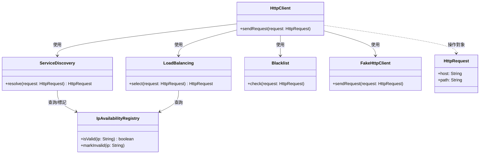
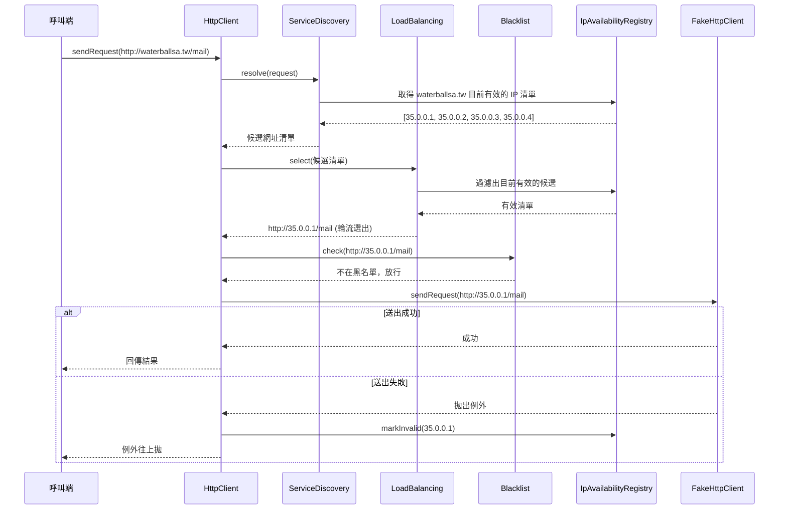
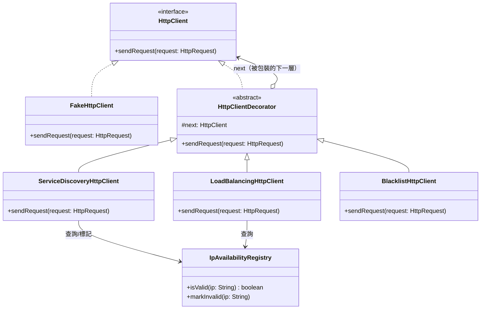

# HttpClient 套件

## ServiceDiscovery

- 職責：找出第一個有效的 IP，並將 Host 轉換成 IP
- 卡點：
  - 具體 OOP 上，有效 IP 從哪取得？
    - 因為和其他類別有重疊需求，可開新類別共用取得 IP 的功能
- 屬性：
- 操作：
  - 成立行為
  - 成立互動
- 其他：
  - 檔案配置
    ```
    waterballsa.tw: 35.0.0.1, 35.0.0.2, 35.0.0.3
    ```

## LoadBalancing

- 職責：分擔 HttpRequest 流量，依序分配到有效 IP 上
- 卡點：
  - 具體 OOP 上，會怎麼設計分配 Host？開新類別或在自己類別處理？
    - 因為只屬於此服務的問題，不開新類別，先在自己類別內處理
  - 具體 OOP 上，有效 IP 從哪取得？
    - 因為和其他類別有重疊需求，可開新類別共用取得 IP 的功能
- 其他：
  - 檔案配置
    ```
    waterballsa.tw: 35.0.0.1, 35.0.0.2, 35.0.0.3
    ```

## Blacklist

- 職責：檢查即將要發出的 HttpRequest 有沒有在黑名單上面，並阻擋
- 其他：
  - 檔案配置
    ```
    waterballsa.tw, 35.0.0.1, 35.0.0.2
    ```

## IpAvailabilityRegistry

- 職責：標記失效、判斷失效標記是否已恢復，提供下次 Request 要參考、要跳過的 IP

---

## OOA 類別圖（尚未套用設計模式）



## OOA 循序圖（尚未套用設計模式，以「服務探索 → 負載平衡 → 黑名單」順序為例）



---

## OOD 套用設計模式：Decorator Pattern

### 情境與問題

OOA 階段把 `HttpClient` 設計成一個「協調者」，依序呼叫 `ServiceDiscovery`、`LoadBalancing`、`Blacklist` 再送出請求。但這個寫法沒辦法滿足 B.2「Client 能自由決定要開哪些機制、以及任意排列組合」的需求——一旦順序或開關組合變動，`HttpClient` 這個協調者內部的呼叫順序就要跟著改，等於每一種組合都要改動（或新增）這個類別本身，違反了 B.4 的開放封閉需求。

### Forces（設計上互相牽制的考量）

1. **組合爆炸 (Combinatorial Explosion)**：三個機制、每個都能開/關、還能任意排序，如果用「繼承」或「在一個類別裡寫死呼叫順序」的方式實作，可能的組合數會隨機制數量指數增長（例如幫每一種開關+順序都寫一個子類別），類別數量很快就會爆炸、難以維護。
2. **開放封閉原則 (Open-Closed Principle)**：題目 B.4 明確要求「不修改既有套件程式碼」就要能新增機制、或新增除 `FakeHttpClient` 之外的 `HttpClient` 實作。這代表擴充點必須設計成「新增程式碼就能擴充，不用改動既有類別」。
3. **一致的介面與可任意巢狀組合 (Uniform Interface / Transparent Composability)**：不管排列組合怎麼變，每一層機制都要能「以同一套邏輯」運行（B.2.a）——也就是每個機制、以及最終真正送出請求的元件，都必須共用同一個操作介面，讓任何一個機制都能被單獨替換、也能被其他機制包住，彼此可以任意疊加、順序可以任意調換，而不需要知道自己外層/內層包的是誰。

這三個 Force 互相牽制：第 1 點要求「不要用繼承窮舉組合」，第 2 點要求「新增機制不能動到舊程式碼」，第 3 點要求「每個機制都要能被同一介面透明替換、任意疊加」——這正是 **Decorator Pattern** 的典型適用情境：把每個機制實作成與 `HttpClient` 同介面的裝飾者，一層包一層，順序由組裝時決定，新增機制只要新增一個 ConcreteDecorator 類別即可。

### 解法：套用 Decorator Pattern 後的類別圖



對照三個 Forces 分別怎麼被滿足：

- **Force 1（組合爆炸）**：每個機制都只是一個實作 `HttpClient` 介面的 ConcreteDecorator，排列組合是在「組裝鏈的時候」用建構子疊起來決定（例如 `new ServiceDiscoveryHttpClient(new LoadBalancingHttpClient(new BlacklistHttpClient(new FakeHttpClient())))`），不需要為每一種組合寫一個新類別，類別數量只跟「機制種類數」成正比，不會隨組合數爆炸。
- **Force 2（開放封閉）**：新增一個機制，只要新增一個新的 ConcreteDecorator（實作 `HttpClient` 介面即可），完全不用改到 `HttpClient` 介面、`FakeHttpClient`，或既有的其他 ConcreteDecorator；新增一個 `HttpClient` 的其他實作（取代 `FakeHttpClient`）也一樣，只要遵守 `HttpClient` 介面即可被既有 Decorator 包裝。
- **Force 3（一致介面/透明組合）**：`HttpClientDecorator` 跟 `FakeHttpClient` 都實作同一個 `HttpClient` 介面，所以任何一個 ConcreteDecorator 的 `next` 欄位可以放「另一個 ConcreteDecorator」或「最終的 `FakeHttpClient`」，彼此互不知情、可以任意疊放順序，滿足「不管排列組合都用同一套邏輯運行」的要求。
