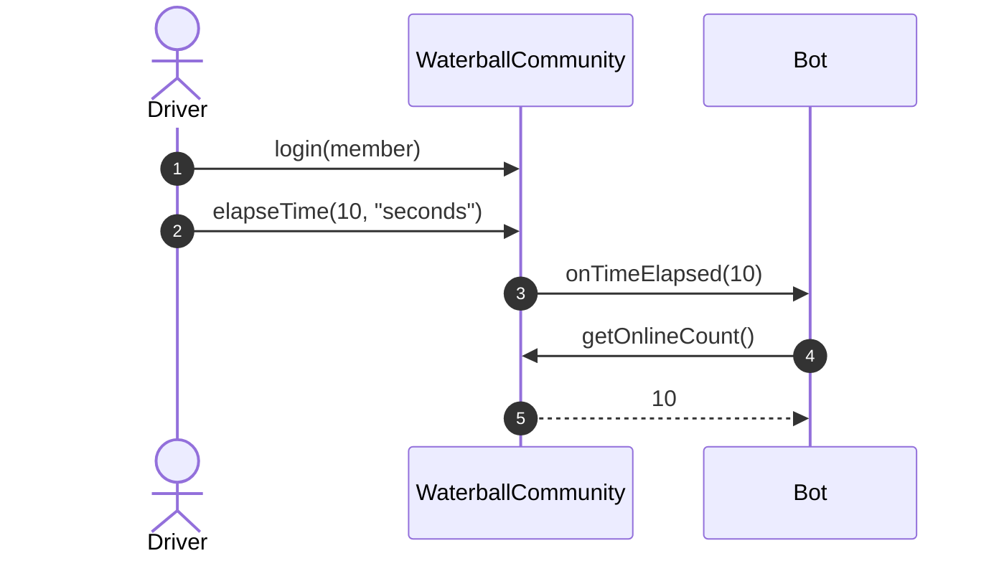
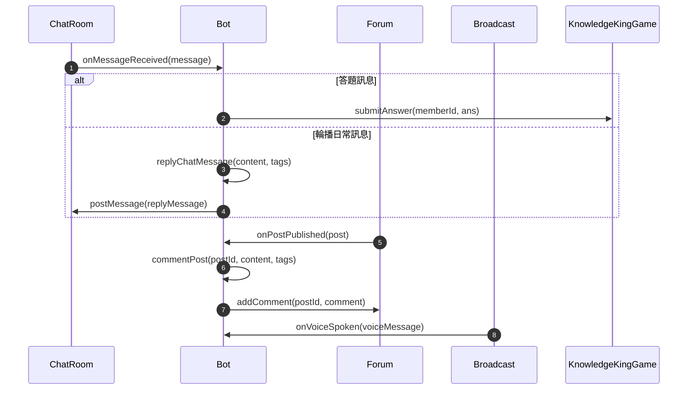
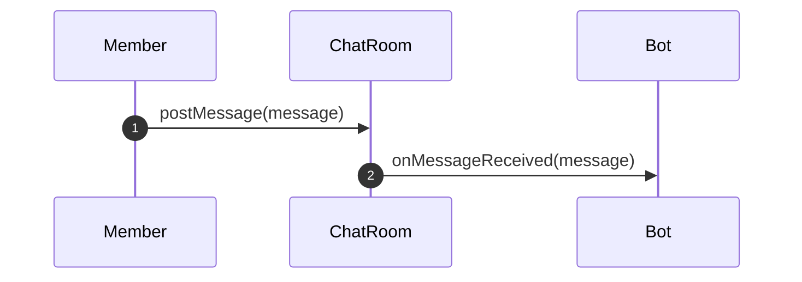
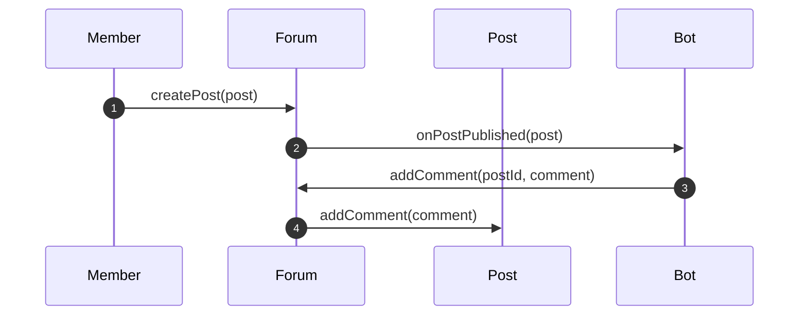
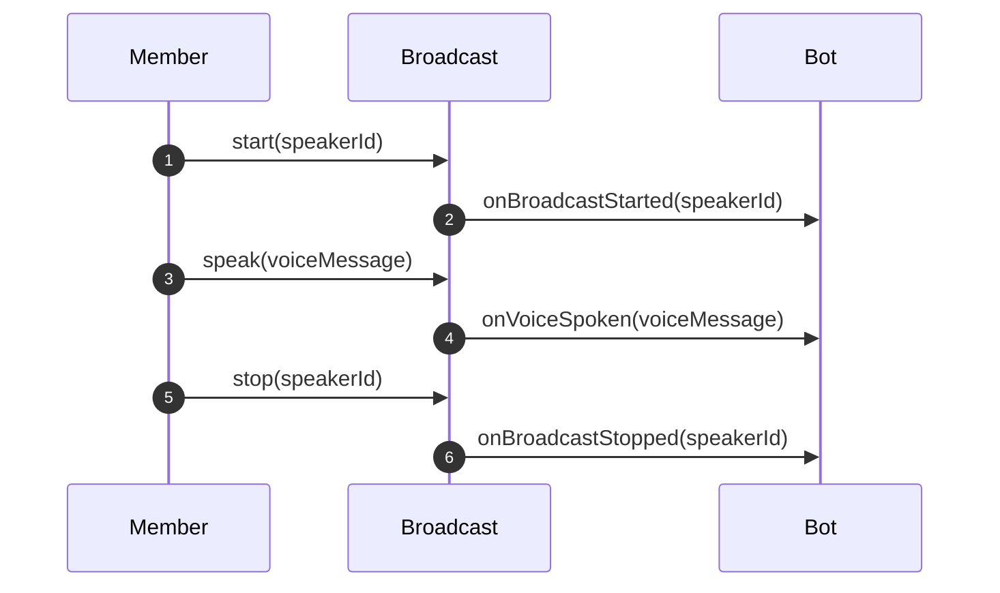
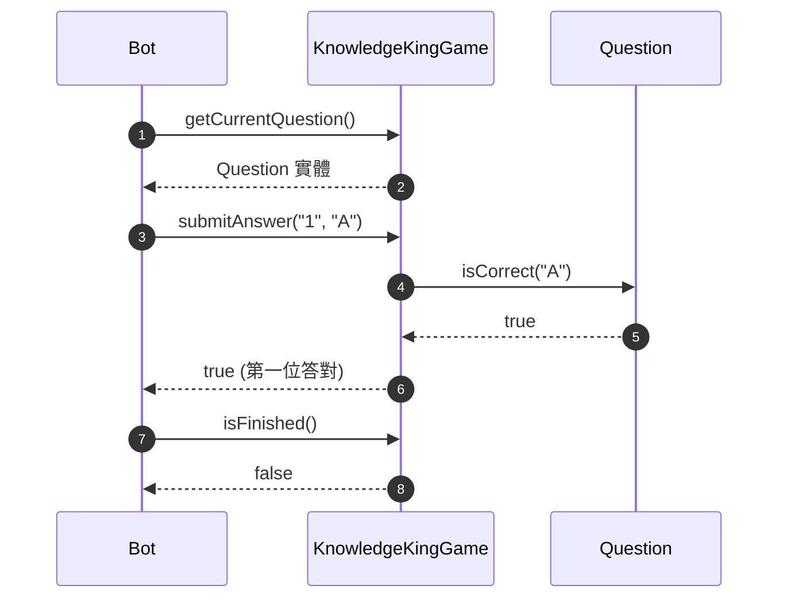

# OOA 各類別方法呼叫關係與行為分析

本文件依據 [homework8_Waterball/OOA-Clean.mmd](homework8_Waterball/OOA-Clean.mmd) 與 [homework8_Waterball/OOA-Clean說明.md](homework8_Waterball/OOA-Clean說明.md)，針對所有具備方法（Functions / Methods）之類別，進行完整的跨物件呼叫來源、呼叫時機、內部職責以及下游呼叫對象之深度分析。

---

## 術語規範與約定
- **`Driver`**：指外部模擬驅動器（測試驅動器 / 控制器），負責讀取測試輸入事件（如 `[login]`, `[new message]` 等）並觸發領域實體。
- **`Member`**：指社群真人使用者。本文件不另用「講者」或「錄音者」等分歧詞彙；若需表示特定情境，統一標記為「正在廣播的 `Member`」或「發起錄音的 `Member`」。
- **`Bot`**：指常駐於社群中的社群機器人。
- **`Participant`**：`Member` 與 `Bot` 的共通父類別。

---

## 目錄
1. [WaterballCommunity](#1-waterballcommunity)
2. [Member](#2-member)
3. [Bot](#3-bot)
4. [ChatRoom](#4-chatroom)
5. [Forum](#5-forum)
6. [Post](#6-post)
7. [Broadcast](#7-broadcast)
8. [RecordingSession](#8-recordingsession)
9. [KnowledgeKingGame](#9-knowledgekinggame)
10. [Question](#10-question)

---

## 1. WaterballCommunity

社群頂層聚合根，負責持有各基礎頻道實體、管理在線參與者名冊與推進模擬時間。

| 方法 | 是誰 Call 它？ | 呼叫時機 / 觸發事件 | 被 Call 後做什麼？接著 Call 誰？ |
| :--- | :--- | :--- | :--- |
| `login(participant: Participant)` | `Driver` | 解析到 `[login]` 事件 | 將 `participant` 加入內部在線清單 `onlineParticipants`。 |
| `logout(participantId: String)` | `Driver` | 解析到 `[logout]` 事件 | 將指定 `participantId` 從內部在線清單中移除。 |
| `elapseTime(amount: int, unit: String)` | `Driver` | 解析到 `[<n> <time-unit> elapsed]` 事件 | 1. 推進內部屬性 `currentTime`。 2. 呼叫 `Bot.onTimeElapsed(seconds)` 通知 `Bot` 進行時間檢查。 |
| `getOnlineParticipants()` | `Bot` | `Bot.onPostPublished` 時 | 回傳目前所有在線的 `Participant` 清單（包含 `Member` 與 `Bot`）。 |
| `getOnlineCount()` | `Bot` | `Bot` 收到新貼文或評估狀態時 | 計算並回傳在線總人數（包含 `Member` 與 `Bot`），供判斷是否 $\ge 10$ 人。 |

### 循序圖

---

## 2. Member

代表社群真人成員，所有操作皆為意圖發起行為。

| 方法 | 是誰 Call 它？ | 呼叫時機 / 觸發事件 | 被 Call 後做什麼？接著 Call 誰？ |
| :--- | :--- | :--- | :--- |
| `sendMessage(chatRoom, content, tags)` | `Driver` | 解析到 `[new message]` 事件 | 建立 `Message` 物件，呼叫 `ChatRoom.postMessage(message)`。 |
| `publishPost(forum, title, content, tags)` | `Driver` | 解析到 `[new post]` 事件 | 建立 `Post` 物件，呼叫 `Forum.createPost(post)`。 |
| `commentPost(forum, postId, content, tags)` | `Driver` | 成員在貼文下留言時 | 建立 `Comment` 物件，呼叫 `Forum.addComment(postId, comment)`。 |
| `startBroadcast(broadcast)` | `Driver` | 解析到 `[go broadcasting]` 事件 | 呼叫 `Broadcast.start(this.id)` 請求開啟麥克風。 |
| `speak(broadcast, content)` | `Driver` | 解析到 `[speak]` 事件 | 建立 `VoiceMessage` 物件，呼叫 `Broadcast.speak(voiceMessage)`。 |
| `stopBroadcast(broadcast)` | `Driver` | 解析到 `[stop broadcasting]` 事件 | 呼叫 `Broadcast.stop(this.id)` 請求釋放麥克風。 |

### 循序圖

---

## 3. Bot

社群機器人，方法分為「接收外部事件通知」與「內部主動動作發送」兩部分。

### (A) 被動接收事件方法
| 方法 | 是誰 Call 它？ | 呼叫時機 / 觸發事件 | 被 Call 後做什麼？接著 Call 誰？ |
| :--- | :--- | :--- | :--- |
| `onMessageReceived(message: Message)` | `ChatRoom` | `ChatRoom.postMessage` 收到訊息後 | 1. 若為一般聊天：處於正常狀態則呼叫 `Bot.replyChatMessage` 發送輪播回覆。 2. 若為指令：檢查權限與 `quota`，依指令切換至錄音或知識王狀態。 3. 若為知識王答題：呼叫 `KnowledgeKingGame.submitAnswer`。 |
| `onPostPublished(post: Post)` | `Forum` | `Forum.createPost` 建立貼文後 | 呼叫 `WaterballCommunity.getOnlineCount()` 判斷人數： - $<10$ 人：呼叫 `Bot.commentPost` 回覆 `Nice post` - $\ge 10$ 人：呼叫 `WaterballCommunity.getOnlineParticipants()` 取得名單，呼叫 `Bot.commentPost` 標記全員回覆。 |
| `onVoiceSpoken(voiceMessage: VoiceMessage)` | `Broadcast` | 正在廣播的 `Member` 呼叫 `Broadcast.speak` | 若處於錄音中狀態，呼叫 `RecordingSession.addVoice(voiceMessage)` 暫存語音。 |
| `onBroadcastStarted(speakerId: String)` | `Broadcast` | 某 `Member` 呼叫 `Broadcast.start` | 若處於錄音的等待狀態，狀態轉為錄音中。 |
| `onBroadcastStopped(speakerId: String)` | `Broadcast` | 正在廣播的 `Member` 呼叫 `Broadcast.stop` | 若處於錄音狀態，呼叫 `RecordingSession.generateReplay()`，並呼叫 `Bot.replyChatMessage` 發送 Replay 到聊天室。 |
| `onTimeElapsed(seconds: int)` | `WaterballCommunity` | `WaterballCommunity.elapseTime` 推進時間 | 1. 知識王答題階段：呼叫 `KnowledgeKingGame.isTimeout` 檢查是否超時 1 小時。 2. 知識王感謝參與階段：檢查是否屆滿 20 秒，屆滿則切換回正常狀態。 |

### (B) 內部主動動作方法
| 方法 | 是誰 Call 它？ | 呼叫時機 / 觸發事件 | 被 Call 後做什麼？接著 Call 誰？ |
| :--- | :--- | :--- | :--- |
| `replyChatMessage(content, tags)` | `Bot` 自己內部 | 輪播回覆、答對提示、題目輸出、Replay 輸出、勝負公布（麥克風佔用時） | 建立 `Message` 物件，呼叫 `ChatRoom.postMessage(message)`。 |
| `commentPost(postId, content, tags)` | `Bot` 自己內部 | `Bot.onPostPublished` 被觸發後 | 建立 `Comment` 物件，呼叫 `Forum.addComment(postId, comment)`。 |
| `broadcastVoice(content)` | `Bot` 自己內部 | 知識王結束且麥克風無人佔用時 | 依序呼叫： 1. `Broadcast.start("bot")` 2. `Broadcast.speak(voiceMessage)` 3. `Broadcast.stop("bot")`。 |

### 循序圖

---

## 4. ChatRoom

文字聊天基礎設施，負責維護聊天記錄並通知 `Bot`。

| 方法 | 是誰 Call 它？ | 呼叫時機 / 觸發事件 | 被 Call 後做什麼？接著 Call 誰？ |
| :--- | :--- | :--- | :--- |
| `postMessage(message: Message)` | <ul><li>`Member.sendMessage`</li><li>`Bot.replyChatMessage`</li></ul> | 真人 `Member` 發言或 `Bot` 回覆訊息時 | 1. 將 `message` 存入內部歷史清單。 2. 若發送者不是 `Bot`，呼叫 `Bot.onMessageReceived(message)`。 |
| `getMessages()` | `Driver` 或查詢模組 | 需要檢查或印出歷史聊天記錄時 | 回傳所有歷史 `Message` 清單。不呼叫其他物件。 |

### 循序圖

---

## 5. Forum

論壇基礎設施，負責維護貼文清單與通知 `Bot`。

| 方法 | 是誰 Call 它？ | 呼叫時機 / 觸發事件 | 被 Call 後做什麼？接著 Call 誰？ |
| :--- | :--- | :--- | :--- |
| `createPost(post: Post)` | `Member.publishPost` | `Member` 發布新貼文時 | 1. 將 `post` 加入內部貼文清單。 2. 呼叫 `Bot.onPostPublished(post)` 通知機器人。 |
| `addComment(postId, comment)` | <ul><li>`Member.commentPost`</li><li>`Bot.commentPost`</li></ul> | `Member` 或 `Bot` 在指定貼文留言時 | 依據 `postId` 找到目標 `Post` 實體，呼叫 `Post.addComment(comment)`。 |
| `getPost(id: String)` | `Driver` 或內部查詢 | 依 ID 檢索貼文時 | 搜尋並回傳對應的 `Post` 物件。不呼叫其他物件。 |

### 循序圖

---

## 6. Post

論壇單一貼文領域實體。

| 方法 | 是誰 Call 它？ | 呼叫時機 / 觸發事件 | 被 Call 後做什麼？接著 Call 誰？ |
| :--- | :--- | :--- | :--- |
| `addComment(comment: Comment)` | `Forum.addComment` | 留言被轉發至本貼文時 | 將 `comment` 附加至內部留言清單 `comments`。不呼叫其他物件。 |
| `getComments()` | `Driver` 或展示模組 | 讀取貼文所有留言時 | 回傳當前所有 `Comment` 清單。不呼叫其他物件。 |

---

## 7. Broadcast

語音廣播頻道基礎設施，掌管麥克風佔用權並通知 `Bot`。

| 方法 | 是誰 Call 它？ | 呼叫時機 / 觸發事件 | 被 Call 後做什麼？接著 Call 誰？ |
| :--- | :--- | :--- | :--- |
| `start(speakerId: String)` | <ul><li>`Member.startBroadcast`</li><li>`Bot.broadcastVoice`</li></ul> | `Member` 開啟廣播或 `Bot` 語音公布結果時 | 1. 設置 `currentSpeakerId = speakerId`。 2. 呼叫 `Bot.onBroadcastStarted(speakerId)`。 |
| `speak(voiceMessage: VoiceMessage)` | <ul><li>`Member.speak`</li><li>`Bot.broadcastVoice`</li></ul> | 正在廣播的 `Member` 或 `Bot` 傳遞語音時 | 1. 驗證發言者是否為當前講者。 2. 呼叫 `Bot.onVoiceSpoken(voiceMessage)`。 |
| `stop(speakerId: String)` | <ul><li>`Member.stopBroadcast`</li><li>`Bot.broadcastVoice`</li></ul> | 正在廣播的 `Member` 或 `Bot` 停止廣播時 | 1. 清空 `currentSpeakerId`。 2. 呼叫 `Bot.onBroadcastStopped(speakerId)`。 |
| `isBroadcasting()` | `Bot` | 啟動錄音指令時、知識王遊戲結算公布前 | 檢查 `currentSpeakerId != null` 並回傳結果。不呼叫其他物件。 |

### 循序圖

---

## 8. RecordingSession

錄音會話實體，由 `Bot` 在錄音期間建立與持有，專門緩存與組合語音訊息。

| 方法 | 是誰 Call 它？ | 呼叫時機 / 觸發事件 | 被 Call 後做什麼？接著 Call 誰？ |
| :--- | :--- | :--- | :--- |
| `addVoice(message: VoiceMessage)` | `Bot.onVoiceSpoken` | 錄音中狀態且廣播頻道有新語音時 | 將 `message` 暫存入內部語音清單。不呼叫其他物件。 |
| `generateReplay()` | <ul><li>`Bot.onBroadcastStopped`</li><li>`Bot.onMessageReceived` (stop-recording 指令)</li></ul> | 講者結束廣播，或發起錄音的 `Member` 下達停止錄音指令時 | 1. 將所有暫存的語音內文以換行符號組合為 `[Record Replay]` 格式字串。 2. 清空暫存清單並回傳該字串。不呼叫其他物件。 |

---

## 9. KnowledgeKingGame

知識王競賽實體，封裝題目推進、答題驗證、超時檢查與計分算贏家之邏輯。

| 方法 | 是誰 Call 它？ | 呼叫時機 / 觸發事件 | 被 Call 後做什麼？接著 Call 誰？ |
| :--- | :--- | :--- | :--- |
| `getCurrentQuestion()` | `Bot` | 剛進入出題狀態，或前一題被答對後準備出下一題時 | 回傳當前題目索引所指向的 `Question` 物件。不呼叫其他物件。 |
| `submitAnswer(memberId, answer)` | `Bot.onMessageReceived` | 成員標記 `@bot` 回答答案時 | 1. 取得當前題目，呼叫 `Question.isCorrect(answer)` 驗證答案。 2. 若正確：為該 `memberId` 加 1 分，推進 `currentQuestionIndex`，並回傳 `true`。 3. 若錯誤：回傳 `false`。 |
| `isFinished()` | `Bot` | 正確答題後，判定是否已完成全部 3 題 | 檢查 `currentQuestionIndex >= 3` 並回傳布林值。不呼叫其他物件。 |
| `isTimeout(currentTime: DateTime)` | `Bot.onTimeElapsed` | 時間流逝事件發生時 | 比對 `currentTime` 與 `startTime` 是否相差超過 1 小時，回傳布林值。不呼叫其他物件。 |
| `getWinner()` | `Bot` | 3 題答完或 1 小時超時結算時 | 比對所有參賽成員累計分數： - 最高分者唯一：回傳最高分成員 ID。 - 同分或無人答對：回傳 `"Tie!"`。不呼叫其他物件。 |

### 循序圖

---

## 10. Question

考題實體，儲存題目、選項與正解，並負責答案核對。

| 方法 | 是誰 Call 它？ | 呼叫時機 / 觸發事件 | 被 Call 後做什麼？接著 Call 誰？ |
| :--- | :--- | :--- | :--- |
| `isCorrect(answer: String)` | `KnowledgeKingGame.submitAnswer` | 知識王遊戲比對成員提交的選項時 | 將傳入的 `answer` 與內部 `correctAnswer` 比對（忽略大小寫），回傳布林值。不呼叫其他物件。 |
