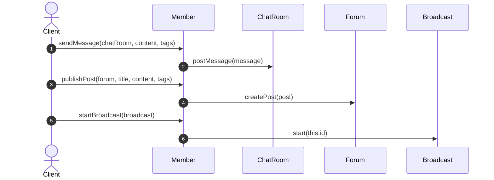
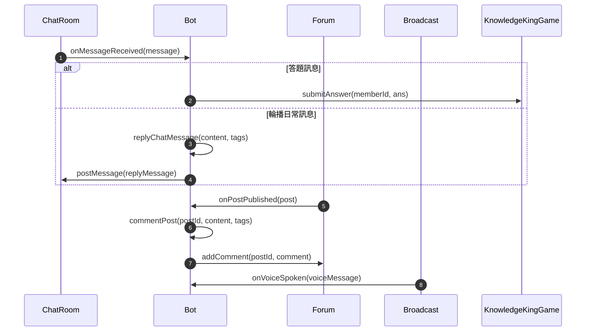
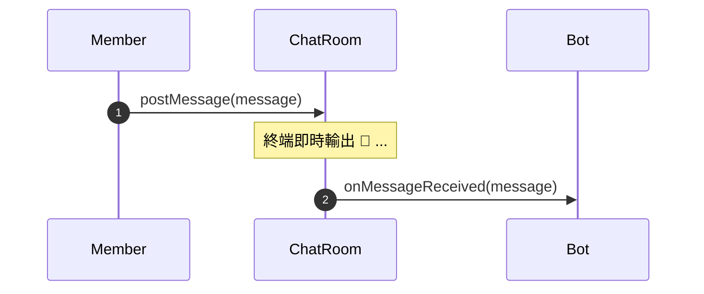
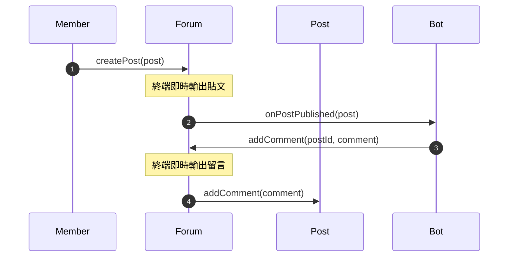
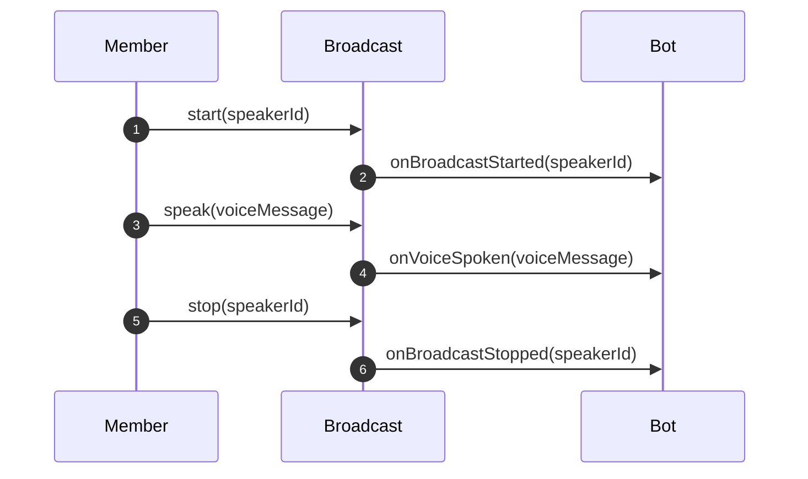
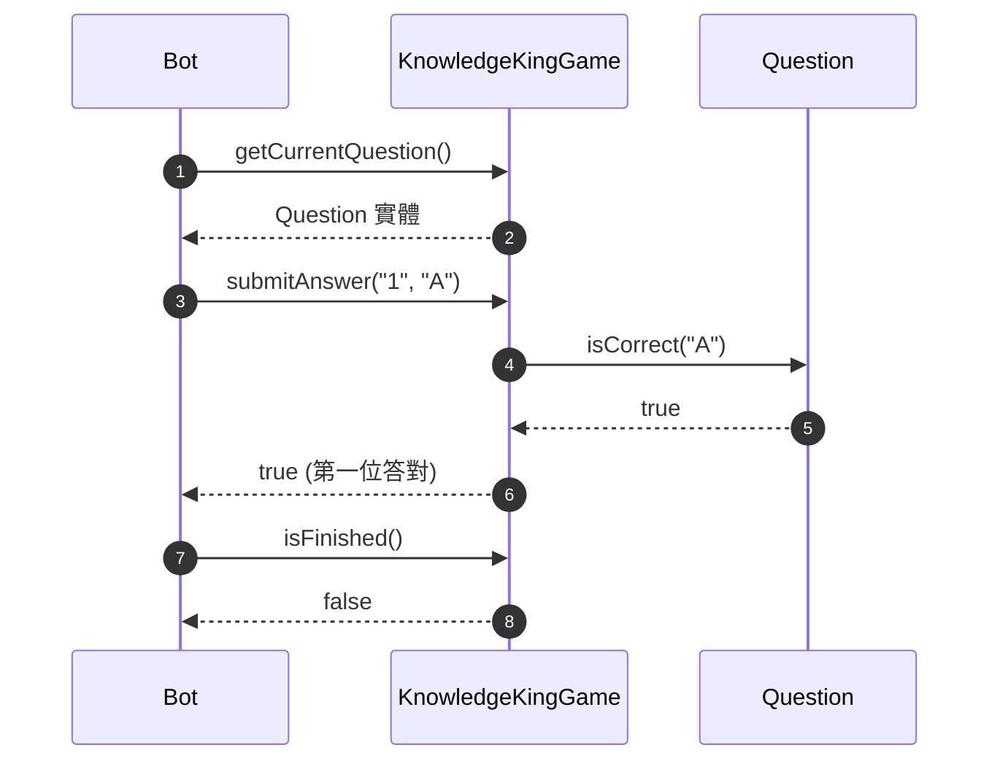

# OOA 各類別方法呼叫關係與行為分析

本文件依據 [homework8_Waterball/OOA-Clean.mmd](homework8_Waterball/OOA-Clean.mmd) 與 [homework8_Waterball/OOA-Clean說明.md](homework8_Waterball/OOA-Clean說明.md)，針對所有具備方法（Functions / Methods）之類別，進行完整的職責界定、跨物件呼叫來源、呼叫時機、內部職責以及下游呼叫對象之深度分析。

---

## 術語規範與約定
- **`Client`**：指外部客戶端呼叫者（系統應用層 / 控制端 / 進入點程式），負責接收使用者或外界操作事件（如登入、發送訊息、時間流逝等）並驅動領域實體。
  - **實作落地備註**：在後續撰寫 Python 實作程式碼時，這個 `Client` 在專案結構上通常會具體落地為 `main.py` 或單元測試檔案（Test Runner）；但在架構分析與 OOA 概念文件中，一律使用 **`Client`** 才是最純粹的物件導向抽象語言。
- **`Member`**：指社群真人使用者。本文件不另用「講者」或「錄音者」等分歧詞彙；若需表示特定情境，統一標記為「正在廣播的 `Member`」或「發起錄音的 `Member`」。
- **`Bot`**：指常駐於社群中的社群機器人。
  - 當欄位標註為 **`Bot (內部狀態判斷/主持流程)`** 時：代表此協作非由單一公開事件 API 直接觸發，而是 **Bot 內部（或狀態機運作）主動發起的協作與查詢**。
- **`Participant`**：`Member` 與 `Bot` 的共通父類別。

---

## 目錄
1. [OOA 方法精簡與淘汰/保留結論](#ooa-方法精簡與淘汰保留結論)
2. [各類別職責總覽 (概念化描述與功能規格)](#各類別職責總覽-概念化描述與功能規格)
3. [便條紙快速速查區 (結構化便條紙)](#便條紙快速速查區-結構化便條紙)
4. [詳細各類別方法分析表](#詳細各類別方法分析表)
   - [1. WaterballCommunity](#1-waterballcommunity)
   - [2. Member](#2-member)
   - [3. Bot](#3-bot)
   - [4. ChatRoom](#4-chatroom)
   - [5. Forum](#5-forum)
   - [6. Post](#6-post)
   - [7. Broadcast](#7-broadcast)
   - [8. RecordingSession](#8-recordingsession)
   - [9. KnowledgeKingGame](#9-knowledgekinggame)
   - [10. Question](#10-question)

---

## OOA 方法精簡與淘汰/保留結論

本題目為標準的**事件驅動串流輸出（Event-Driven Stream Output）**，輸入事件觸發領域行為後即時輸出結果至終端（stdout），而非傳統 Web/DB 的 CRUD 查詢系統。

因此，對 OOA 中的方法進行嚴格的「業務協作必要性審查」：

### 淘汰與保留清單

| 類別 | 方法名稱 | 判定 | 具體原因 |
| :--- | :--- | :---: | :--- |
| **`ChatRoom`** | `getMessages()` | ❌ **移除** | 題目為即時事件推播（收到即印出），從無「事後查詢所有歷史聊天紀錄」的領域業務需求。 |
| **`Post`** | `getComments()` | ❌ **移除** | 留言在新增當下即完成終端印出，領域內無事後整批拉取留言清單之協同需求。 |
| **`Forum`** | `getPost(id)` | ⚠️ **降為內部私有** | 外部成員或機器人只呼叫 `addComment(postId, comment)`，依 ID 查找貼文為論壇內部實作細節，不在 OOA 公開介面暴露。 |
| **其餘所有方法** | （共 26 個方法） | ✅ **全部保留** | 每個方法皆嚴格對應題目規格中的狀態轉移、資源互斥、事件通知或資料拼裝。 |

> **核心架構結論**：
> 移除 `ChatRoom.getMessages()` 與 `Post.getComments()` 兩個純資料導向的 Getter，並將 `Forum.getPost(id)` 降為內部私有方法後，整份 OOA 轉化為純粹的**責任驅動設計（Responsibility-Driven Design, RDD）**。留在公開介面上的每一個方法都有其不可替代的業務使命！

---

## 各類別職責總覽 (概念化描述與功能規格)

本區塊獨立歸納各類別之核心責任：先以一句人類自然語言進行較為概念化、本質性的職責描述，再條列大方向的功能規格。

### 1. WaterballCommunity
> **概念化職責描述**：作為整個 Waterball 社群的世界中樞，統整基礎建設、維繫社群成員的在線生命週期，並主導世界時間的推進。

**大方向功能規格**：
1. 管理參與者上線與離線（維護在線名冊）。
2. 推進時間時呼叫 `Bot.onTimeElapsed(seconds)` 觸發超時與倒數檢查。
3. 提供在線總人數與參與者名冊供 `Bot` 與系統查詢。

---

### 2. Member
> **概念化職責描述**：代表社群中活生生的人，是所有社群社交、內容創作、語音交流以及指令操作的意圖發起者。

**大方向功能規格**：
1. 聊天室交流與下指令：封裝訊息發送至聊天室。
2. 論壇發布與回覆：發表主題貼文或針對特定文章留言互動。
3. 語音廣播操作：主動發起廣播開麥、傳遞即時說話內容，以及結束廣播閉麥。

---

### 3. Bot
> **概念化職責描述**：常駐在社群裡的智慧管家與活動主持者，無時無刻監聽社群動態，適時做出熱情回應，並負責控管資源與主持特定活動。

**大方向功能規格**：
1. 監聽聊天室訊息：控管指令額度、主持日常輪播回覆、協調狀態切換或傳遞作答。
2. 監聽論壇新貼文：依在線熱絡程度（在線人數門檻）決定貼文回應內容與標記全員。
3. 監聽廣播即時語音：於錄音狀態收集發言內容，並於下麥時產出文字回放。
4. 推進活動時間：監控知識王作答時效（1 小時）與賽後致謝倒數（20 秒）。
5. 主動操作基礎頻道：發送聊天訊息、留言論壇貼文，或在麥克風空閒時進行廣播語音公布。

---

### 4. ChatRoom
> **概念化職責描述**：社群的即時文字交誼廳，負責承載與沈澱成員間的所有對話流，並即時提醒常駐管家。

**大方向功能規格**：
1. 接收成員與機器人的文字發言，並即時於終端輸出訊息。
2. 於收到非機器人發言時，即時通報 `Bot` 進行理解與處置。

---

### 5. Forum
> **概念化職責描述**：社群的非同步知識庫與主題討論版面，負責組織主題文章並串接交流回覆。

**大方向功能規格**：
1. 接收並管理所有主題貼文，即時於終端輸出貼文，並於新貼文成立時通知 `Bot`。
2. 內部定位目標貼文並將留言附著於其下，同時即時於終端輸出留言。

---

### 6. Post
> **概念化職責描述**：單一主題討論的容器實體，負責匯聚該話題下所有的討論留言與標籤脈絡。

**大方向功能規格**：
1. 封裝貼文本身之標題、內文、作者與標記名單。
2. 接收並維護隸屬於該貼文之下的留言（`Comment`）記錄。

---

### 7. Broadcast
> **概念化職責描述**：社群唯一的即時語音廣播站台，把關發話特權，並將每一次聲音脈動廣播給社群常駐者。

**大方向功能規格**：
1. 獨佔性麥克風使用權仲裁（同一時間僅允許零至一人開麥）。
2. 轉遞講者即時說話的語音訊息，並即時於終端輸出廣播動態。
3. 於講者上麥、說話、下麥時，即時通報常駐的 `Bot`。
4. 提供目前麥克風佔用狀態之查詢。

---

### 8. RecordingSession
> **概念化職責描述**：專屬於特定錄音任務的聲音軌跡筆記本，負責收錄講者的一字一句並整編成結構化回放文稿。

**大方向功能規格**：
1. 綁定發起錄音的成員身分，並暫存錄音期間收到的語音串流。
2. 於錄音終止或講者下麥時，格式化組合為 `[Record Replay]` 換行文稿並重置暫存。

---

### 9. KnowledgeKingGame
> **概念化職責描述**：知識王問答競賽的裁判與計分系統，精準掌握考題推進、答題判定與勝負終局結算。

**大方向功能規格**：
1. 管理 3 道關卡題庫之當前進度與考題提取。
2. 檢驗作答答案，為首位答對者累計積分並推進下一題。
3. 掌握遊戲終局條件：判定是否 3 題作答完畢或已超過 1 小時作答上限。
4. 結算所有參賽者積分，產出最高分得主或判定平手。

---

### 10. Question
> **概念化職責描述**：考題的知識實體，封裝題目內容與選項，並擔任客觀的正解判定者。

**大方向功能規格**：
1. 封裝題號、題目描述、選項清單與標準答案標籤。
2. 比對使用者所提答案是否與正解相符（忽略英文大小寫）。

---

## 便條紙快速速查區 (結構化便條紙)

此區塊依據結構化便條紙格式整理，方便直接複製貼入 Astah 便條紙中。

### 📌 便條紙：WaterballCommunity
```text
【WaterballCommunity】
- 主要行為：維護參與者在線清單、推進世界時鐘並通知 Bot 檢查規則
- 觸發時機：模擬開始與系統事件（login, logout, elapsed）發生時
- 被誰觸發：Client
- 協作對象：Bot
- 會觸發誰：Bot.onTimeElapsed()
```

### 📌 便條紙：Member
```text
【Member】
- 主要行為：主動在聊天室發話、在論壇發文留言，以及開啟麥克風進行廣播與發言
- 觸發時機：成員收到系統輸入指令或自身意圖發起活動時
- 被誰觸發：Client
- 協作對象：ChatRoom, Forum, Broadcast
- 會觸發誰：ChatRoom.postMessage(), Forum.createPost(), Forum.addComment(), Broadcast.start/speak/stop()
```

### 📌 便條紙：Bot (接收事件)
```text
【Bot (接收事件)】
- 主要行為：接收聊天訊息、新貼文、語音串流與時間推進，依當前狀態與額度決定行為或轉移狀態
- 觸發時機：社群內各頻道有新動態或時間流逝時
- 被誰觸發：ChatRoom, Forum, Broadcast, WaterballCommunity
- 協作對象：KnowledgeKingGame, RecordingSession
- 會觸發誰：Bot.replyChatMessage(), Bot.commentPost(), Bot.broadcastVoice(), Game.submitAnswer(), Session.addVoice()
```

### 📌 便條紙：Bot (主動操作)
```text
【Bot (主動操作)】
- 主要行為：在聊天室發布輪播與活動訊息、在貼文留言，或在麥克風無人使用時廣播公布勝者
- 觸發時機：內部狀態處理完畢需要對社群輸出回饋時
- 被誰觸發：Bot 內部自身
- 協作對象：ChatRoom, Forum, Broadcast
- 會觸發誰：ChatRoom.postMessage(), Forum.addComment(), Broadcast.start/speak/stop()
```

### 📌 便條紙：ChatRoom
```text
【ChatRoom】
- 主要行為：輸出文字發言至終端，並在收到成員新發言時通知 Bot 處置
- 觸發時機：Member 發言或 Bot 發送訊息時
- 被誰觸發：Member.sendMessage(), Bot.replyChatMessage()
- 協作對象：Bot
- 會觸發誰：Bot.onMessageReceived()
```

### 📌 便條紙：Forum
```text
【Forum】
- 主要行為：發布貼文與轉發留言至指定貼文（輸出終端），並在新貼文建立時通知 Bot
- 觸發時機：Member 發布貼文、Member/Bot 發表留言時
- 被誰觸發：Member.publishPost(), Member.commentPost(), Bot.commentPost()
- 協作對象：Post, Bot
- 會觸發誰：Post.addComment(), Bot.onPostPublished()
```

### 📌 便條紙：Post
```text
【Post】
- 主要行為：儲存貼文核心內容並接收轉發而來的討論留言
- 觸發時機：論壇轉發留言至該貼文時
- 被誰觸發：Forum.addComment()
- 協作對象：無
- 會觸發誰：無
```

### 📌 便條紙：Broadcast
```text
【Broadcast】
- 主要行為：鎖定/釋放麥克風獨佔權、傳遞即時語音，並通報 Bot 講者上麥、發言與下麥狀態
- 觸發時機：Member 或 Bot 進行廣播操作時
- 被誰觸發：Member.startBroadcast/speak/stopBroadcast(), Bot.broadcastVoice()
- 協作對象：Bot
- 會觸發誰：Bot.onBroadcastStarted(), Bot.onVoiceSpoken(), Bot.onBroadcastStopped()
```

### 📌 便條紙：RecordingSession
```text
【RecordingSession】
- 主要行為：暫存講者說話語音，並在結束時格式化產出換行排版的 Replay 訊息後清空暫存
- 觸發時機：廣播有即時發言、講者下麥，或成員下達停止錄音指令時
- 被誰觸發：Bot.onVoiceSpoken(), Bot.onBroadcastStopped(), Bot.onMessageReceived()
- 協作對象：無
- 會觸發誰：無
```

### 📌 便條紙：KnowledgeKingGame
```text
【KnowledgeKingGame】
- 主要行為：提供當前考題、核對作答並為首位答對者計分、檢查 3 題作答/超時狀態，結算優勝者
- 觸發時機：Bot 主持知識王出題、收到成員作答、時間推進與結算時
- 被誰觸發：Bot (內部狀態判斷/主持流程)
- 協作對象：Question
- 會觸發誰：Question.isCorrect()
```

### 📌 便條紙：Question
```text
【Question】
- 主要行為：比對傳入作答選項與標準答案是否相符（忽略英文大小寫）
- 觸發時機：知識王核對成員作答內容時
- 被誰觸發：KnowledgeKingGame.submitAnswer()
- 協作對象：無
- 會觸發誰：無
```

---

## 詳細各類別方法分析表

---

### 1. WaterballCommunity

社群頂層聚合根，負責持有各基礎頻道實體、管理在線參與者名冊與推進模擬時間。

| 方法 | 是誰 Call 它？ | 呼叫時機 / 觸發事件 | 被 Call 後做什麼？接著 Call 誰？ | 便條紙欄位 (結構化摘要) |
| :--- | :--- | :--- | :--- | :--- |
| `login(participant: Participant)` | `Client` | 外部發起登入事件 | 將 `participant` 加入內部在線清單 `onlineParticipants`。 | **主要行為**：將成員加入在線名冊<br/>**觸發時機**：成員登入事件<br/>**被誰觸發**：Client |
| `logout(participantId: String)` | `Client` | 外部發起登出事件 | 將指定 `participantId` 從內部在線清單中移除。 | **主要行為**：將成員移出在線名冊<br/>**觸發時機**：成員登出事件<br/>**被誰觸發**：Client |
| `elapseTime(amount: int, unit: String)` | `Client` | 外部推進時間流逝事件 | 1. 推進內部屬性 `currentTime`。<br/>2. 呼叫 `Bot.onTimeElapsed(seconds)` 通知 `Bot` 進行時間檢查。 | **主要行為**：推進社群模擬時間並通知機器人檢查倒數規則<br/>**觸發時機**：時間流逝事件<br/>**被誰觸發**：Client<br/>**會觸發誰**：Bot.onTimeElapsed() |
| `getOnlineParticipants()` | `Bot` | `Bot.onPostPublished` 時 | 回傳目前所有在線的 `Participant` 清單（包含 `Member` 與 `Bot`）。 | **主要行為**：提供在線參與者名冊<br/>**觸發時機**：Bot 需標記全員回覆貼文時<br/>**被誰觸發**：Bot.onPostPublished() |
| `getOnlineCount()` | `Bot` | `Bot` 收到新貼文或評估狀態時 | 計算並回傳在線總人數（包含 `Member` 與 `Bot`），供判斷是否 $\ge 10$ 人。 | **主要行為**：計算並回傳在線總人數<br/>**觸發時機**：Bot 評估狀態或回覆貼文門檻時<br/>**被誰觸發**：Bot (內部狀態判斷/主持流程) |

#### 循序圖


---

### 2. Member

代表社群真人成員，所有操作皆為意圖發起行為。

| 方法 | 是誰 Call 它？ | 呼叫時機 / 觸發事件 | 被 Call 後做什麼？接著 Call 誰？ | 便條紙欄位 (結構化摘要) |
| :--- | :--- | :--- | :--- | :--- |
| `sendMessage(chatRoom, content, tags)` | `Client` | 成員發言或下指令時 | 建立 `Message` 物件，呼叫 `ChatRoom.postMessage(message)`。 | **主要行為**：封裝聊天訊息並發送至聊天室<br/>**觸發時機**：成員聊天發言或下指令時<br/>**被誰觸發**：Client<br/>**會觸發誰**：ChatRoom.postMessage() |
| `publishPost(forum, title, content, tags)` | `Client` | 成員在論壇發布新文章時 | 建立 `Post` 物件，呼叫 `Forum.createPost(post)`。 | **主要行為**：封裝主題貼文並發布至論壇<br/>**觸發時機**：成員在論壇發布新文章時<br/>**被誰觸發**：Client<br/>**會觸發誰**：Forum.createPost() |
| `commentPost(forum, postId, content, tags)` | `Client` | 成員在貼文下留言時 | 建立 `Comment` 物件，呼叫 `Forum.addComment(postId, comment)`。 | **主要行為**：封裝留言內容並回覆指定貼文<br/>**觸發時機**：成員在貼文下留言時<br/>**被誰觸發**：Client<br/>**會觸發誰**：Forum.addComment() |
| `startBroadcast(broadcast)` | `Client` | 成員開啟廣播時 | 呼叫 `Broadcast.start(this.id)` 請求開啟麥克風。 | **主要行為**：向廣播頻道請求開啟麥克風並開始廣播<br/>**觸發時機**：成員開啟廣播時<br/>**被誰觸發**：Client<br/>**會觸發誰**：Broadcast.start() |
| `speak(broadcast, content)` | `Client` | 成員廣播講話時 | 建立 `VoiceMessage` 物件，呼叫 `Broadcast.speak(voiceMessage)`。 | **主要行為**：傳遞即時說話語音給廣播頻道<br/>**觸發時機**：成員廣播講話時<br/>**被誰觸發**：Client<br/>**會觸發誰**：Broadcast.speak() |
| `stopBroadcast(broadcast)` | `Client` | 成員結束廣播時 | 呼叫 `Broadcast.stop(this.id)` 請求釋放麥克風。 | **主要行為**：關閉麥克風並結束廣播<br/>**觸發時機**：成員結束廣播時<br/>**被誰觸發**：Client<br/>**會觸發誰**：Broadcast.stop() |

#### 循序圖


---

### 3. Bot

社群機器人，方法分為「接收外部事件通知」與「內部主動動作發送」兩部分。

#### (A) 被動接收事件方法
| 方法 | 是誰 Call 它？ | 呼叫時機 / 觸發事件 | 被 Call 後做什麼？接著 Call 誰？ | 便條紙欄位 (結構化摘要) |
| :--- | :--- | :--- | :--- | :--- |
| `onMessageReceived(message: Message)` | `ChatRoom` | `ChatRoom.postMessage` 收到訊息後 | 1. 若為一般聊天：處於正常狀態則呼叫 `Bot.replyChatMessage` 發送輪播回覆。<br/>2. 若為指令：檢查權限與 `quota`，依指令切換至錄音或知識王狀態。<br/>3. 若為知識王答題：呼叫 `KnowledgeKingGame.submitAnswer`。 | **主要行為**：判讀訊息為指令、答題或日常對話，進行狀態轉移或回覆<br/>**觸發時機**：聊天室有新發言時<br/>**被誰觸發**：ChatRoom.postMessage()<br/>**協作對象**：KnowledgeKingGame<br/>**會觸發誰**：Bot.replyChatMessage(), Game.submitAnswer() |
| `onPostPublished(post: Post)` | `Forum` | `Forum.createPost` 建立貼文後 | 呼叫 `WaterballCommunity.getOnlineCount()` 判斷人數：<br/>- $<10$ 人：呼叫 `Bot.commentPost` 回覆 `Nice post`<br/>- $\ge 10$ 人：呼叫 `WaterballCommunity.getOnlineParticipants()` 取得名單，呼叫 `Bot.commentPost` 標記全員回覆。 | **主要行為**：依在線總人數決定貼文留言內容（Nice post 或全員標記）<br/>**觸發時機**：論壇有新貼文發布時<br/>**被誰觸發**：Forum.createPost()<br/>**協作對象**：WaterballCommunity<br/>**會觸發誰**：Bot.commentPost() |
| `onVoiceSpoken(voiceMessage: VoiceMessage)` | `Broadcast` | 正在廣播的 `Member` 呼叫 `Broadcast.speak` | 若處於錄音中狀態，呼叫 `RecordingSession.addVoice(voiceMessage)` 暫存語音。 | **主要行為**：於錄音狀態將講者語音串流收集至錄音會話中<br/>**觸發時機**：廣播頻道有即時語音送出時<br/>**被誰觸發**：Broadcast.speak()<br/>**協作對象**：RecordingSession<br/>**會觸發誰**：RecordingSession.addVoice() |
| `onBroadcastStarted(speakerId: String)` | `Broadcast` | 某 `Member` 呼叫 `Broadcast.start` | 若處於錄音的等待狀態，狀態轉為錄音中。 | **主要行為**：感知成員開啟廣播，錄音狀態自動由等待切換為錄音中<br/>**觸發時機**：有成員成功開啟麥克風時<br/>**被誰觸發**：Broadcast.start() |
| `onBroadcastStopped(speakerId: String)` | `Broadcast` | 正在廣播的 `Member` 呼叫 `Broadcast.stop` | 若處於錄音狀態，呼叫 `RecordingSession.generateReplay()`，並呼叫 `Bot.replyChatMessage` 發送 Replay 到聊天室。 | **主要行為**：感知講者閉麥，觸發產出 Replay 文稿並送至聊天室<br/>**觸發時機**：講者結束廣播時<br/>**被誰觸發**：Broadcast.stop()<br/>**協作對象**：RecordingSession<br/>**會觸發誰**：Session.generateReplay(), Bot.replyChatMessage() |
| `onTimeElapsed(seconds: int)` | `WaterballCommunity` | `WaterballCommunity.elapseTime` 推進時間 | 1. 知識王答題階段：呼叫 `KnowledgeKingGame.isTimeout` 檢查是否超時 1 小時。<br/>2. 知識王感謝參與階段：檢查是否屆滿 20 秒，屆滿則切換回正常狀態。 | **主要行為**：檢查活動計時，處理知識王 1 小時超時或 20 秒結算結束<br/>**觸發時機**：社群模擬時間推進時<br/>**被誰觸發**：WaterballCommunity.elapseTime()<br/>**協作對象**：KnowledgeKingGame<br/>**會觸發誰**：Game.isTimeout() |

#### (B) 內部主動動作方法
| 方法 | 是誰 Call 它？ | 呼叫時機 / 觸發事件 | 被 Call 後做什麼？接著 Call 誰？ | 便條紙欄位 (結構化摘要) |
| :--- | :--- | :--- | :--- | :--- |
| `replyChatMessage(content, tags)` | `Bot` 自己內部 | 輪播回覆、答對提示、題目輸出、Replay 輸出、勝負公布（麥克風佔用時） | 建立 `Message` 物件，呼叫 `ChatRoom.postMessage(message)`。 | **主要行為**：以 Bot 身分發送訊息或回覆至聊天室<br/>**觸發時機**：輪播回覆、考題發布、Replay 輸出或勝負聊天公布時<br/>**被誰觸發**：Bot 內部自身<br/>**會觸發誰**：ChatRoom.postMessage() |
| `commentPost(postId, content, tags)` | `Bot` 自己內部 | `Bot.onPostPublished` 被觸發後 | 建立 `Comment` 物件，呼叫 `Forum.addComment(postId, comment)`。 | **主要行為**：以 Bot 身分在論壇指定貼文底下發表留言<br/>**觸發時機**：回應新貼文時<br/>**被誰觸發**：Bot.onPostPublished()<br/>**會觸發誰**：Forum.addComment() |
| `broadcastVoice(content)` | `Bot` 自己內部 | 知識王結束且麥克風無人佔用時 | 依序呼叫：<br/>1. `Broadcast.start("bot")`<br/>2. `Broadcast.speak(voiceMessage)`<br/>3. `Broadcast.stop("bot")`。 | **主要行為**：於麥克風空閒時短暫開麥進行語音公布並隨即閉麥<br/>**觸發時機**：知識王結算且無人廣播時<br/>**被誰觸發**：Bot 內部自身<br/>**會觸發誰**：Broadcast.start(), Broadcast.speak(), Broadcast.stop() |

#### 循序圖


---

### 4. ChatRoom

文字聊天基礎設施，負責輸出聊天訊息至終端並通知 `Bot`。

| 方法 | 是誰 Call 它？ | 呼叫時機 / 觸發事件 | 被 Call 後做什麼？接著 Call 誰？ | 便條紙欄位 (結構化摘要) |
| :--- | :--- | :--- | :--- | :--- |
| `postMessage(message: Message)` | `Member.sendMessage` 或 `Bot.replyChatMessage` | `Member` 發言或 `Bot` 回覆訊息時 | 1. 即時將訊息格式化輸出至終端（`💬 ...` 或 `🤖: ...`）。<br/>2. 若發送者不是 `Bot`，呼叫 `Bot.onMessageReceived(message)`。 | **主要行為**：即時輸出發言至終端，若非機器人發言則通報 Bot<br/>**觸發時機**：成員或機器人發送聊天訊息時<br/>**被誰觸發**：Member.sendMessage(), Bot.replyChatMessage()<br/>**會觸發誰**：Bot.onMessageReceived() |

> **說明**：原先規劃之 `getMessages()` 經審查已移除。因系統為即時串流輸出，無任何業務物件需要事後拉取歷史訊息清單。

#### 循序圖


---

### 5. Forum

論壇基礎設施，負責管理貼文發布、轉發留言，並通知 `Bot`。

| 方法 | 是誰 Call 它？ | 呼叫時機 / 觸發事件 | 被 Call 後做什麼？接著 Call 誰？ | 便條紙欄位 (結構化摘要) |
| :--- | :--- | :--- | :--- | :--- |
| `createPost(post: Post)` | `Member.publishPost` | `Member` 發布新貼文時 | 1. 即時將貼文格式化輸出至終端。<br/>2. 將 `post` 加入內部貼文清單。<br/>3. 呼叫 `Bot.onPostPublished(post)` 通知機器人。 | **主要行為**：將貼文納入清單、即時輸出至終端並通知 Bot 回應<br/>**觸發時機**：成員發表新貼文時<br/>**被誰觸發**：Member.publishPost()<br/>**會觸發誰**：Bot.onPostPublished() |
| `addComment(postId, comment)` | `Member.commentPost` 或 `Bot.commentPost` | `Member` 或 `Bot` 在指定貼文留言時 | 1. 內部透過 ID 找到目標 `Post` 實體。<br/>2. 呼叫 `Post.addComment(comment)`。<br/>3. 即時輸出留言至終端。 | **主要行為**：定位目標貼文並掛載留言，即時輸出至終端<br/>**觸發時機**：成員或機器人發表貼文留言時<br/>**被誰觸發**：Member.commentPost(), Bot.commentPost()<br/>**會觸發誰**：Post.addComment() |

> **說明**：原先的 `getPost(id: String)` 為論壇內部尋找貼文的輔助操作，降為內部私有實作，不暴露於 OOA 公開介面。

#### 循序圖


---

### 6. Post

論壇單一貼文領域實體。

| 方法 | 是誰 Call 它？ | 呼叫時機 / 觸發事件 | 被 Call 後做什麼？接著 Call 誰？ | 便條紙欄位 (結構化摘要) |
| :--- | :--- | :--- | :--- | :--- |
| `addComment(comment: Comment)` | `Forum.addComment` | 留言被轉發至本貼文時 | 將 `comment` 附加至內部留言清單 `comments`。不呼叫其他物件。 | **主要行為**：將新留言加入此貼文的留言清單中<br/>**觸發時機**：論壇將留言轉發至本貼文時<br/>**被誰觸發**：Forum.addComment() |

> **說明**：原先規劃之 `getComments()` 經審查已移除。留言在加進去時已由 `Forum` 即時輸出，系統無事後整批拉取留言清單之協同需求。

---

### 7. Broadcast

語音廣播頻道基礎設施，掌管麥克風佔用權並通知 `Bot`。

| 方法 | 是誰 Call 它？ | 呼叫時機 / 觸發事件 | 被 Call 後做什麼？接著 Call 誰？ | 便條紙欄位 (結構化摘要) |
| :--- | :--- | :--- | :--- | :--- |
| `start(speakerId: String)` | `Member.startBroadcast` 或 `Bot.broadcastVoice` | `Member` 開啟廣播或 `Bot` 語音公布結果時 | 1. 設置 `currentSpeakerId = speakerId` 並即時輸出上麥動態至終端。<br/>2. 呼叫 `Bot.onBroadcastStarted(speakerId)`。 | **主要行為**：鎖定麥克風講者並通知 Bot 講者上麥<br/>**觸發時機**：成員或機器人開啟廣播時<br/>**被誰觸發**：Member.startBroadcast(), Bot.broadcastVoice()<br/>**會觸發誰**：Bot.onBroadcastStarted() |
| `speak(voiceMessage: VoiceMessage)` | `Member.speak` 或 `Bot.broadcastVoice` | 正在廣播的 `Member` 或 `Bot` 傳遞語音時 | 1. 驗證發言者是否為當前講者，即時輸出語音內容至終端。<br/>2. 呼叫 `Bot.onVoiceSpoken(voiceMessage)`。 | **主要行為**：驗證發話身分並將即時語音傳遞給 Bot 監聽<br/>**觸發時機**：講者在廣播中傳遞語音時<br/>**被誰觸發**：Member.speak(), Bot.broadcastVoice()<br/>**會觸發誰**：Bot.onVoiceSpoken() |
| `stop(speakerId: String)` | `Member.stopBroadcast` 或 `Bot.broadcastVoice` | 正在廣播的 `Member` 或 `Bot` 停止廣播時 | 1. 清空 `currentSpeakerId` 並即時輸出閉麥動態至終端。<br/>2. 呼叫 `Bot.onBroadcastStopped(speakerId)`。 | **主要行為**：釋放麥克風並通知 Bot 講者下麥<br/>**觸發時機**：講者結束廣播時<br/>**被誰觸發**：Member.stopBroadcast(), Bot.broadcastVoice()<br/>**會觸發誰**：Bot.onBroadcastStopped() |
| `isBroadcasting()` | `Bot` | 啟動錄音指令時、知識王遊戲結算公布前 | 檢查 `currentSpeakerId != null` 並回傳結果。不呼叫其他物件。 | **主要行為**：查詢當前麥克風是否有人正在使用<br/>**觸發時機**：錄音判定初始子狀態或知識王結算決定發布方式時<br/>**被誰觸發**：Bot (內部狀態判斷/主持流程) |

#### 循序圖


---

### 8. RecordingSession

錄音會話實體，由 `Bot` 在錄音期間建立與持有，專門緩存與組合語音訊息。

| 方法 | 是誰 Call 它？ | 呼叫時機 / 觸發事件 | 被 Call 後做什麼？接著 Call 誰？ | 便條紙欄位 (結構化摘要) |
| :--- | :--- | :--- | :--- | :--- |
| `addVoice(message: VoiceMessage)` | `Bot.onVoiceSpoken` | 錄音中狀態且廣播頻道有新語音時 | 將 `message` 暫存入內部語音清單。不呼叫其他物件。 | **主要行為**：累積並暫存講者的單筆語音訊息<br/>**觸發時機**：錄音期間講者發話時<br/>**被誰觸發**：Bot.onVoiceSpoken() |
| `generateReplay()` | `Bot.onBroadcastStopped` 或 `Bot.onMessageReceived` (stop-recording 指令) | 講者結束廣播，或發起錄音的 `Member` 下達停止錄音指令時 | 1. 將所有暫存的語音內文以換行符號組合為 `[Record Replay]` 格式字串。<br/>2. 清空暫存清單並回傳該字串。不呼叫其他物件。 | **主要行為**：將暫存語音組裝為換行 Replay 文字並重置暫存<br/>**觸發時機**：講者閉麥或收到停止錄音指令時<br/>**被誰觸發**：Bot.onBroadcastStopped(), Bot.onMessageReceived() |

---

### 9. KnowledgeKingGame

知識王競賽實體，封裝題目推進、答題驗證、超時檢查與計分算贏家之邏輯。

| 方法 | 是誰 Call 它？ | 呼叫時機 / 觸發事件 | 被 Call 後做什麼？接著 Call 誰？ | 便條紙欄位 (結構化摘要) |
| :--- | :--- | :--- | :--- | :--- |
| `getCurrentQuestion()` | `Bot` | 剛進入出題狀態，或前一題被答對後準備出下一題時 | 回傳當前題目索引所指向的 `Question` 物件。不呼叫其他物件。 | **主要行為**：提取當前進度之考題題目與選項<br/>**觸發時機**：遊戲開始或下一題出題時<br/>**被誰觸發**：Bot (內部狀態判斷/主持流程) |
| `submitAnswer(memberId, answer)` | `Bot.onMessageReceived` | 成員標記 `@bot` 回答答案時 | 1. 取得當前題目，呼叫 `Question.isCorrect(answer)` 驗證答案。<br/>2. 若正確：為該 `memberId` 加 1 分，推進 `currentQuestionIndex`，並回傳 `true`。<br/>3. 若錯誤：回傳 `false`。 | **主要行為**：比對答案正確性，首位答對者累計 1 分並推進下一題<br/>**觸發時機**：成員提交作答時<br/>**被誰觸發**：Bot.onMessageReceived()<br/>**協作對象**：Question<br/>**會觸發誰**：Question.isCorrect() |
| `isFinished()` | `Bot` | 正確答題後，判定是否已完成全部 3 題 | 檢查 `currentQuestionIndex >= 3` 並回傳布林值。不呼叫其他物件。 | **主要行為**：判定 3 道考題是否已全數解答完成<br/>**觸發時機**：每題答對推進後檢查遊戲是否終止<br/>**被誰觸發**：Bot (內部狀態判斷/主持流程) |
| `isTimeout(currentTime: DateTime)` | `Bot.onTimeElapsed` | 時間流逝事件發生時 | 比對 `currentTime` 與 `startTime` 是否相差超過 1 小時，回傳布林值。不呼叫其他物件。 | **主要行為**：檢查遊戲自啟動起是否已超過 1 小時時限<br/>**觸發時機**：時間流逝推進時<br/>**被誰觸發**：Bot.onTimeElapsed()<br/>**協作對象**：KnowledgeKingGame |
| `getWinner()` | `Bot` | 3 題答完或 1 小時超時結算時 | 比對所有參賽成員累計分數：<br/>- 最高分者唯一：回傳最高分成員 ID。<br/>- 同分或無人答對：回傳 `"Tie!"`。不呼叫其他物件。 | **主要行為**：結算積分並回傳獲勝成員 ID 或平手 (Tie!)<br/>**觸發時機**：遊戲全部答完或逾時終止結算時<br/>**被誰觸發**：Bot (內部狀態判斷/主持流程) |

#### 循序圖


---

### 10. Question

考題實體，儲存題目、選項與正解，並負責答案核對。

| 方法 | 是誰 Call 它？ | 呼叫時機 / 觸發事件 | 被 Call 後做什麼？接著 Call 誰？ | 便條紙欄位 (結構化摘要) |
| :--- | :--- | :--- | :--- | :--- |
| `isCorrect(answer: String)` | `KnowledgeKingGame.submitAnswer` | 知識王遊戲比對成員提交的選項時 | 將傳入的 `answer` 與內部 `correctAnswer` 比對（忽略大小寫），回傳布林值。不呼叫其他物件。 | **主要行為**：核對提交選項是否符合標準答案（忽略大小寫）<br/>**觸發時機**：遊戲核對作答時<br/>**被誰觸發**：KnowledgeKingGame.submitAnswer() |
