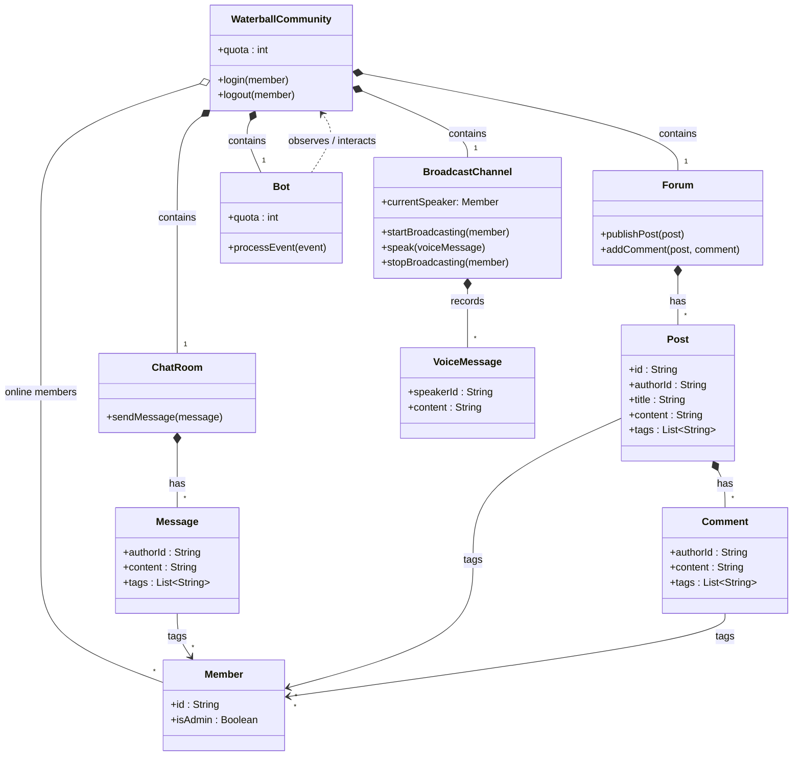

# Waterball 社群 - 物件導向分析 (OOA)

以下是針對 Waterball 社群機制的物件導向分析 (OOA) 概念類別圖。這張圖的重點是釐清「問題領域 (Problem Domain)」中存在哪些「名詞 (Entities)」以及它們之間的「關係 (Relationships)」。

### OOA 設計重點解析：

1. **核心聚合點 (Aggregate Root)**: `WaterballCommunity` 代表我們經營的社群，它聚合了三大基礎建設：`ChatRoom` (聊天室)、`Forum` (論壇) 與 `BroadcastChannel` (廣播頻道)，並且追蹤目前在線的 `Member`。
2. **通訊載體 (Communication Payloads)**:
   - 聊天室產生 `Message`
   - 論壇產生 `Post`，而 `Post` 底下可以接 `Comment`
   - 廣播頻道會由一位 Speaker (也是一種 `Member`) 產生連續的 `VoiceMessage`
3. **標記 (Tags)**: `Message`、`Post` 和 `Comment` 都具備標記功能，這裡的 `tags` 概念上關聯到特定 `Member` 的 ID (包含 `Bot`)。
4. **社群機器人 (Bot)**: `Bot` 在這個世界觀中，是一個特殊的參與者。它與社群共用 `quota` 額度，同時像個觀察者一樣，傾聽社群內發生的各種變動事件 (`processEvent`) 來做出對應回饋。

在 OOA 階段中，我們確認了整個世界的「**靜態結構**」。接下來為了釐清機器人的「**動態行為**」，我們會進一步繪製**狀態機圖 (State Machine Diagram)** 來拆解 `Bot` 收到不同事件時要怎麼流轉狀態。
